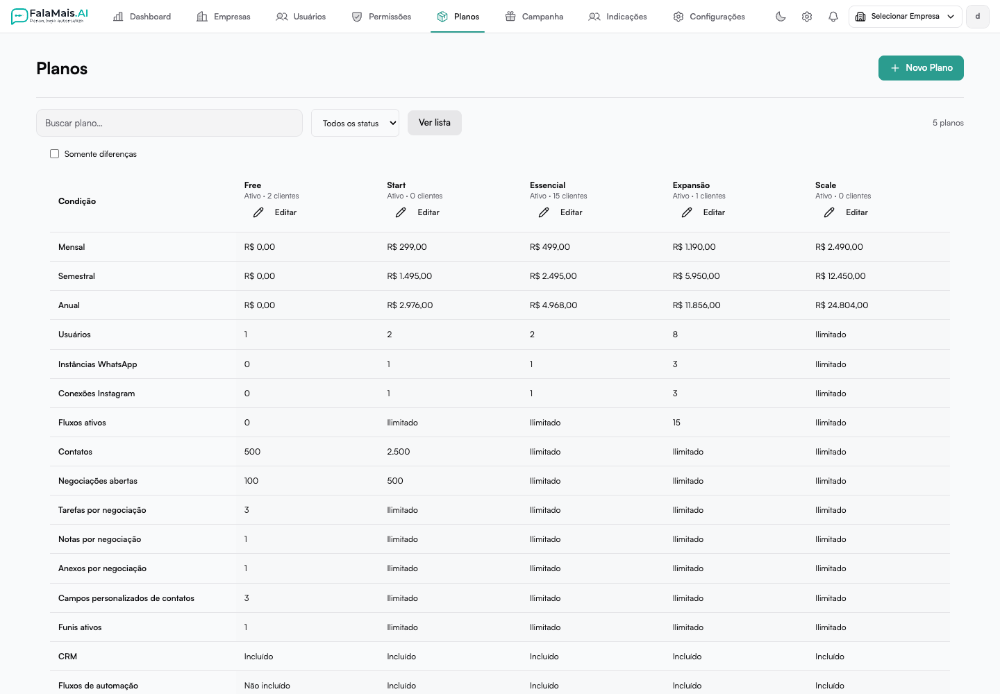

# Administração de empresas e planos

Esta área está disponível para administradores da plataforma. As alterações afetam o acesso e as condições comerciais das empresas.

## Planos

Em **Planos**, busque pelo nome, filtre pelo estado ativo ou inativo e use **Comparar planos** para conferir preços, limites e recursos. A opção **Somente diferenças** reduz a comparação aos itens que variam.

Ao abrir um plano, confira os dados comerciais, os limites e os recursos. É possível gerenciar usuários, canais, contatos, negociações abertas, funis, fluxos e limites por negociação. **Zero** impede novas criações; **Ilimitado** remove o teto numérico daquele item. Reduzir um limite não apaga os registros existentes.

Revise as alterações antes de confirmar. A mudança de capacidade alcança as empresas que seguem aquele plano; exceções individuais são preservadas. Alterar o preço do catálogo não reajusta automaticamente assinaturas já contratadas.

## Empresas

A página de cada empresa reúne:

- **Visão Geral:** situação da conta e consumo.
- **Plano e limites:** plano vinculado, consumo e limites personalizados.
- **Recursos:** funcionalidades disponíveis para o cliente.
- **Cobrança:** categoria da conta, situação financeira, conta ativa e condições comerciais.
- **Usuários:** pessoas cadastradas e condições de acesso.
- **Condições especiais:** resumo das exceções daquele cliente.
- **Histórico:** últimos 50 eventos registrados, com filtros por tipo.
- **Configurações:** dados administrativos e credenciais da empresa.

O filtro de capacidade próxima do limite considera as vagas de usuários. Administradores da plataforma que acessam a empresa para suporte não consomem essas vagas.

## Personalizações e cobrança

Personalize somente os itens que devem ser diferentes do plano. **Restaurar** volta a seguir o padrão do plano, inclusive nas alterações futuras. O motivo informado no salvamento fica registrado no histórico.

**Conta ativa** controla o bloqueio manual da operação. A situação financeira representa a condição de cobrança. Uma empresa com pagamento por autoatendimento pode continuar gerenciando o cartão, mesmo com preço negociado; nesses casos, a troca de plano é tratada pelo suporte.

## Teste e plano gratuito

O teste usa limites e recursos próprios durante seu prazo. O plano para contratação é separado do acesso temporário. **Estender Trial** soma dias ao vencimento de um teste ainda ativo; se o prazo já terminou, a contagem parte da data atual.

O Free é permanente. Enquanto uma contratação paga estiver pendente, a conta gratuita continua seguindo a política efetiva do Free.

Veja também [Planos e preços](planos.md).
