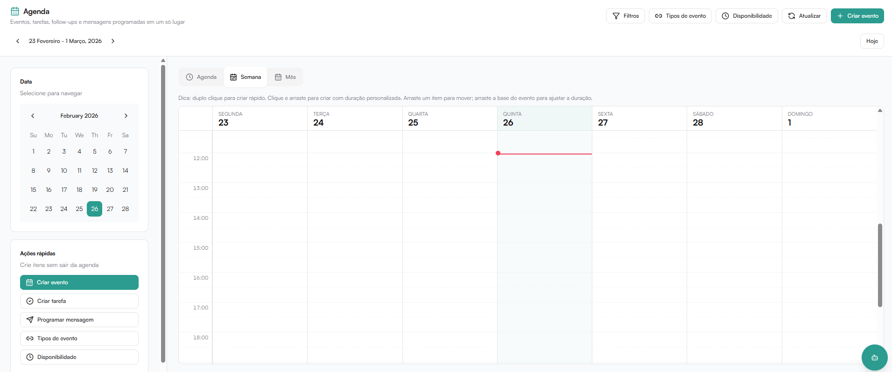

A **Agenda** centraliza eventos, tarefas, follow-ups e mensagens programadas em um único lugar.

Ela permite:

- Visualizar compromissos
- Criar eventos internos
- Criar tarefas
- Programar mensagens no WhatsApp
- Gerar links públicos de agendamento
- Configurar disponibilidade
- Criar bloqueios de horários

:::info[Importante]
Tarefas ficam **apenas na agenda interna** e não são sincronizadas com o Google Agenda.
:::



---

## Visão Geral da Agenda

A Agenda pode ser visualizada em três formatos:

- **Agenda** — lista dos compromissos do dia
- **Semana** — visão semanal em grade de horários
- **Mês** — visão mensal resumida

No topo também é possível:

- Aplicar **filtros** para controlar o que aparece
- Gerenciar **tipos de evento** (links públicos de agendamento)
- Ajustar a **disponibilidade** de horários
- **Atualizar** a visualização
- Criar um **novo evento** rapidamente

### Dicas de interação

Na visualização Semana, você pode:

- **Duplo clique** em um horário para criar um evento rápido
- **Clicar e arrastar** para criar um evento com duração personalizada
- **Arrastar um item** para movê-lo para outro horário
- **Arrastar a borda inferior** de um evento para ajustar sua duração

---

## Ações Rápidas

No menu lateral da Agenda você pode criar itens sem sair da tela:

- **Criar evento** — compromisso com data, hora e visibilidade
- **Criar tarefa** — item de acompanhamento interno
- **Programar mensagem** — envio automático via WhatsApp
- **Tipos de evento** — gerenciar links públicos de agendamento
- **Disponibilidade** — configurar horários disponíveis

---

## Criar Evento

Eventos são compromissos criados manualmente pela equipe.

### Campos disponíveis

| Campo | Obrigatório |
|---|---|
| Título | Sim |
| Início (data e hora) | Sim |
| Fim (data e hora) | Sim |
| Visibilidade | Não (padrão: Privado) |
| Profissional | Não (padrão: quem cria) |
| Descrição | Não |

O campo **Profissional** aparece para quem tem permissão de atribuir itens a
outros usuários: o evento entra na agenda do profissional escolhido e o
**conflito de horário é verificado na agenda dele** (respeitando a
configuração de encaixe/overbooking da empresa).

:::tip[Observação]
Eventos criados manualmente entram como **confirmados por padrão**.
:::

---

## Criar Tarefa

Tarefas ajudam a manter a equipe organizada e aparecem na agenda interna.

### Campos disponíveis

| Campo | Obrigatório |
|---|---|
| Título | Sim |
| Prazo | Não |
| Prioridade (Baixa, Média, Alta) | Não |
| Descrição | Não |

---

## Programar Mensagem

Permite agendar o envio automático de uma mensagem via WhatsApp em uma data e hora específicas.

### Campos disponíveis

| Campo | Obrigatório |
|---|---|
| Conversa | Sim |
| Data e hora de envio | Sim |
| Mensagem | Sim |

Após confirmar, a mensagem será enviada automaticamente no horário definido.

---

## Filtros da Agenda

Os filtros controlam o que é exibido na visualização da agenda.

### Opções disponíveis

- **Somente meus itens** — exibe apenas os itens do usuário logado
- **Incluir itens em rascunho** — exibe também itens ainda não confirmados
- **Profissionais** — selecione um ou mais profissionais para ver as agendas
  lado a lado; cada um ganha uma **cor fixa** nos eventos, com legenda na
  visualização semanal. Sem seleção, a agenda mostra tudo o que o seu perfil
  permite ver.

**Tipos de itens que podem ser exibidos:**

- Eventos
- Tarefas
- Follow-ups
- Mensagens programadas

Clique em **Aplicar** para atualizar a visualização com os filtros selecionados.

---

## Tipos de Evento (Links Públicos)

Tipos de evento criam links públicos de agendamento que podem ser enviados para clientes ou disponibilizados no site.

O link segue o formato:

```
/book/<companyPublicId>/<slug>
```

### Criar novo tipo de evento

Clique em **+ Criar tipo** e preencha os campos:

| Campo | Obrigatório | Descrição |
|---|---|---|
| Nome | Sim | Nome do tipo exibido publicamente |
| Slug (URL) | Sim | Identificador na URL (use kebab-case: letras, números e hífens) |
| Duração (minutos) | Sim | Duração padrão do agendamento |
| Criar Google Meet | Não | Se o Google Calendar estiver conectado, gera um link de Meet automaticamente ao confirmar. Desativado significa apenas bloquear o horário. |

**Exemplo:**
- Nome: `Agendamento inicial`
- Slug: `agendamento-inicial`
- Duração: `30` minutos

### Ações disponíveis por tipo

Cada tipo de evento possui as seguintes opções:

| Ação | Descrição |
|---|---|
| **IA pode agendar** | Permite que a IA do WhatsApp marque horários automaticamente neste tipo |
| **Criar Google Meet** | Gera link de reunião quando há Google Calendar conectado |
| **Editar** | Altera nome, slug, duração e configurações |
| **Copiar link** | Copia o link público de agendamento |
| **Abrir** | Abre a página pública de agendamento no navegador |
| **Ativar / Desativar** | Ativa ou desativa o tipo sem excluí-lo |
| **Excluir** | Remove o tipo permanentemente |

### Página pública de agendamento

Quando alguém acessa o link público:

1. Seleciona uma **data** disponível (próximos 14 dias)
2. Escolhe um **horário** disponível
3. Informa **nome e telefone** (opcional)
4. Confirma o agendamento

O sistema cria automaticamente o evento na Agenda. O fuso horário é exibido no topo da página.

### IA pode agendar

Quando ativado, a IA do WhatsApp poderá:

- Verificar a disponibilidade de horários
- Marcar agendamentos automaticamente
- Confirmar compromissos com o cliente

---

## Disponibilidade

A Disponibilidade define quando você está disponível para receber agendamentos. Ela funciona em três camadas: um preset rápido, janelas base por usuário e overrides por tipo de evento.

### Preset rápido

Aplica um padrão pronto de disponibilidade em uma única ação.

**Campos:**

- **Escopo** — onde o preset será aplicado:
  - **Usuário** — altera a disponibilidade base geral do usuário
  - **Tipo de evento** — altera apenas um tipo específico (ex.: reunião técnica com horário diferente)
- **Preset** — padrão a aplicar (ex.: Comercial, Final de semana, Customizado)
- **Tipo de evento** — selecionado quando o escopo é por tipo

Clique em **Aplicar preset** para definir os horários rapidamente.

### Janelas base do usuário

Define a disponibilidade padrão, usada quando não há override configurado para um tipo de evento específico.

**Exemplo de uso:** configure segunda a sexta, das 09:00 às 18:00 como horário padrão para todos os tipos.

Para adicionar uma janela, clique em **+ Janela**, defina o dia, início e fim, e clique em **Salvar**.

### Override por tipo de evento

Permite configurar uma disponibilidade específica para um determinado tipo de evento. Quando configurado, **tem prioridade total** sobre a janela base do usuário.

**Exemplo de uso:** reuniões de 15 min podem ter agenda diferente de apresentações de 60 min.

Se as janelas do tipo selecionado estiverem vazias, o tipo herda automaticamente a disponibilidade base do usuário.

### Bloqueios de disponibilidade

Bloqueios impedem que horários sejam exibidos como disponíveis para agendamento. Útil para almoços, reuniões internas, feriados e outros períodos indisponíveis.

**Campos:**

| Campo | Descrição |
|---|---|
| Título | Identificação do bloqueio (ex.: Reunião interna) |
| Tipo | **Pontual** — bloqueia um intervalo único de data/hora. **Semanal** — bloqueia uma faixa recorrente toda semana (ex.: toda quarta das 12:00 às 13:00) |
| Escopo | **Todos os tipos** — bloqueia para qualquer agenda. **Evento específico** — bloqueia apenas um tipo de evento |
| Início | Data e hora de início do bloqueio |
| Fim | Data e hora de fim do bloqueio |
| Ativar bloqueio ao criar | Quando ligado, o bloqueio entra em vigor imediatamente após salvar, aplicando a regra para novos agendamentos |

Clique em **Criar bloqueio** para salvar.
