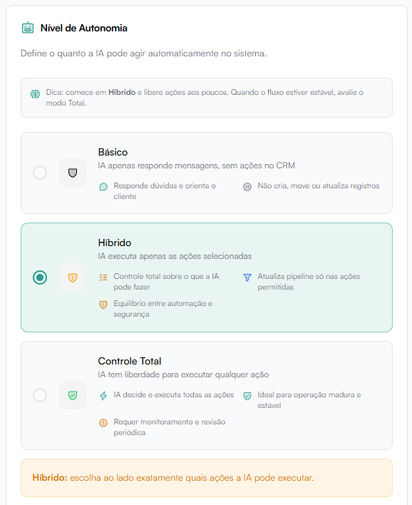
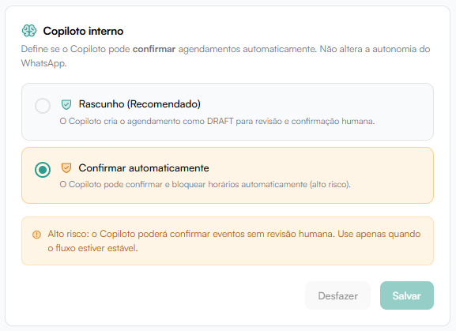

# Autonomia

A seção **Nível de Autonomia** define o quanto a IA pode agir automaticamente dentro do sistema.

Essa configuração impacta diretamente:

- Ações no CRM
- Alterações em negociações
- Atualizações de contato
- Execuções automáticas estratégicas

Recomendação geral:
Começar em modo **Híbrido** e liberar autonomia gradualmente.

## Básico

O modo **Básico** é o nível mais restritivo de autonomia.

### O que a IA faz no modo Básico?

- Responde mensagens automaticamente.
- Orienta o cliente.
- Esclarece dúvidas.
- Mantém a conversa ativa.

### O que a IA NÃO pode fazer?

- Não cria negociações.
- Não move etapas de funil.
- Não atualiza registros.
- Não altera dados no CRM.
- Não executa ações internas.

### Quando usar?

- Início da implementação.
- Testes controlados.
- Operações que exigem validação humana constante.
- Empresas com baixa maturidade em automação.

É o modo ideal para validar comportamento sem risco operacional.

## Modo Híbrido

Permite selecionar exatamente quais ações a IA pode executar.

Mais seguro e recomendado para início de operação.

## Ações que a IA pode executar

Entre as opções:

- Adicionar Nota Interna
- Atualizar Perfil do Contato
- Gerenciar Tags
- Adicionar Nota na Negociação
- Ler Notas da Negociação
- Criar Negociação
- Atualizar Negociação
- Mover de Estágio
- Marcar como Qualificado
- Agendar Follow-up
- Criar Agendamento (rascunho)
- Criar Funil
- Criar Etapa do Funil
- Fechar Negociação como Ganho
- Fechar Negociação como Perdida
- Pausar Atendimento
- Notificar Humano
- Disparar Automação
- Criar Agendamento (confirmado)

Cada ação pode ser ativada ou desativada individualmente.

## Controle Total

A IA pode executar qualquer ação automaticamente.

Recomendado apenas quando:

- O fluxo já está validado.
- A operação é estável.
- Existe monitoramento constante.

Requer revisão periódica.

## Copiloto Interno

A seção **Copiloto Interno** controla como a IA lida com agendamentos automáticos.

:::warning Importante
Não altera a autonomia do WhatsApp.
Afeta apenas comportamento interno relacionado a agenda.
:::

### Objetivo do Copiloto

Permitir que a IA:

- Crie agendamentos automaticamente.
- Confirme horários.
- Bloqueie agendas.

### Rascunho (Recomendado)

O Copiloto cria o agendamento como **DRAFT (rascunho)**.

#### Como funciona:

- A IA sugere o horário.
- O sistema cria um agendamento pendente.
- Um humano revisa e confirma manualmente.

#### Vantagens

- Reduz risco.
- Mantém controle humano.
- Ideal para fase inicial de implementação.

### Confirmar Automaticamente

O Copiloto confirma e bloqueia horários automaticamente.

#### Como funciona:

- A IA agenda.
- O horário é confirmado.
- A agenda é bloqueada sem revisão humana.

Alto risco operacional.

Use apenas quando:

- O fluxo de qualificação é extremamente confiável.
- A operação já está validada.
- Existe monitoramento ativo.

## Alerta de Risco

Ao habilitar confirmação automática:

A IA poderá confirmar eventos sem revisão humana.

Recomendado apenas quando o processo estiver estável e previsível.
