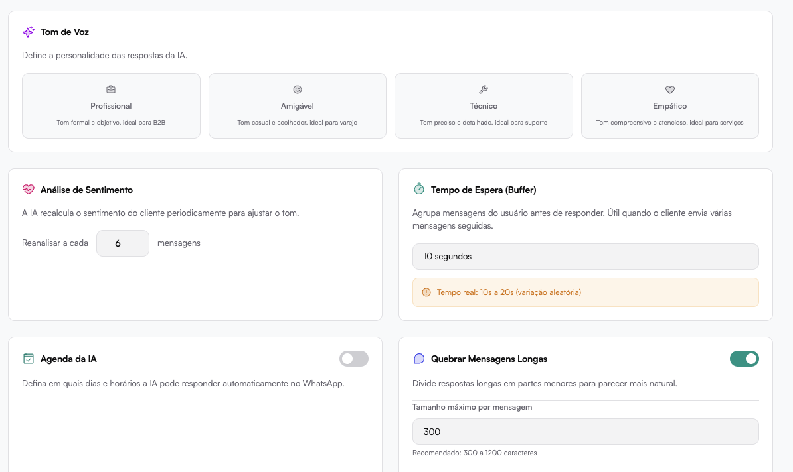

# Comportamento

Define como a IA responde operacionalmente às mensagens.

## Ativar IA

Liga ou desliga as respostas automáticas.

Quando ativado:
A IA passa a responder automaticamente conforme configuração.

## Pausar IA ao envio manual

Quando ativado:
Se um humano enviar mensagem, a IA pausa automaticamente.

Recomendação:
Desativado para operações maduras.
Ativado em ambientes mais híbridos.

## Tom de Voz

Opções:

- Profissional (formal, objetivo)
- Amigável (casual e acolhedor)
- Técnico (preciso e detalhado)
- Empático (compreensivo e atencioso)

Define a personalidade automática das respostas.

## Análise de Sentimento

A IA reavalia o sentimento do cliente periodicamente.

Configuração:
Reanalisar a cada X mensagens.

Permite ajuste dinâmico de tom conforme humor do cliente.

##  Tempo de Espera (Buffer)

Define um tempo para agrupar mensagens antes de responder.

Exemplo:
10 segundos (variação real 10-20s)

Evita múltiplas respostas fragmentadas quando o cliente envia várias mensagens seguidas.

## Agenda da IA

Permite definir dias e horários em que a IA pode responder automaticamente.

Útil para:

- Responder apenas em horário comercial
- Desativar respostas fora do expediente

## Quebrar Mensagens Longas

Divide respostas longas em partes menores.

Configurações:

- Tamanho máximo por mensagem
- Intervalo entre partes

Deixa a conversa mais natural.

## Modo Teste

Quando ativado:
A IA responde apenas para número configurado.

Ideal para testar em produção sem afetar usuários reais.
