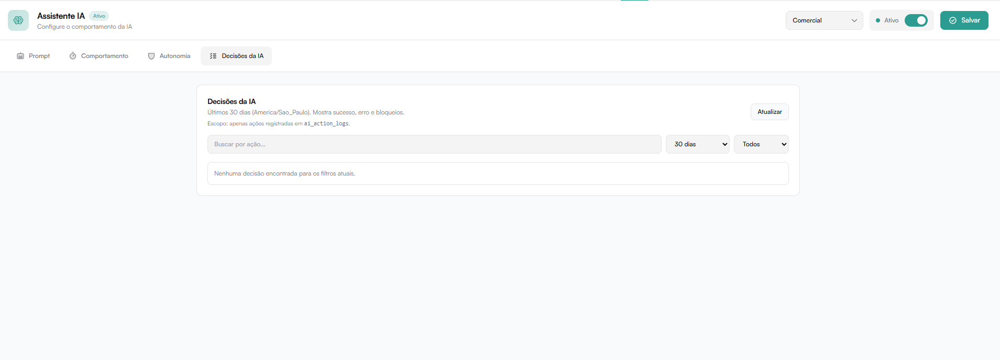

# Decisões da IA

Área de auditoria e monitoramento.

Mostra:

- Ações realizadas
- Sucessos
- Erros
- Bloqueios

Filtros disponíveis:

- Período (ex: últimos 30 dias)
- Tipo de ação
- Status

Exibe registros do ai_action_logs.

Importante para:

- Monitoramento
- Ajustes estratégicos
- Identificação de falhas
- Análise de comportamento
