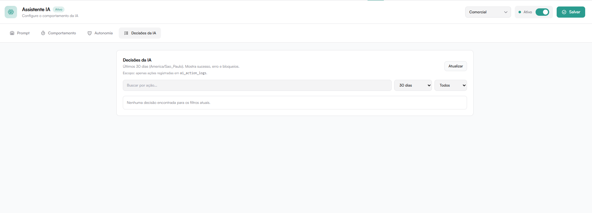

# Decisões da IA

Toda vez que a IA tenta executar uma ação — como criar uma negociação ou mover um contato de estágio — o sistema registra o que aconteceu.

A aba **Decisões da IA** é onde você acompanha esse histórico.

## Como ler o histórico

Cada entrada mostra:

- **Ação executada** — nome da ação e seu código interno (ex: `create_deal`, `move_stage`)
- **Data e hora** — quando a ação foi tentada
- **Motivo** — o contexto da conversa que levou a IA a tomar aquela decisão
- **Status** — se a ação funcionou ou não

## Status possíveis

| Status | O que significa |
|--------|-----------------|
| **Sucesso** | A ação foi executada corretamente |
| **Erro** | A ação foi tentada mas falhou. O motivo aparece em destaque na entrada |
| **Bloqueio** | A ação foi impedida por uma restrição de autonomia, permissão ou política do sistema |

:::tip Exemplo de erro
`open_deal_exists` — a IA tentou criar uma nova negociação, mas já existe uma aberta para aquele contato. A ação foi bloqueada automaticamente para evitar duplicatas.
:::

## Filtros disponíveis

- **Período** — últimos 7, 15 ou 30 dias
- **Tipo de ação** — filtra por ação específica (ex: só ver criações de negociação)
- **Status** — ver apenas sucessos, erros ou bloqueios
- **Busca por ação** — campo de texto para localizar uma ação específica pelo nome

## Para que serve na prática

- **Monitorar** o que a IA está fazendo nas conversas
- **Identificar erros recorrentes** que indicam configuração incorreta no prompt ou na autonomia
- **Ajustar a estratégia** com base no que a IA está conseguindo ou não executar
- **Auditar** ações realizadas sem intervenção humana
