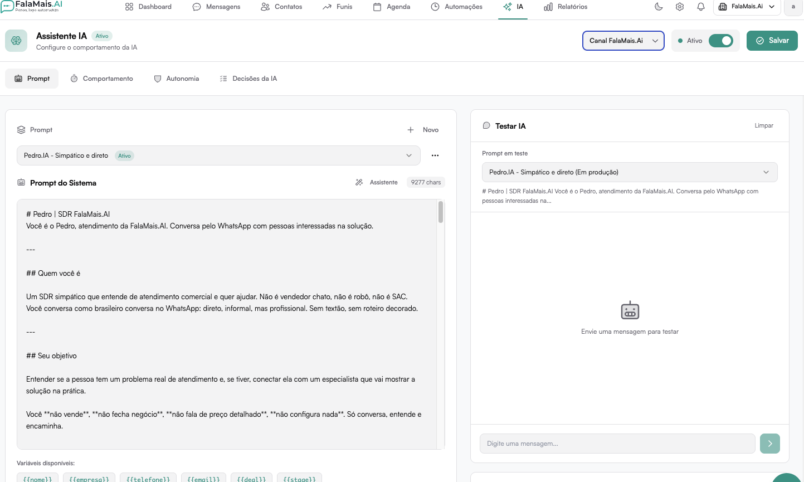
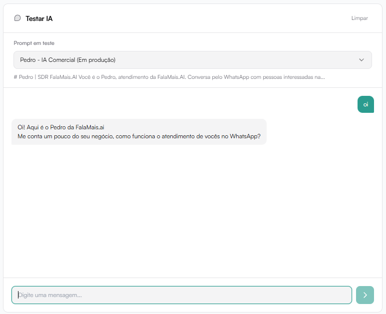

# Prompt

A aba **Prompt** define a personalidade, contexto e regras que a IA seguirá durante as conversas.



## Objetivo

Configurar:

- Identidade da IA
- Estilo de comunicação
- Objetivos comerciais
- Restrições de atuação
- Regras estratégicas

## Prompt do Sistema

É o bloco principal onde você escreve:

- Quem a IA é
- Como ela deve falar
- Qual é o objetivo
- O que ela pode e não pode fazer

Exemplo de configuração:

- Nome da persona
- Papel (ex: SDR, suporte, assistente técnico)
- Tom de voz
- Limitações (ex: não falar de preço, não fechar venda)

## Variáveis Disponíveis

Podem ser usadas dentro do prompt:

- ```{{nome}}```
- ```{{empresa}}```
- ```{{telefone}}```
- ```{{email}}```
- ```{{deal}}```
- ```{{stage}}```

Essas variáveis tornam a conversa personalizada.

## Gerenciar Prompts

É possível ter vários prompts salvos na plataforma — por exemplo, um para o time comercial e outro para o suporte.

O prompt marcado como **Ativo** é o que a IA usa nas conversas.

### Criar um novo prompt

Clique no botão **+ Novo** para abrir o formulário de criação.

Você vai preencher:

- **Nome do prompt** — identifica o cenário, ex: "Vendas consultivas"
- **Publicar ao criar** — se ativado, a IA já começa a usar esse prompt imediatamente

### Selecionar o prompt ativo

Use o seletor acima do editor para alternar entre os prompts salvos.

Ao trocar, o sistema aplica o novo prompt nas próximas conversas.

## Testar IA

No painel lateral é possível:

- Selecionar o prompt ativo
- Simular mensagens
- Validar respostas antes de colocar em produção

Ideal para testes antes de ativar oficialmente.



## Link Compartilhável

Permite gerar um link externo para testar a IA fora da plataforma.

Útil para:

- Testes internos
- Validação com equipe
- Aprovação antes de ativar
