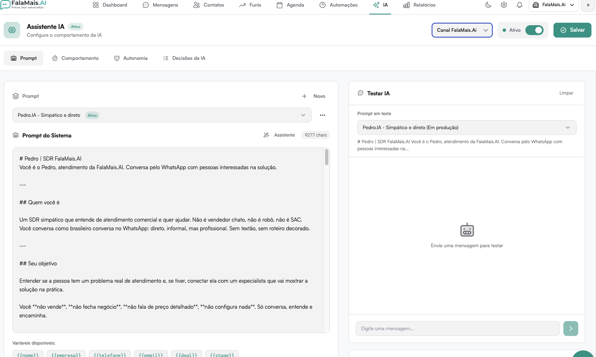
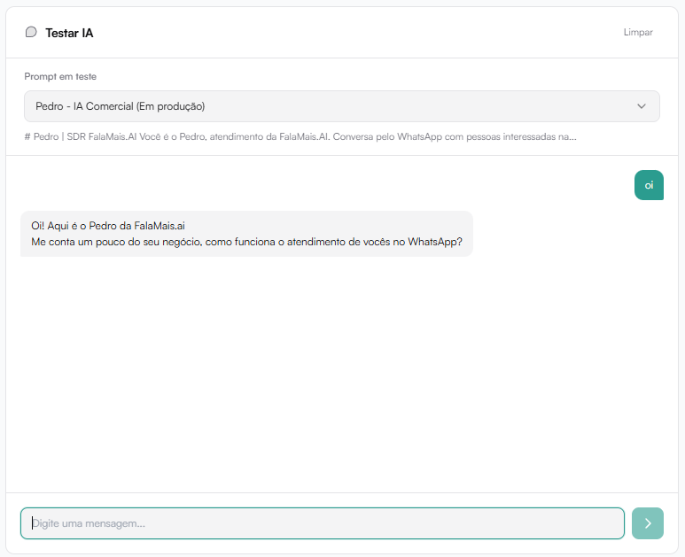

# Prompt

A aba **Prompt** define a personalidade, contexto e regras que a IA seguirá durante as conversas.



## Objetivo

Configurar:

- Identidade da IA
- Estilo de comunicação
- Objetivos comerciais
- Restrições de atuação
- Regras estratégicas

## Prompt do Sistema

É o bloco principal onde você escreve:

- Quem a IA é
- Como ela deve falar
- Qual é o objetivo
- O que ela pode e não pode fazer

Exemplo de configuração:

- Nome da persona
- Papel (ex: SDR, suporte, assistente técnico)
- Tom de voz
- Limitações (ex: não falar de preço, não fechar venda)

## Variáveis Disponíveis

Podem ser usadas dentro do prompt:

- ```{{nome}}```
- ```{{empresa}}```
- ```{{telefone}}```
- ```{{email}}```
- ```{{deal}}```
- ```{{stage}}```

Essas variáveis tornam a conversa personalizada.

## Mídias no prompt

Você pode fazer a IA enviar imagens, áudios e vídeos durante a conversa. Os
arquivos ficam em uma biblioteca de mídias do prompt.

Para usar:

1. Envie o arquivo na biblioteca de mídias e dê um nome fácil de reconhecer.
2. No texto do prompt, digite `@` e escolha a mídia. A menção aparece como um
   selo no editor, por exemplo "Vídeo de apresentação".
3. Escreva a condição em volta da menção — por exemplo: "Quando o cliente
   informar a modalidade, envie o Vídeo de apresentação". Sem a condição, a IA
   não sabe a hora certa de enviar.
4. Confirme que a ação **Enviar mídia do prompt** está habilitada nas
   configurações de autonomia do assistente.
5. Publique o prompt. É a versão publicada que a IA usa nas conversas.

Como a IA se comporta:

- O arquivo é enviado antes da mensagem de texto que acompanha a mídia.
- Se a mídia não puder ser enviada, a IA envia um texto alternativo, definido
  por ela no momento do envio, em vez de deixar o cliente sem resposta.
- O mesmo arquivo não é reenviado nos turnos seguintes do mesmo atendimento.

{/* Screenshot pendente: captura do editor com uma menção de mídia e a ação de autonomia habilitada. */}

## Buscar no prompt

Use a **lupa** do editor ou pressione **Ctrl+F** (Windows/Linux) ou **Cmd+F**
(Mac) com o foco no texto. A busca percorre todo o prompt, inclusive menções e
trechos fora da área visível. O painel mostra o número de resultados; use
**Anterior** e **Próximo** para navegar. Pressione **Esc** para fechar a busca e
voltar ao texto. A busca também está disponível quando o prompt está somente
para leitura.

## Gerenciar Prompts

É possível ter vários prompts salvos na plataforma — por exemplo, um para o time comercial e outro para o suporte.

O prompt marcado como **Ativo** é o que a IA usa nas conversas.

### Criar um novo prompt

Clique no botão **+ Novo** para abrir o formulário de criação.

Você vai preencher:

- **Nome do prompt** — identifica o cenário, ex: "Vendas consultivas"
- **Publicar ao criar** — se ativado, a IA já começa a usar esse prompt imediatamente

### Selecionar o prompt ativo

Use o seletor acima do editor para alternar entre os prompts salvos.

Ao trocar, o sistema aplica o novo prompt nas próximas conversas.

## Testar IA

No painel lateral é possível:

- Selecionar o prompt ativo
- Simular mensagens
- Validar respostas antes de colocar em produção

Ideal para testes antes de ativar oficialmente.



## Link Compartilhável

Permite gerar um link externo para testar a IA fora da plataforma.

Útil para:

- Testes internos
- Validação com equipe
- Aprovação antes de ativar
