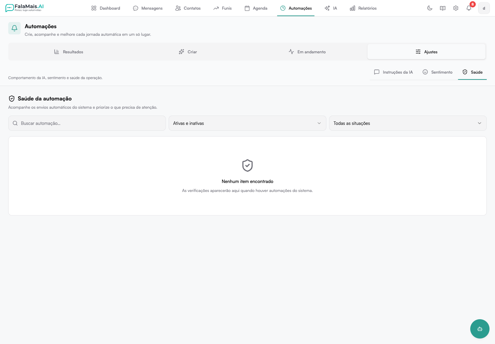

# Saúde da automação

A área **Saúde** acompanha os envios automáticos do sistema e coloca primeiro
os itens que precisam de atenção.

Localização:

**Automações → Ajustes → Saúde**

## Resumo operacional

No topo, a página separa:

- itens que precisam de atenção
- itens funcionando dentro do padrão esperado

Quando não há problemas detectados, o resumo deixa esse estado explícito.

## Filtros

- **Buscar automação** — encontra um item pelo nome ou descrição
- **Status** — ativas e inativas, somente ativas ou somente inativas
- **Funcionamento** — todas as situações, precisa de atenção ou funcionando
  normalmente

Use **Limpar filtros** para restaurar a visão completa.

## Leitura dos itens

Cada item mostra nome, descrição, estado ativo/inativo, última atividade e o
diagnóstico conhecido. Automações com anomalia recebem destaque visual e ficam
antes das saudáveis.

## Estados vazios e erro

- **Tudo funcionando normalmente** aparece quando o filtro de atenção não
  encontra problemas.
- **Nenhum item encontrado** indica que os filtros atuais não retornaram dados.
- Se a verificação falhar, a página mostra **Tentar novamente** em vez de
  apresentar um resultado vazio.
