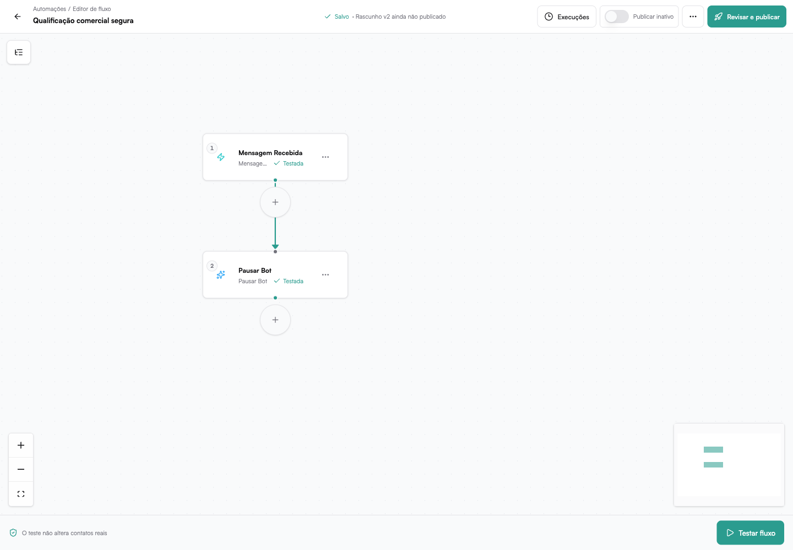

# Fluxos

Os **Fluxos** permitem montar jornadas visuais com gatilhos, condições, ações,
esperas e integrações. Eles são indicados para automações com ramificações ou
várias etapas encadeadas.

Localização:

**Automações → Criar → Fluxos**

---

## Lista de fluxos

A biblioteca mostra os fluxos da empresa com:

- nome e descrição
- gatilhos configurados
- quantidade de componentes
- status de rascunho, ativo ou inativo
- indicação de alterações ainda não publicadas
- data da última atualização

Use a busca para localizar um fluxo. Se o carregamento falhar, a página exibe
o erro e oferece uma nova tentativa; uma falha nunca aparece como biblioteca
vazia.

## Criar um fluxo

Clique em **Novo fluxo**. No editor, adicione primeiro o gatilho e depois os
componentes que formam a jornada.

:::info[Rascunho e produção]
O editor salva um rascunho. A automação em produção só muda quando você publica
uma nova versão. Um fluxo que nunca foi publicado não pode aparecer como ativo;
publique a primeira versão antes de usar o controle de ativação.

Criar ou editar um fluxo pelo Copiloto segue o mesmo processo. A automação não
é ativada automaticamente: primeiro o rascunho é salvo, depois publicado e, por
fim, ativado. Ao publicar novamente um fluxo existente, a escolha atual de
mantê-lo ativo ou pausado é preservada.
:::

## Área de trabalho

O Studio é composto por:

- **barra superior** — nome, estado do salvamento, execuções, ativação,
  versões e publicação
- **canvas** — componentes e conexões do fluxo
- **seletor de componentes** — aberto pelos botões de adição no canvas
- **painel lateral** — configuração e resultado do componente selecionado

No desktop, o seletor abre próximo ao ponto de inserção. Em celular, ele usa
uma folha inferior com a mesma busca e as mesmas opções.

## Adicionar componentes

Clique no botão **+** depois de uma etapa ou em um ponto vazio do fluxo. O
seletor organiza os componentes por categoria e permite buscar sem depender de
acentos.

O Studio oferece somente opções compatíveis com aquele ponto:

- gatilhos aparecem apenas no início
- uma etapa seguinte não pode ser outro gatilho
- condições e ramificações mostram suas saídas pelo nome
- componentes inexistentes ou incompatíveis bloqueiam a publicação

O novo componente já é conectado ao caminho escolhido.

## Configurar uma etapa

Clique em um componente para abrir o painel lateral. Use:

- **Configurar** — campos executados pela etapa
- **Resultado** — último resultado seguro ou resultado selecionado no histórico

As setas do cabeçalho percorrem os componentes anterior e seguinte sem fechar
o painel.

### Usar dados das etapas anteriores

Campos compatíveis abrem o seletor **Usar dados** ao receber foco ou pelo botão
de inserção. Ele mostra:

- dados do gatilho
- resultados das etapas anteriores que chegam ao componente atual
- tipo e exemplo do valor
- objetos e listas em uma árvore expansível

Use a busca ou navegue pela árvore. Ao escolher um campo, o valor é inserido no
ponto atual do texto, o seletor fecha e o foco volta ao campo de destino.

:::info[Somente dados disponíveis]
Etapas futuras, ramos que não chegam ao componente e etapas desativadas não são
oferecidos como fonte, pois não produzem um valor válido naquele ponto.
:::

### Campos em vez de código

As configurações mais comuns usam controles visuais:

- **Requisição HTTP** — URL, método, query, cabeçalhos, tipo de corpo, campos
  mapeados, timeout e tentativas
- **Integração** — conexão, operação e campos esperados pela integração
- **Responder webhook** — status, cabeçalhos e corpo
- **Template oficial** — parâmetros na ordem exigida pelo template
- **Mapear/definir campos** — destino e valor em linhas editáveis

Os dados técnicos completos continuam disponíveis de forma recolhida para
diagnóstico, mas não são a forma principal de configurar a etapa.

Linhas com chave repetida, valor inválido ou campo obrigatório ausente mostram
o erro no próprio controle e bloqueiam o teste daquela etapa.

## Tipos de componentes

### Gatilhos

Iniciam a automação a partir de eventos como mensagem recebida, tag adicionada,
mudança de etapa, contato ou negociação criada, entrada em lista ou webhook.

### Condições

Avaliam conteúdo, tags, etapa, horário, decisão da IA ou vários casos por meio
de **Switch**. Cada saída recebe um nome estável para que reordenar casos não
troque o caminho existente.

### Ações

Enviam mensagens, usam template oficial ou mensagem rápida, adicionam ou
removem tags, notificam a equipe, movem uma negociação, criam uma negociação,
pausam a IA, chamam integrações ou fazem requisições HTTP.

### Controle e dados

Incluem espera, espera por resposta, fim, merge, mapeamento de campos e resposta
de webhook.

## Testar com segurança

Antes de publicar, abra o teste do fluxo e escolha um cenário compatível com o
gatilho. É possível informar uma mensagem, dados do contato ou montar o corpo
de um webhook por campos, sem escrever JSON.

O teste é sempre seguro:

- mensagens não são enviadas a contatos reais
- alterações de tags, campos e etapas são simuladas
- negociações não são criadas
- chamadas externas não são disparadas
- decisões da IA recebem uma prévia determinística

O resultado informa claramente quando algo foi **Simulado**, **Pulado**,
**Desativado**, concluído ou falhou.

Para testar um componente isolado, o rascunho precisa estar salvo e válido. Se
houver pendências, use **Corrigir pendências** para ir ao campo bloqueador.

## Resultado e histórico de execução

A aba **Resultado** prioriza uma leitura humana, com campos de negócio e listas
organizadas. Os dados completos ficam recolhidos por padrão.

Em **Execuções**, selecione um teste ou execução para ver:

- status e duração
- linha de execução
- entrada e saída de cada componente
- motivo de falha ou de ação pulada
- chamadas externas registradas

Se a IA pulou uma ação, o motivo disponível aparece na linha do tempo. Uma
etapa desativada é identificada separadamente.

O resultado de uma espera por resposta aparece somente quando esse componente
fez parte do caminho executado. Outros fluxos não recebem um aviso de tempo
esgotado sem terem aguardado uma resposta.

## Desativar uma etapa sem excluir

Uma ação linear compatível pode ser desativada pelo menu do componente ou pelo
painel lateral. A etapa permanece no desenho, mas a automação segue diretamente
para sua única saída sem executar o efeito.

Não podem ser desativados:

- gatilhos
- condições e Switch
- espera por resposta
- fim
- etapas sem uma única saída segura

Se outra etapa usa o resultado daquela ação, o Studio bloqueia a desativação e
oferece **Revisar campo**. Para voltar a executar, use **Reativar etapa**.

## Editar e desfazer

O editor mantém histórico local de alterações. Use desfazer e refazer para
recuperar configuração, conexões, posição, exclusão ou desativação. Uma nova
edição depois de desfazer inicia uma nova sequência.

Ao excluir uma ação intermediária simples, o Studio reconecta o caminho quando
isso é seguro. O gatilho não pode ser excluído.

## Publicar e ativar

Clique em **Publicar** para abrir a revisão. A tela apresenta pendências e o
estado de ativação que será aplicado.

- **Publicar ativo** — a nova versão passa a receber eventos
- **Publicar inativo** — salva a versão em produção sem iniciar novas execuções

O histórico de versões permite consultar, restaurar ou publicar uma versão
anterior. Execuções que já começaram continuam vinculadas à versão usada no
início, mesmo que o rascunho ou a produção sejam alterados depois.

:::warning[WhatsApp Oficial]
Mensagens livres dependem da janela de 24 horas. Fora dela, configure
explicitamente um template oficial aprovado; o fluxo não faz troca automática.
:::
