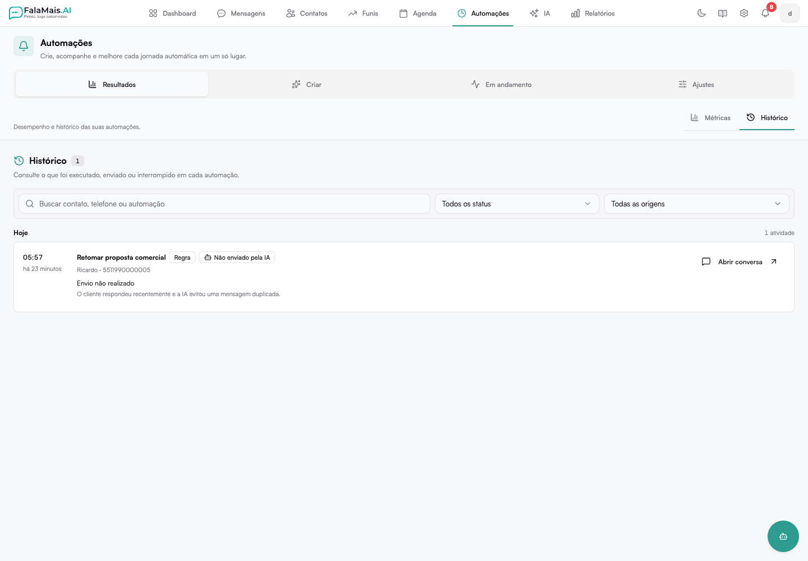

# Histórico

O **Histórico** registra o que aconteceu nas regras de follow-up e nos fluxos
visuais. Ele mostra o resultado, a origem, o contato e o motivo disponível para
cada evento.

Localização:

**Automações → Resultados → Histórico**

## Busca e filtros

O campo de busca encontra registros por:

- nome ou telefone do contato
- nome da regra ou do fluxo
- mensagem ou resumo do resultado
- identificador da conversa

Também é possível filtrar por grupo de status:

- **Em andamento**
- **Enviado**
- **Respondido**
- **Não enviado**
- **Cancelado**
- **Concluído**

E por origem:

- **Regra**
- **Fluxo**
- **Agendamento manual**
- **Criado pela IA**

Quando o Histórico é aberto a partir de uma conversa, o filtro daquela
conversa aparece aplicado e pode ser removido sem perder os outros filtros.

## Organização por data

Os registros são agrupados em **Hoje**, **Ontem** ou pela data completa. Dentro
de cada dia, a ordem dos eventos é preservada para facilitar a leitura da
sequência real.

## Informações de cada registro

Cada item pode apresentar:

- horário e tempo relativo
- contato e telefone
- automação e tipo de origem
- status em linguagem operacional
- mensagem enviada, quando houver
- resumo do resultado
- motivo da falha, cancelamento ou decisão da IA
- sentimento identificado, quando disponível
- atalho para abrir a conversa

## Ações puladas pela IA

Uma ação **Não enviada pela IA** significa que o sistema reavaliou o contexto
antes do disparo e evitou um envio que deixou de ser adequado. O motivo
registrado aparece junto ao resultado.

:::info[Histórico antigo]
Alguns eventos antigos podem não ter uma justificativa detalhada. Nesses casos,
a tela informa que o motivo não foi registrado, sem assumir uma causa.
:::

## Sem resultados e falhas

Se nenhum item corresponder aos filtros, use **Limpar filtros** para voltar ao
histórico completo. Se a API falhar, a página exibe o erro e permite tentar
novamente; uma falha nunca é apresentada como histórico vazio.
