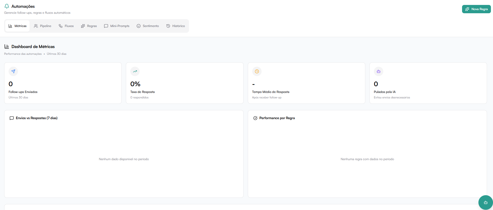

A aba **Métricas**, dentro do módulo **Automações**, mostra o desempenho das suas automações de forma visual e resumida.

Os dados exibidos são referentes aos **últimos 30 dias**.



---

## Dashboard de Métricas

No topo do dashboard existem quatro cards com os principais indicadores das automações.

### Follow-ups Enviados

Total de mensagens automáticas enviadas no período.

> Considera apenas envios efetivamente realizados.

---

### Taxa de Resposta

Porcentagem de contatos que responderam após receber um follow-up.

**Como é calculada:**

```
Contatos que responderam ÷ Total de follow-ups enviados
```

Quando nenhum contato respondeu, o valor exibido será `0%` com a legenda `0 respondidos`.

---

### Tempo Médio de Resposta

Tempo médio que os contatos levaram para responder após receber o follow-up.

A legenda exibida é: `Após receber follow-up`.

> Se não houver respostas no período, o campo exibirá um traço (`-`).

---

### Pulados pela IA

Quantas mensagens **não foram enviadas** porque a IA entendeu que o envio não era necessário naquele momento.

A legenda exibida é: `Evitou envios desnecessários`.

Exemplos de situações em que isso acontece:
- O cliente já havia respondido antes do disparo
- A conversa já estava resolvida
- A condição da regra deixou de ser válida

---

## Envios vs Respostas (7 dias)

Gráfico que compara, nos últimos 7 dias:

- Mensagens enviadas
- Mensagens respondidas

Permite visualizar tendências de engajamento ao longo da semana.

> Quando não há dados no período, é exibido: **Nenhum dado disponível no período**

---

## Performance por Regra

Mostra o desempenho individual de cada regra criada.

Quando nenhuma regra tiver execuções no período, é exibido:

> **Nenhuma regra com dados no período**

---

## Resumo de Status

Bloco com a consolidação geral dos resultados do período.

### Enviados com Sucesso
Mensagens que foram disparadas corretamente.

### Respondidos
Follow-ups que geraram uma resposta do cliente.

### Falhas
Mensagens que não puderam ser entregues.

Possíveis causas:
- Instância desconectada
- Erro no canal
- Número inválido
- Bloqueio no WhatsApp

### Pulados pela IA
Mensagens canceladas preventivamente pelo sistema antes do envio.
