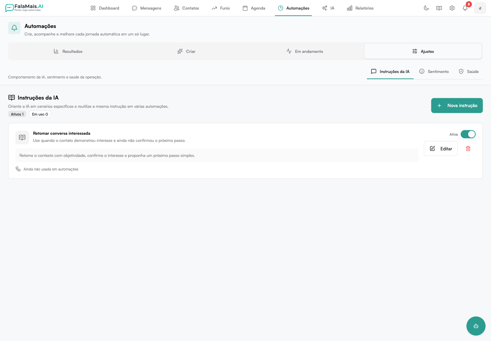
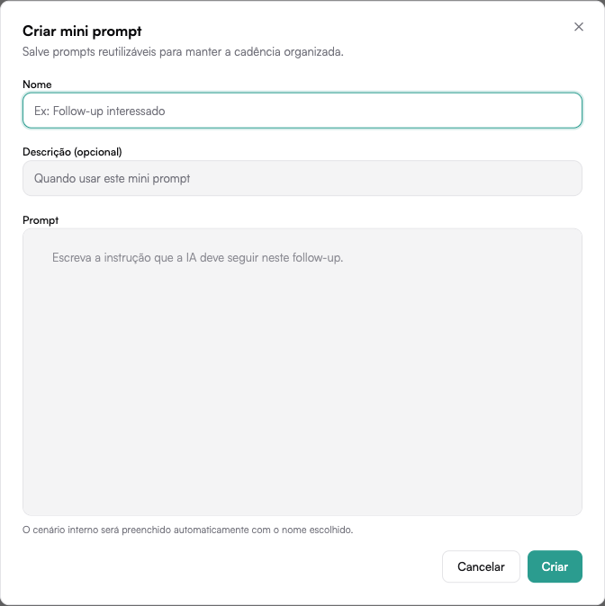
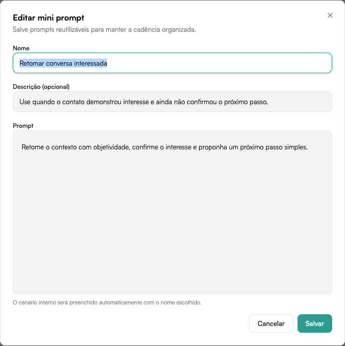

# Instruções da IA

As **Instruções da IA** definem como a IA deve agir em cenários específicos.
Uma mesma instrução pode ser reutilizada em várias regras de automação.

Localização:

**Automações → Ajustes → Instruções da IA**

## Visão geral

O cabeçalho mostra:

- quantidade de instruções ativas
- quantidade de instruções em uso
- botão **Nova instrução**

Cada item apresenta nome, descrição, uma prévia do texto, estado e as
automações que usam aquela instrução.

## Criar uma instrução

Clique em **Nova instrução** e preencha:

- **Nome** — identificação curta para a equipe
- **Descrição** — quando ou por que a orientação deve ser usada
- **Instrução** — orientação que a IA deve seguir

Depois de salvar, selecione a instrução nas ações geradas por IA dentro do
editor de regras.

## Ativar, editar e excluir

- Use o seletor **Ativa/Inativa** para controlar a disponibilidade sem excluir
  o conteúdo.
- Clique em **Editar** para alterar nome, descrição ou instrução.
- A exclusão exige confirmação e não pode ser desfeita.

Antes de excluir, confira a indicação **Usada em X automações**. Ela mostra as
regras que ainda dependem daquela orientação.

## Estado vazio e falhas

Quando ainda não existe nenhuma instrução, a página explica o uso e oferece
**Criar primeira instrução**. Se a consulta falhar, a tela informa o problema
e permite tentar novamente.

:::tip[Boa prática]
Escreva uma orientação objetiva, com contexto e resultado esperado. Evite
misturar vários cenários diferentes na mesma instrução.
:::
