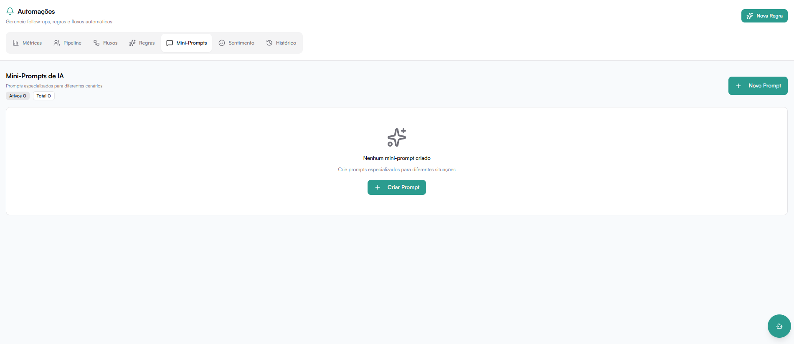

# Mini-Prompts de IA

A aba **Mini-Prompts** dentro do módulo **Automações** permite criar **prompts reutilizáveis para a IA**, que podem ser utilizados nas regras automáticas do sistema.

Esses prompts funcionam como **instruções especializadas**, permitindo orientar a IA sobre **como gerar ou adaptar mensagens automaticamente** em diferentes situações.

Localização no sistema:

**Automações → Mini-Prompts**



---

## O que são Mini-Prompts

Mini-prompts são **instruções configuráveis para a IA**, criadas para orientar a geração de mensagens automáticas dentro das regras de automação.

Eles servem para:

- Definir **tom de comunicação**
- Ajustar **tipo de abordagem**
- Criar **mensagens inteligentes e contextualizadas**
- Padronizar respostas automáticas
- Facilitar reutilização em várias regras

Em vez de escrever instruções em cada regra, você cria **mini-prompts reutilizáveis**.

---

## Visão Geral da Página

Na tela principal são exibidos:

- Indicadores **Ativos** e **Total** de prompts cadastrados
- Lista de mini-prompts com nome, descrição e toggle de ativação
- Botões **Editar** e **Excluir** para cada prompt


Quando não existem prompts criados, o sistema exibe a mensagem:

```
Nenhum mini-prompt criado
Crie prompts especializados para diferentes situações
```


---

## Ativar e Desativar Mini-Prompts

Cada mini-prompt possui um **toggle** para ativá-lo ou desativá-lo individualmente, sem precisar excluí-lo.

- Toggle **ligado** → prompt disponível para uso nas regras
- Toggle **desligado** → prompt ignorado pelas automações

---

## Criar um Mini-Prompt

Para criar um novo mini-prompt, clique em **+ Novo Prompt** (no topo direito) ou em **+ Criar Prompt** (quando a lista está vazia).

Isso abrirá o formulário de criação.


---

## Estrutura de um Mini-Prompt

Ao criar um mini-prompt, você deverá preencher os seguintes campos:

---

### Nome

Define o **nome identificador do mini-prompt**.

Esse nome será utilizado para selecionar o prompt dentro das regras de automação.

Exemplo:

```
Follow-up interessado
```

Boas práticas:

- Use nomes claros
- Indique o objetivo do prompt
- Facilite a identificação dentro das regras

---

### Descrição (opcional)

Campo opcional usado para explicar **quando o prompt deve ser utilizado**.

Exemplo:

```
Usar quando o lead demonstrou interesse mas não respondeu após 24h.
```

Esse campo ajuda equipes a entenderem **o contexto do prompt**.

---

### Prompt

Este é o **campo principal**, onde você escreve a instrução que a IA deve seguir.

Aqui você define **como a IA deve gerar ou adaptar a mensagem**.

Exemplo de prompt:

```
Escreva uma mensagem de follow-up amigável perguntando se o cliente ainda tem interesse na proposta enviada. 
Use tom profissional, curto e direto.
```

Outro exemplo:

```
Envie uma mensagem educada lembrando o cliente sobre o orçamento enviado anteriormente e perguntando se ele gostaria de tirar dúvidas.
```

:::info
O cenário interno será preenchido automaticamente com o nome escolhido para o mini-prompt.
:::

---

## Editar um Mini-Prompt

Clique em **Editar** no cartão do prompt para abrir o formulário de edição com os mesmos campos da criação.


Após ajustar, clique em **Salvar**.

---

## Como os Mini-Prompts Funcionam

Quando uma **regra de automação utiliza IA**, ela pode chamar um mini-prompt configurado.

O fluxo funciona assim:

1️⃣ A regra é executada  
2️⃣ O mini-prompt é aplicado  
3️⃣ A IA gera a mensagem baseada nas instruções  
4️⃣ A mensagem é enviada ao cliente  

Isso permite mensagens:

- mais naturais
- mais personalizadas
- menos robóticas

---

# Reutilização de Prompts

Uma grande vantagem dos mini-prompts é a **reutilização**.

Um mesmo prompt pode ser usado em várias regras, por exemplo:

- Follow-up após orçamento
- Reativação de cliente
- Lembrete de reunião
- Acompanhamento de proposta

Isso mantém **padronização de comunicação**.
