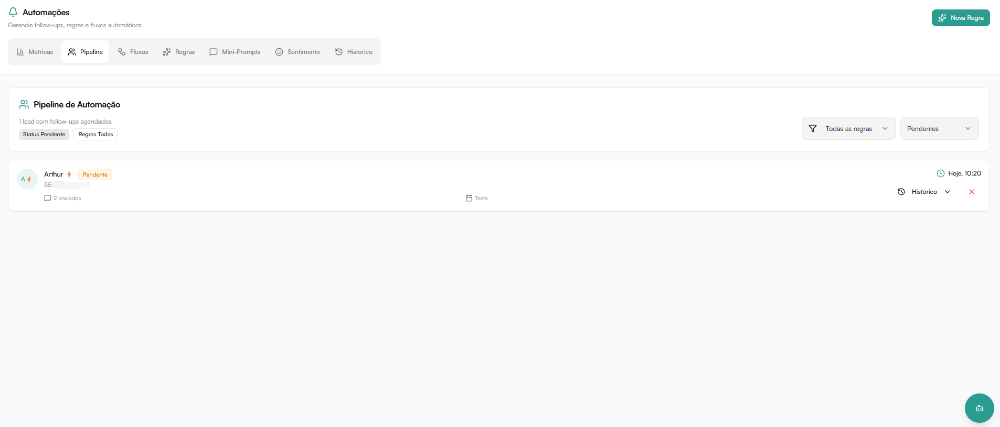

A aba **Pipeline** dentro do módulo **Automações** mostra todos os leads que possuem follow-ups automáticos programados pelas regras do sistema.

É aqui que você acompanha quais contatos estão aguardando o envio de mensagens automáticas.

**Automações → Pipeline**



---

## Visão Geral

Ao entrar na aba, é exibido o título **Pipeline de Automação** com um resumo logo abaixo:

```
0 leads com follow-ups agendados
```

Quando não há nenhum lead com automações ativas, a tela exibe:

> **Nenhum lead em automação**  
> Quando suas regras de follow-up agendarem mensagens para leads, eles aparecerão aqui.

---

## Filtros Ativos

Acima da lista, são exibidas etiquetas com os filtros que estão aplicados no momento. Exemplo:

- `Status Pendente`
- `Regras Todas`
- `Data Todas`

Essas etiquetas mudam conforme os filtros selecionados nos menus à direita.

---

## Filtros Disponíveis

No canto superior direito existem três menus de filtro:

### Todas as regras

Filtra os leads por uma regra específica de automação.

Opções disponíveis:
- Todas as regras
- Cada regra criada aparece listada individualmente (ex: Reengajamento - Cliente (30min), Boas-vindas - comprador/fornecedor, etc.)

---

### Todas as datas

Filtra os leads pelo período dos follow-ups agendados.

Opções disponíveis:
- Todas as datas
- Hoje
- Últimos 7 dias
- Últimos 30 dias
- Período personalizado

---

### Status

Filtra os leads pelo estado atual da automação.

Opções disponíveis:
- Todos
- **Pendentes** → follow-up ainda será enviado
- **Enviados** → mensagem já foi disparada
- **Respondidos** → cliente respondeu após o envio
- **Falharam** → houve erro no envio
- **Cancelados** → automação foi interrompida

---

## Estrutura de Cada Item

Quando há leads no pipeline, cada linha exibe:

- **Nome do contato** — nome do lead que está na automação
- **Telefone** — número vinculado à conversa
- **Status** — situação atual da automação (ex: Pendente)
- **Regra associada** — qual regra está sendo aplicada ao lead
- **Quantidade enviada** — quantos follow-ups já foram disparados
- **Próxima execução** — quando ocorrerá o próximo envio automático (ex: Hoje, 10:20)

---

## Ações por Lead

Cada item do pipeline pode ter ações disponíveis:

### Histórico
Visualiza os eventos da automação para aquele contato, incluindo mensagens enviadas, respostas recebidas e etapas concluídas.

### Remover do Pipeline
Cancela a automação para aquele lead. Após a remoção, os follow-ups futuros deixam de ser enviados e a regra para de acompanhar o contato.

Útil quando:
- O lead já foi atendido manualmente
- O cliente pediu para parar os contatos
- A automação não faz mais sentido para aquele caso
