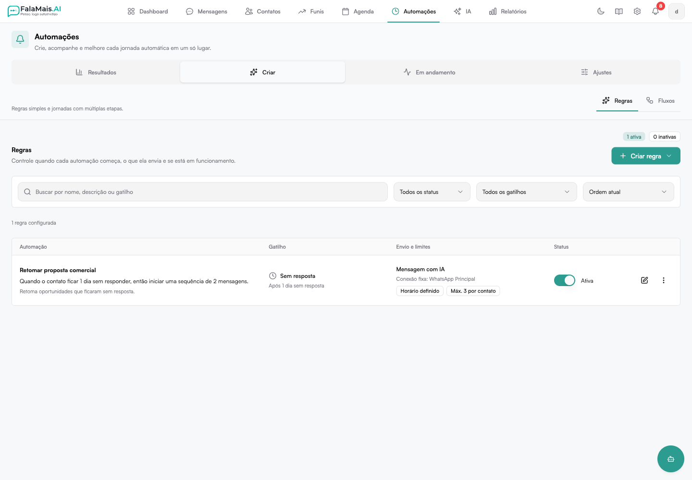
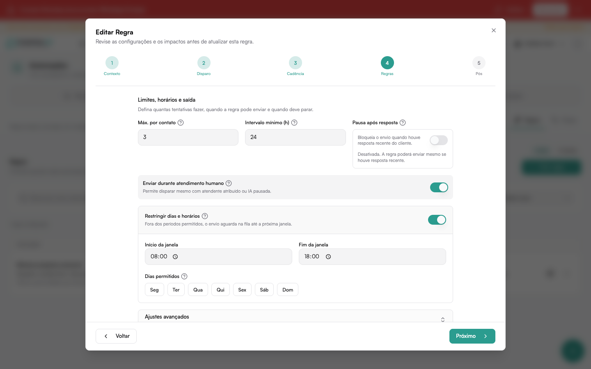

# Regras

As **Regras** automatizam follow-ups com uma cadência definida. Elas controlam
quando agir, quem pode receber, qual mensagem usar e quando interromper os
próximos envios.

Localização:

**Automações → Criar → Regras**

## Lista de regras

A página mostra:

- quantidade total e ativa
- busca por nome ou descrição
- ordenação por prioridade, nome, gatilho ou status
- resumo em linguagem humana de cada regra
- estado ativo/inativo
- atalhos para editar e consultar resultados

Quando existem regras, há um único botão **Nova regra**. Se a consulta falhar,
a tela informa o erro e oferece **Tentar novamente** em vez de mostrar uma
lista vazia.

## Criar uma regra

Clique em **Nova regra** e escolha:

- **Usar um template** — começa com uma estrutura pronta
- **Começar do zero** — configura todos os passos manualmente

Quando ainda não há nenhuma regra, essas duas opções aparecem na orientação
inicial da página.

## Biblioteca de templates

A biblioteca organiza os modelos em uma lista e uma prévia detalhada. É
possível buscar e filtrar por:

- **Objetivo** — por exemplo, reengajar, lembrar, qualificar ou acompanhar
- **Segmento** — geral, saúde, jurídico, imobiliário, educação, serviços ou
  varejo
- **Recurso** — IA, mensagem rápida, template oficial, mídia e pós-ações

A prévia informa:

- gatilho e canal compatíveis
- quantidade e sequência dos passos
- o que já vem configurado
- o que ainda precisa ser escolhido na sua empresa
- mensagem de exemplo e cenário recomendado

Clique em **Usar este template** para abrir o editor. Nada é ativado sem sua
revisão.

## Etapas do editor

O criador segue cinco etapas.

### 1. Contexto

Defina nome, resumo, conexões permitidas, conexão de envio e fallback. O resumo
do editor acompanha as escolhas e mostra o alcance da regra.

### 2. Disparo

Escolha o evento que inicia a regra:

- sem resposta
- tag adicionada
- etapa alterada
- sentimento detectado
- janela oficial de 24 horas
- entrada ou saída de lista

Também é possível restringir por lista, tag, etapa, funil, automação ou regra
anterior.

O atraso aceita minutos, horas ou dias, com limite de **365 dias**.

### 3. Cadência

Cada passo contém:

- nome interno
- intervalo até o envio
- tipo de resposta
- instrução complementar
- instrução reutilizável da IA, quando aplicável

Tipos de resposta disponíveis:

- IA gera a mensagem
- template oficial
- mensagem rápida

Uma regra pode ter até **12 passos**. Ao trocar a unidade de minutos, horas ou
dias, o editor preserva a duração configurada.

:::info[WhatsApp Oficial]
Fora da janela de 24 horas, selecione explicitamente um template oficial
aprovado. O sistema não converte uma mensagem livre automaticamente.
:::

### 4. Regras

Configure:

- máximo de envios por contato
- intervalo mínimo entre disparos
- pausa depois de uma resposta
- horário e dias permitidos
- política de reentrada
- condições de saída
- envio durante atendimento humano, quando esse comportamento for desejado

### Enviar durante atendimento humano

Ative **Enviar durante atendimento humano** quando o follow-up deve continuar
mesmo com um atendente atribuído à conversa ou com a IA de atendimento pausada.

Com essa opção ativa:

1. uma mensagem enviada pelo atendente reinicia o prazo da próxima tentativa;
2. a conversa continua elegível enquanto estiver em atendimento humano;
3. a IA prepara o follow-up considerando as mensagens recebidas como falas do
   **Cliente** e todas as mensagens enviadas como falas do **Atendente**;
4. uma resposta do cliente antes do horário cancela o envio pendente.

O limite máximo de envios, o intervalo mínimo, os dias e os horários da regra
continuam valendo normalmente.

Quando a opção está desativada, a intervenção humana mantém o comportamento de
interromper ou reagendar o follow-up de acordo com a configuração atual.

Se o horário estiver habilitado, o início precisa ser anterior ao fim. Quando a
restrição de horário está desligada, os dias ocultos não bloqueiam o envio.

### 5. Pós

Adicione ações executadas depois do follow-up, como aplicar tags, mover etapa,
pausar a IA ou notificar a equipe.

## Validação por IA

Quando ativada, a IA reavalia o contexto imediatamente antes do envio. Se o
follow-up não fizer mais sentido, ele não é enviado e o motivo disponível
aparece em **Em andamento** e no **Histórico**.

Mensagens geradas pela IA também passam por uma proteção contra repetição de
instruções internas. Quando houver apenas uma suspeita, uma revisão semântica
da IA pode:

- aprovar a mensagem original;
- reescrever a mensagem uma única vez e validá-la novamente;
- bloquear o envio com uma justificativa segura.

Se a revisão estiver indisponível ou a versão reescrita continuar insegura, a
mensagem não é enviada. Os prompts internos e o conteúdo suspeito não são
mostrados nem guardados no histórico.

## Avisos antes de salvar

O editor impede salvar quando encontra, entre outros casos:

- mensagem rápida sem uma seleção real
- atraso maior que 365 dias
- mais de 12 passos
- janela de horário invertida
- campo obrigatório ausente
- combinação incompatível com a conexão escolhida

Avisos de alcance amplo ou compatibilidade aparecem antes da ativação para que
a equipe possa revisar a configuração.

## Editar, ativar e desativar

Clique em **Editar** para abrir a mesma sequência de cinco etapas. O seletor da
lista ativa ou desativa a regra sem apagar sua configuração.

As alterações entram em vigor depois de salvar. Consulte **Resultados** para
acompanhar métricas e histórico, ou **Em andamento** para ver os contatos e
próximas ações.
