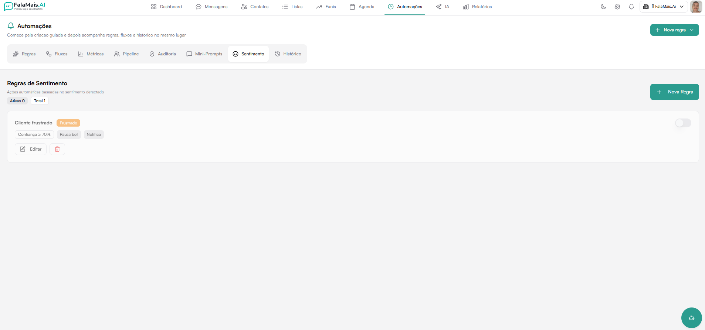
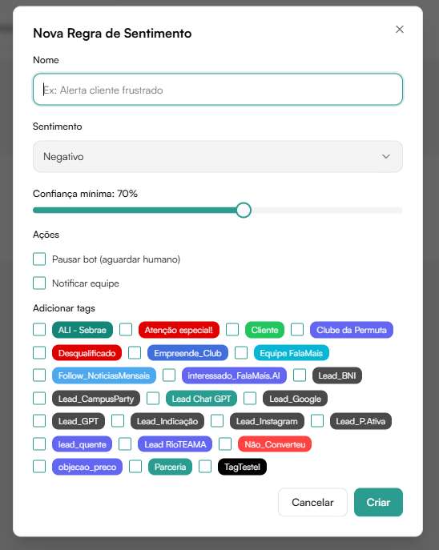
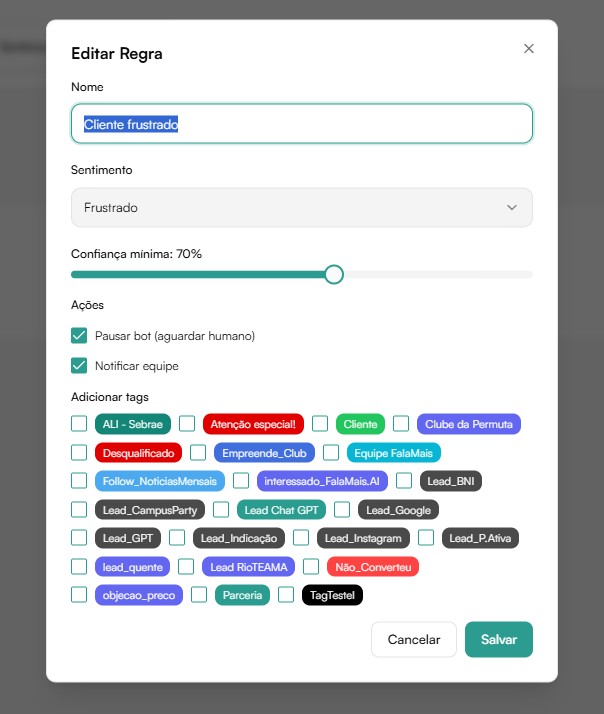

# Regras de Sentimento

A aba **Sentimento** dentro do módulo **Automações** permite criar **regras automáticas baseadas no sentimento detectado** nas mensagens dos clientes.

Quando a IA identifica um sentimento específico com determinado nível de confiança, as ações configuradas são executadas automaticamente — como pausar o bot ou notificar a equipe.

Localização no sistema:

**Automações → Sentimento**



---

## Visão Geral da Página

Na tela principal são exibidos:

- Indicadores **Ativos** e **Total** de regras cadastradas
- Lista de regras com nome, sentimento detectado, limiar de confiança e ações configuradas
- Toggle para ativar ou desativar cada regra individualmente
- Botões **Editar** e **Excluir** para cada regra

Botão principal:

```
+ Nova Regra
```

---

## Criar uma Regra de Sentimento

Clique em **+ Nova Regra** para abrir o formulário de criação.



---

## Estrutura de uma Regra

### Nome

Identificador da regra, usado para reconhecê-la na lista.

Exemplo:

```
Alerta cliente frustrado
```

---

### Sentimento

Define qual sentimento detectado pela IA irá disparar a regra.

Opções disponíveis no dropdown:

- **Negativo**
- **Frustrado**
- (outros sentimentos conforme configuração da conta)

---

### Confiança Mínima

Define o **percentual mínimo de certeza** que a IA precisa ter para acionar a regra.

O valor é ajustado por um slider e o padrão é **70%**.

Exemplo:

```
Confiança mínima: 70%
```

Quanto maior o valor, mais precisa precisa ser a detecção antes de a regra ser ativada.

---

### Ações

Definem o que acontece quando a regra é acionada. As opções são:

| Ação | Descrição |
|------|-----------|
| **Pausar bot (aguardar humano)** | O bot é pausado e a conversa aguarda atendimento humano |
| **Notificar equipe** | A equipe recebe uma notificação sobre o sentimento detectado |

Ambas as ações podem ser combinadas.

---

### Adicionar Tags

Permite aplicar **tags automaticamente** ao contato quando o sentimento for detectado.

As tags disponíveis são as já cadastradas no sistema. Basta marcar as desejadas.

---

## Editar uma Regra

Clique em **Editar** no cartão da regra para abrir o formulário de edição com os mesmos campos da criação.



Após ajustar, clique em **Salvar**.

---

## Ativar e Desativar Regras

Cada regra possui um **toggle** que permite ativá-la ou desativá-la sem precisar excluí-la.

- Toggle **ligado** → regra ativa, acionada automaticamente quando o sentimento for detectado
- Toggle **desligado** → regra pausada, sem efeito nas conversas

---

## Exemplo de Regra

| Campo | Valor |
|-------|-------|
| Nome | Cliente frustrado |
| Sentimento | Frustrado |
| Confiança mínima | 70% |
| Ações | Pausar bot + Notificar equipe |
