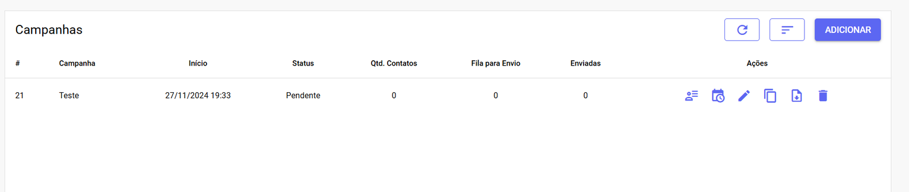
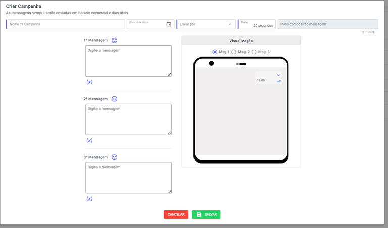
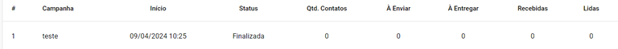
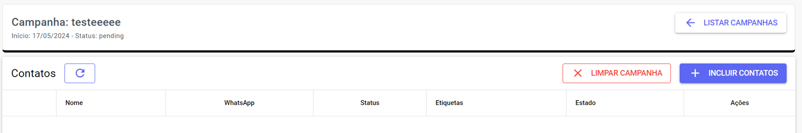
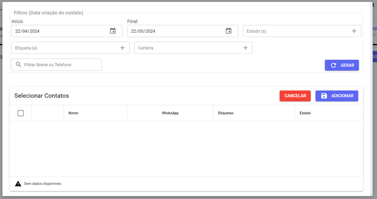

# Gestão de Campanha 

<iframe width="700" height="410" src="https://www.youtube.com/embed/wgAnz6WYZzI?si=_qHcC0_5LmvshF0V" title="YouTube video player" frameborder="0" allow="accelerometer; autoplay; clipboard-write; encrypted-media; gyroscope; picture-in-picture; web-share" referrerpolicy="strict-origin-when-cross-origin" allowfullscreen></iframe>

---

:::warning Dica
**Intervalo Fixo vs. Aleatório**

A funcionalidade de **Campanha** utiliza um intervalo de tempo fixo e pré-definido entre cada envio.

O seu principal diferencial é a **flexibilidade** para enviar **variações** de **mensagens** e associar dados específicos da campanha a cada disparo.

Se a sua necessidade é ter um **intervalo** **aleatório** entre os envios (ex: entre 10 e 30 segundos), a função correta a ser utilizada é a de **Disparo em Massa.**
:::

Essa ferramenta te permite **multiplas** **possibilidades** de **abordagem**. Aqui é possível fazer Disparos Programados de WhatsApp.

## Criar Campanha

Clique em **Adicionar** no canto superior da tela

Assim que selecionar esse botão, um **pop up** se abrirá para que você preencha as informações. Veja o exemplo:

Conheça os campos de preenchimento:

| Campo                         | Descrição                                                                 |
|------------------------------|---------------------------------------------------------------------------|
| **Nome da Campanha**            | Defina a forma como irá identificar essa campanha de marketing. Esse nome estará visível apenas para os Administradores. |
| **Data/Hora Início**            | Determine a data e hora de início do envio dessa campanha.                |
| **Enviar por**                   | Escolha qual canal/conexão será responsável por esse envio.               |
| **Delay**                        | Defina o tempo de envio entre cada mensagem. Lembre-se que essa janela de tempo é contada em segundos. |
| **Mídia Composição Mensagem**    | Você pode inserir um arquivo de mídia para ser enviado junto à campanha. |
| **1ª, 2ª e 3ª Mensagem**         | Crie o texto que será enviado, podendo ser até 3 mensagens diferentes, que o sistema irá enviar aleatoriamente. Essas mensagens podem conter o nome personalizado do cliente e emojis. |
| **Visualização**                 | Visualize como ficará a sua campanha vista pelo celular. Aqui você consegue ver as 3 mensagens de forma separada. |

As mensagens sempre serão enviadas em **horário** **comercial** e dias úteis. Clique em **Salvar** para finalizar o cadastro da campanha e pronto!

:::tip dica
**Atenção**: A Ordem de Envio das Mensagens é **Aleatória**

Ao configurar uma campanha com **múltiplas** **mensagens** (1ª, 2ª e 3ª Mensagem), o sistema fará o envio de apenas **uma** delas de forma **aleatória** para cada contato.
:::

## Gerencie as Campanhas

Na parte inferior do painel de Campanhas, você pode **visualizar** informações como: **Nome da Campanha, Data de Início, Status, Quantidade de Contatos, Quantidade de Mensagens Pendente Envio e Entrega, Quantidade de Mensagens Recebidas e Lidas.**

Além dessas informações, você encontra o campo de **Ações**. Conheça um pouco mais cada uma delas abaixo:

## Lista de Contatos da Campanha

Clique no botão **Lista de Contatos da Campanha**

Em seguida, você verá a seguinte tela:

No topo da tela é possível visualizar o **Nome da Campanha, Data de Início e Status**. Além disso, também há o botão Listar Campanhas, para voltar a tela inicial de Campanhas.

Logo abaixo você tem os botões para **Atualizar os Dados, Remover todos os Contatos da Campanha e Incluir Contatos.**

Clicando em **Incluir Contatos**, se abrirá um pop up para buscar os contatos que deseja incluir na campanha. Veja o exemplo:

Conheça os tipos de filtro de busca:

| Campo                     | Descrição                                                                 |
|---------------------------|---------------------------------------------------------------------------|
| **Início e Final**            | Janela temporal onde os contatos foram criados.                           |
| **Estado(s)**                 | Filtre os contatos através dos estados cadastrados.                       |
| **Etiqueta(s)**              | Filtre os contatos através das etiquetas atribuídas.                      |
| **Carteira**                  | Escolha os usuários aos quais esses contatos estão vinculados.            |
| **Filtrar Nome ou Telefone**  | Use o campo de busca para procurar os contatos por nome ou número do WhatsApp. |

Para ativar os filtros, clique no botão Gerar. Abaixo você tem a lista de contatos já cadastrados na sua plataforma. Na caixa de seleção, escolha os contatos que deseja incluir na campanha e clique em Adicionar para finalizar.

## Programar Envio

Clique no botão **Programar** Envio

Assim que acionado, o status da campanha muda de Pendente para **Programado**. Além disso, o botão de programar muda para **Cancelar** Campanha. Se desejar cancelar o envio, basta clicar nessa opção.

Você pode **Duplicar** **Campanhas** no botão abaixo:

Ou **Baixar** **Relatórios** Completos da campanha:

## Editar e Excluir

O botão de **editar** reabre o pop up de criação da campanha, para alguma **correção** de informações ou conteúdo. Já o botão com a **lixeira** **exclui** a campanha **permanentemente**.

