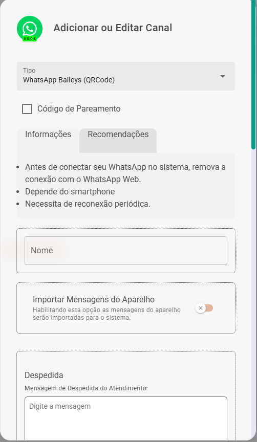
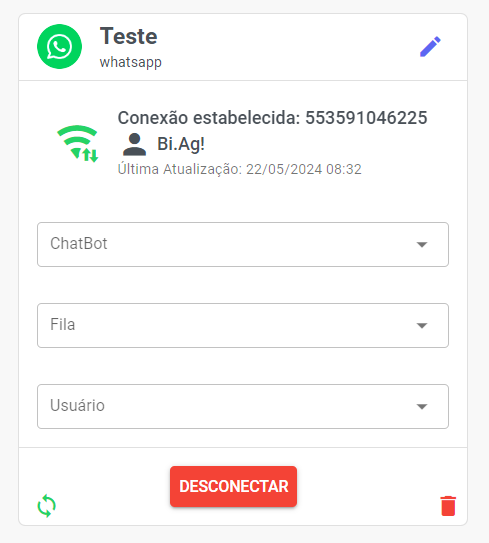

# Primeiro Passo

O primeiro e mais crucial passo é decidir qual **canal** você deseja conectar. Sua escolha definirá as **funcionalidades**, o **método** de **autenticação** e a **estabilidade** da sua comunicação.

Observe a lista abaixo e selecione o canal que melhor atende às suas necessidades. Lembre-se de que, para o WhatsApp, você deverá escolher entre a **API Oficial (WABA)**, que oferece maior robustez, ou uma das **APIs Não Oficiais** baseadas em QR Code (**Baileys, Evolution, Meow, WebJs**), que geralmente são mais simples de configurar.

* WhatsApp Oficial (WABA)
* WhatsApp Baileys (QRCode)
* WhatsApp Evolution API (QRCode)
* WhatsApp Meow API (QRCode)
* WhatsApp WebJs (QRCode)
* Webchat
* Hub NotificaMe (Face, Insta, WebChat e Email)
* Telegram
* Wavoip

Nesta seção, você visualiza a lista de todas as conexões da sua empresa utilizadas para realizar os atendimentos.

## Nova Conexão

Para adicionar uma nova conexão clique em **Adicionar Canal** no canto superior direito na tela de Canais.

Assim que selecionar esse botão irá abrir um pop-up para que você preencha as informações do seu canal.

Veja a seguir:

| Campo | Descrição |
| :--- | :--- |
| **Tipo** | Escolha entre **WhatsApp Oficial (WABA)**, **WhatsApp Web (QRCode)**, **Telegram**, **Hub Notificame**, **Evolution**, **Wuzapi** ou **Webchat**. |
| **Nome** | Insira um **nome** para identificar esse canal. |
| **Importar Mensagens do Aparelho** | Caso queira importar as mensagens do aparelho para o sistema. |
| **Mensagem de Despedida do Atendimento** | Digite uma **mensagem para finalizar os atendimentos**. Nesse campo você pode inserir **variáveis** como: **Nome**, **Saudação** ou **Protocolo**. Para isso basta clicar no **(X)** no canto inferior do campo. |

## Configurações do Canal

Se necessário, você pode prosseguir com as configurações complementares do seu canal abaixo.

## Gerenciar Canais

Na listagem de canais que você possui, você pode editar as informações do seu canal clicando no ícone do lápis, você pode excluir o canal clicando no ícone de lixeira.

### ChatBot

Em ChatBot você pode escolher o Fluxo que usará como padrão para o atendimento desse número. Voce pode atribuir apenas um fluxo para cada número/conexão.

### Fila

Em Fila você pode escolher uma Fila que usará como padrão para o atendimento desse número.

### Usuário
Em Usuário você pode escolher uma Usuário que usará como padrão para o atendimento desse número.

Por último, você encontra as opções de **sincronização**, **desconexão** e **exclusão**, respectivamente.

## Transfêrencia de Canais

Você poderá **transferir** os atendimentos entre canais.

Ao selecionar o canal de origem para a transferência, você também deve escolher o canal de destino que receberá os atendimentos.

---

> Essa ação é irreversível.
> 
> A transferência de atendimentos pode apresentar problemas de sincronia, caso o volume de atendimentos seja alto ou entre tipos (APIs) diferentes de canais. Ness caso, realize um backup dos atendimentos antes, e não delete o canal antigo antes de ter certeza de que todos os atendimentos foram transferidos.

---

