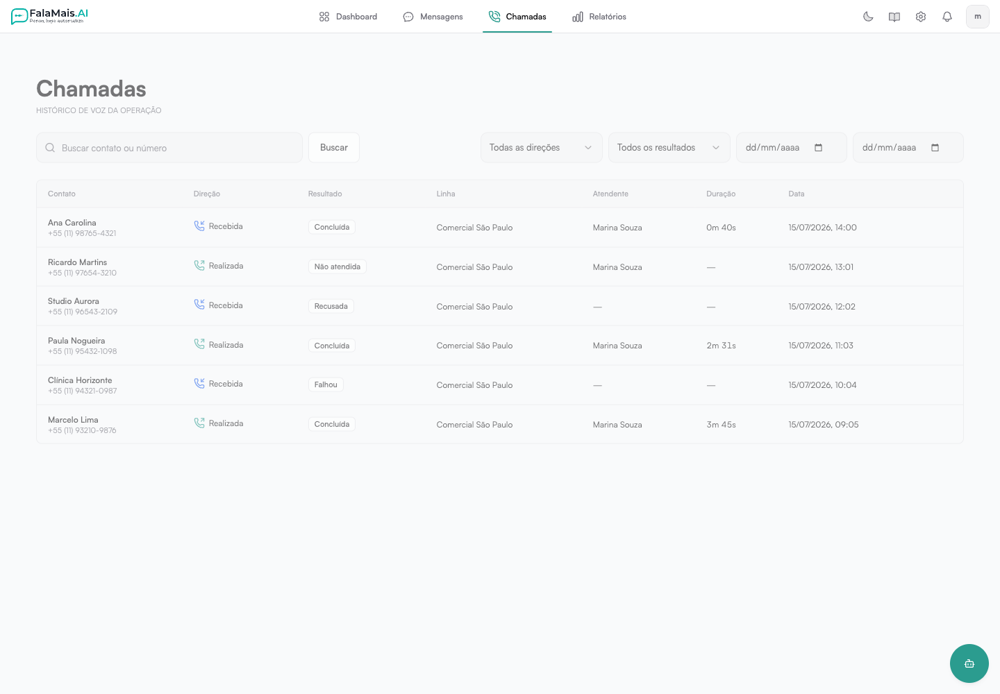

# Chamadas pelo WhatsApp

Contas habilitadas podem iniciar e receber chamadas do WhatsApp dentro do
FalaMais.AI. A telefonia funciona em linhas **UAZAPI** configuradas com Wavoip;
os canais da API Oficial continuam operando normalmente para mensagens.

## Antes de começar

Você precisa de:

- uma linha UAZAPI conectada no FalaMais.AI;
- um dispositivo ativo no Wavoip e o token correspondente;
- a permissão **Gerenciar chamadas** para fazer a ativação;
- as permissões de chamada adequadas para cada função da equipe.

A disponibilidade começa por contas selecionadas. Se a seção **Chamadas** não
aparecer, entre em contato com o suporte para verificar a liberação.

## Ativar chamadas em uma linha

1. Acesse **Configurações → Canais**.
2. Localize a linha UAZAPI que será usada.
3. Na seção **Chamadas**, clique em **Ativar**.
4. Informe um nome fácil de reconhecer e o token do dispositivo Wavoip.
5. Clique em **Salvar**.
6. Copie o endereço de webhook exibido e cadastre-o no painel Wavoip.
7. Aguarde o status mudar de **Pendente** para **Pronta**.

O endereço do webhook é mostrado somente durante a ativação ou rotação. Guarde-o
em local seguro e não envie o token ou esse endereço por mensagens.

### Estados da linha

- **Pendente** — o FalaMais.AI ainda aguarda a primeira confirmação do dispositivo.
- **Pronta** — dispositivo e webhook foram validados; a linha pode fazer chamadas.
- **Atenção** — o dispositivo está conectado, mas apresenta instabilidade.
- **Com erro** — revise o dispositivo no painel Wavoip.
- **Desativada** — a linha não inicia nem recebe novas chamadas.

## Fazer uma chamada

1. Abra uma conversa em **Mensagens**.
2. Clique no ícone de telefone no cabeçalho da conversa.
3. Confirme o contato e selecione a linha de saída.
4. Verifique o microfone e clique em **Ligar**.

Durante a conversa, a barra de chamada permanece visível. Nela você pode
silenciar o microfone ou encerrar a ligação sem perder o contexto do atendimento.

## Receber uma chamada

Quando uma ligação chega, o FalaMais.AI mostra o contato, a linha e a empresa.
Clique em **Atender** ou **Recusar**. Se o sistema estiver aberto em várias abas,
somente uma delas assume a chamada para evitar ações duplicadas.

Permita o uso do microfone quando o navegador solicitar. Se o áudio não ficar
disponível, revise a permissão do site nas configurações do navegador e tente
novamente.

## Consultar o histórico

Acesse **Chamadas** no menu lateral. A lista permite:

- buscar por contato ou número;
- filtrar ligações recebidas ou realizadas;
- filtrar pelo resultado;
- escolher um período;
- consultar linha, atendente, duração e data.

O histórico respeita as permissões **Ver chamadas próprias** e **Ver chamadas
da equipe**.

## Permissões da equipe

Em **Configurações → Usuários → Funções**, ajuste conforme a responsabilidade
de cada perfil:

- **Realizar chamadas**;
- **Atender chamadas**;
- **Ver chamadas próprias**;
- **Ver chamadas da equipe**;
- **Gerenciar chamadas**, para ativar linhas e trocar credenciais.

Por segurança, mantenha **Gerenciar chamadas** somente com administradores ou
responsáveis técnicos.

## Trocar o token ou o webhook

Volte a **Configurações → Canais → Chamadas → Configurar**. Você pode informar
um novo token ou escolher **Gerar novo webhook**. Ao gerar outro endereço, o
anterior para de funcionar; atualize o painel Wavoip imediatamente e aguarde a
linha voltar ao status **Pronta**.

Para interromper a telefonia naquela linha, escolha **Desativar**. As mensagens
do canal continuam funcionando.

Veja também: [Canais — WhatsApp](configuracao/canais.md) e
[Funções e permissões](configuracao/usuarios/funcao.md).
