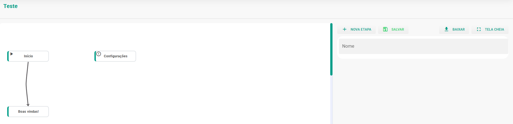
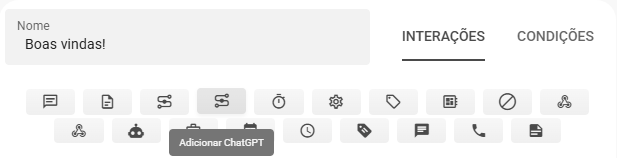
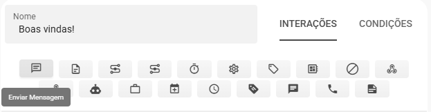
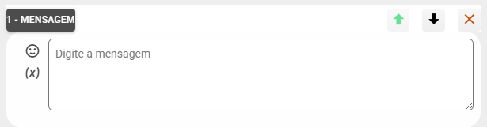
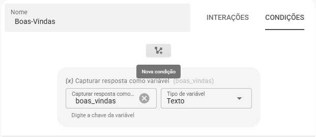
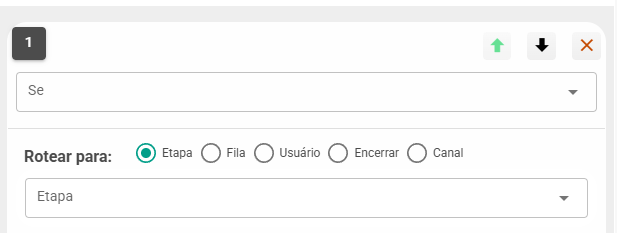

# Criação de Fluxo

Para criar um novo fluxo de ChatBot, clique em **Adicionar**, informe um nome e defina se o fluxo ficará **ativo**. Opcionalmente, você pode inserir um **número de teste** — enquanto esse número estiver configurado, apenas ele receberá respostas deste fluxo.

:::tip Dica
A opção *Número de teste* é útil para validar o comportamento do fluxo sem impactar usuários reais. Insira um número que você possui para testar as respostas e o fluxo de mensagens.
:::

Ao abrir o editor do fluxo você encontrará, por padrão, três blocos (nós):

- **Início**
- **Configurações**
- **Boas‑Vindas**



Cada nó tem uma função específica:

- **Início**: representa o primeiro contato do cliente com o sistema. Nesse nó o número do cliente é registrado e, em seguida, o fluxo encaminha automaticamente para o bloco **Boas‑Vindas** (o rótulo deste nó pode ser alterado posteriormente).
- **Configurações**: contém opções adicionais para ajustar comportamentos e parâmetros do fluxo, permitindo maior personalização.
- **Boas‑Vindas**: exibe a primeira mensagem ao cliente e direciona os próximos passos do fluxo conforme as regras e personalizações que você definir.

Esses três blocos formam a base do fluxo, e a partir deles você pode adicionar novos nós e ramificações conforme a necessidade do atendimento.

## Fluxo ChatBot com IA

Para utilizar a IA como fluxo de ChatBot, selecione o nó de Boas-Vindas (você pode renomear o nome do nó).

Para ativar respostas baseadas em IA, selecione o nó **Boas‑Vindas** e clique no quarto ícone da barra de ações (veja img/imagem abaixo):



Isso adicionará uma interação com o ChatGPT. Para que a IA responda corretamente, você precisa configurar:

| Campo | Descrição |
|------|----------|
| **API Key** | A chave de integração com o ChatGPT. Podemos fornecer a API Key — solicite ao suporte caso ainda não a possua. |
| **Prompt para o ChatGPT** | Texto que orienta a IA sobre o contexto, tom e regras de resposta (veja mais abaixo). |
| **ID da Organização** | Pode deixar em branco. Não será necessário. |

### O que é o Prompt?

O prompt é o conjunto de instruções que guia a IA a responder de forma adequada ao seu negócio. Inclua no prompt informações como: descrição da empresa, horário de atendimento, canais de contato, perguntas frequentes e exemplos de respostas desejadas. Quanto mais claro e contextualizado for o prompt, melhores serão as respostas geradas.

Para facilitar a criação e os testes, disponibilizamos um **Gerenciador de Prompts**. Para obter acesso, entre em contato com a equipe de suporte; eles fornecerão as credenciais e as orientações necessárias.

Também oferecemos um guia com boas práticas para elaboração de prompts — consulte: [**Guia de Boas Práticas**](../../chatBot/guiaIA.md).

Ao final da criação, lembre de salvar as alterações no botão **Salvar**.

## Fluxo ChatBot Básico

Para criar um fluxo básico e mais "robotizado" — onde o cliente escolhe entre opções (por exemplo: digite 1 para suporte, 2 para atendimento comercial) — você deve adicionar interações de mensagem e ramificações que tratem cada escolha.

### Passo 1 - Adicionar a mensagem inicial

Para inserir uma mensagem, clique no primeiro ícone da barra de ações (img/imagem abaixo):



Será criado um bloco do tipo **Mensagem**, onde você digita o texto que o cliente receberá ao iniciar a conversa. O editor aceita emojis e variáveis.



Se houver mais de uma interação, você pode reordená-las com as setas (cima/baixo) ou excluir uma interação quando necessário.

Exemplo de mensagem:

```txt
Bom dia.
Digite 1 para receber informações sobre carros.
Digite 2 para receber informações sobre casas.
```

### Passo 2 - Criar condições para ramificar o fluxo

Para direcionar o cliente conforme a resposta, crie condições. Acesse o painel de condições:



O painel contém controles para definir novas condições e capturar a resposta do cliente:

| Campo | Descrição |
|------|----------|
| **Nova Condição** | Cria uma nova regra de roteamento. |
| **Capturar resposta** | Salva a resposta do cliente em uma variável (por exemplo: `boas_vindas`, gerada a partir do nome do nó). |
| **Tipo de variável** | Define o tipo de dado esperado (texto, número). |

Ao clicar em **Nova Condição**, você verá uma interface para configurar o critério:



No campo **Se** há duas opções principais:

- **Qualquer resposta**: qualquer conteúdo enviado pelo cliente ativa a rota configurada.
- **Respostas**: permite comparar a resposta com um valor específico (ex.: **Igual a** → `1`). Se a condição for atendida, o cliente é roteado para a etapa escolhida.

### Passo 3 - Roteamento para outra etapa

Para enviar o cliente a uma etapa diferente, crie uma nova etapa com o botão **Nova Etapa**, defina um nome e selecione essa etapa na opção de roteamento da condição.

Esses passos permitem montar menus simples e fluxos ramificados; combine mensagens, condições e etapas para criar experiências mais completas.
