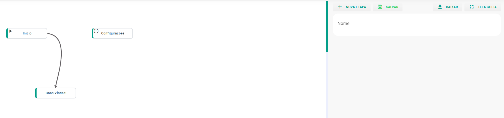
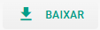
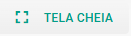
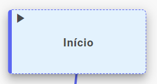
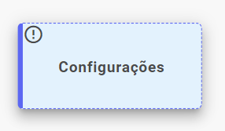
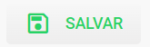
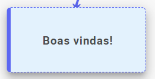
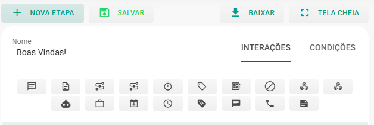
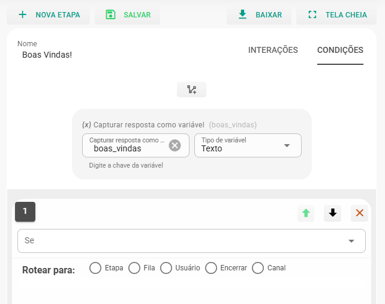
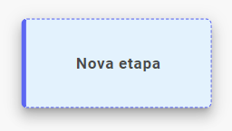

# Etapas para Criação de um Fluxo de Chatbot

Este documento descreve, de forma prática e ampliada, o processo de criação de um fluxo no construtor visual do chatbot. A ideia é apresentar a tela, os principais elementos (nós), as configurações mais importantes e boas práticas para validar e publicar seu fluxo.

## Visão geral da tela

Ao abrir o construtor você verá a área de trabalho (canvas) onde os blocos/nós são posicionados e conectados para representar a lógica de atendimento.

No canto superior direito há controles úteis para trabalhar com o fluxo:

| Ação | O que faz |
|------|----------|
| Baixar | Exporta o fluxo em formato JSON (útil para backup ou importação em outro ambiente).  |
| Expandir | Maximiza a área do editor para facilitar a edição em telas pequenas ou fluxos maiores.  |

Além desses, normalmente você terá botões para salvar, testar, desfazer/refazer e publicar.

## Componentes principais (nós)

Os fluxos são montados a partir de nós que representam ações, mensagens, decisões e integrações. Abaixo estão os nós mais comuns e como usá-los:

### Início: 

Essa etapa representa o contato inicial do atendimento.

* Caso seja o primeiro contato do cliente, o sistema salvará automaticamente na agenda as informações do cliente;
* O Bot irá interagir nos atendimentos iniciados pelos clientes;
* O Bot irá parar de interagir caso o atendimento seja assumido por um usuário.

### Configurações

Caso queira definir as Configurações desse fluxo. Para isso clique no bloco correspondente.

| Campo | Descrição |
| --- | --- |
| Mensagem de saudação (Fila/Usuário) | Quando o bot direcionar o atendimento para uma fila ou usuário, essa mensagem será enviada. Nesse caso você pode incluir emoji na mensagem. |
| Se nenhuma resposta esperada for enviada | Essa exceção será aplicada caso a resposta enviada pelo cliente não corresponda aos valores esperados conforme condições da etapa. Nesse caso você pode incluir emoji na mensagem. |
| Palavra chave para iniciar o fluxo | Essa interação será acionada quando o cliente enviar a palavra chave definida, e o cliente será encaminhado para a Fila/Usuário configurados. Ou seja, ao receber essa mensagem, o bot ativa novamente |
| Ausência de resposta | Após o tempo determinado (minutos), se o cliente não responder, o bot realizará o encaminhamento para uma Fila, Usuário ou encerrará o atendimento. |
| Mensagem de Ausência | Após o tempo determinado, se o cliente não responder, o bot enviará essa mensagem. |
| Máximo de Tentativas do Bot | Uma vez excedido o número máximo de retentativas de pergunta/resposta, caso o cliente não envie uma respota válida, o bot irá realizar o encaminhamento para uma Fila, Usuário ou encerrará o atendimento. |
| Direcionamento na primeira interação | Essa interação será acionada na primeira interação com o cliente, e o cliente será encaminhado para a Fila/Usuário configurados. |
| Se estiver fora do horário de atendimento | Essa interação será acionada caso o cliente envie uma mensagem fora do horário de atendimento, e o cliente será encaminhado para a Fila/Usuário configurados. |
| Auto Distribuir Atendimento | Nessa opção você tem duas alternativas: **Não**, permanecendo desativada a opção; ou **Aleatória**, onde definirá um Usuário de forma aleatória para os usuários da fila. |
| Encerrar Atendimento | Caso o cliente digite algumas das informações esperadas, o atendimento será encerrado. Para cadastrar a palavra que será o gatilho para encerrar o atendimento, basta digitá-la e apertar Enter. |
| Mensagem de Encerramento (Fila/Usuário) | Quando o bot terminar o atendimento, seja para uma Fila ou um Usuário, essa mensagem será enviada. Nesse caso você pode incluir emoji na mensagem. |

Ao concluir o preenchimento, clique em **Salvar**.

### Boas Vindas!

Edite a mensagem de Boas Vindas clicando no bloco a seguir:

Ao clicar, a lateral do seu painel de edição do fluxo ficará assim:

Na etapa de **Interações** você pode adicionar mensagens de texto, algum arquivo, adicionar um delay, adicionar uma etiqueta ao contato, chamar um webhook get, iniciar um novo fluxo, adicionar TypeBot ou ChatGPT, adicionar uma nota, adicionar um sms, adicionar uma demanda, adicionar ao google agenda, adicionar uma oportunidade, adicionar a uma etapa kanban.

Ao clicar na etapa de **Condições**, será preciso selecionar o botão de **Nova Condição** sempre que quiser uma variável. Assim que selecionar, parecerá um campo para inserir a variável desejada.

No campo Se, selecione uma entre as opções:

* **Qualquer Resposta** - Independentemente do que o cliente responder, ele será direcionado para uma outra Etapa do fluxo, Fila de atendimento ou Usuário selecionado.
* **Respostas** - Digite o valor necessário para realizar o mesmo direcionamento e aperte Enter. Esse caso é mais eficaz quando se é apresentado um menu de atendimento ou uma tabela de serviços/produtos.
  
Assim como em Interações, você pode incluir mais de uma condição, movendo a ordem ou excluindo-as. Ao concluir o preenchimento, clique em **Salvar**.

### Nova Etapa

A qualquer momento você pode clicar no botão + Nova Etapa. Isso permite que uma nova etapa seja criada a cada clique dado, surgindo assim um novo bloco no seu painel de edição do fluxo:

Clique no bloco para abrir o painel de edição na lateral da sua tela. Assim como no bloco de Boas Vindas, você pode inserir quantas Interações e Condições desejar.

O mais importante aqui é renomear a nova etapa para facilitar o processo de construção do seu fluxo. Assim você saberá quais fases do atendimento já foram criadas.

Lembre-se que para que uma Nova Etapa seja apresentada ao cliente no atendimento, ela deve estar vinculada as Condições da etapa anterior.

Para gravar as alterações, clique no botão Salvar.

