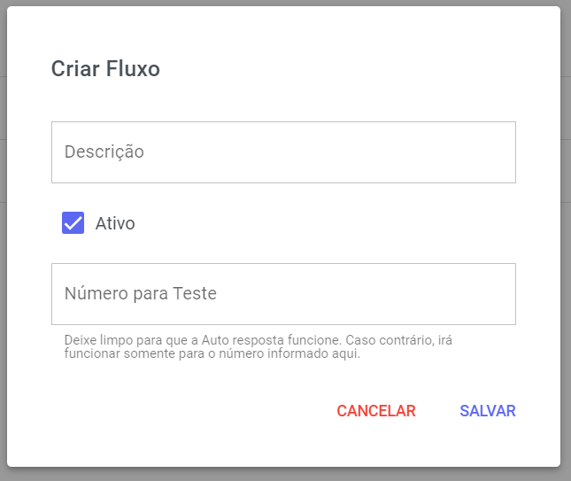
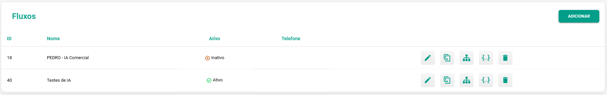
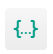

# ChatBot

Nesta seção, você configura e cria novos fluxos de chatbot.

## Gerenciamento de Fluxos

O fluxo é uma forma simplificada e intuitiva de contrução o seu Bot de Atendimento. Nessa seção é possível criar quantos fluxos forem necessários para um melhor funcionamento do seu atendimento.

### Novo ChatBot

Clique em **Adicionar** no canto superior da tela.

Assim que selecionar esse botão, um pop up se abrirá para que você preencha as informações. Veja o exemplo:

| Campo             | Descrição                                                                                                   |
|-------------------|-------------------------------------------------------------------------------------------------------------|
| Descrição         | Insira um nome para identificar esse fluxo de atendimento.                                                  |
| Número para Teste | Deixe limpo para que a Auto Resposta funcione. Caso contrário, irá funcionar somente para o número informado aqui. |

Na parte inferior do painel de **ChatBot**, você poderá visualizar informações como: Nome, Ativo e Telefone.

E logo ao lado você verá os seguintes botões:

| Descrição             | Aparência                                                                                                   |
|-------------------|-------------------------------------------------------------------------------------------------------------|
| Aqui você pode editar as mesmas informações do pop up de cadastro.         |                                                 |
| A função de duplicar o fluxo pode auxiliar no desenvolvimento de um bot similar. |  |
| Aqui é onde você irá desenvolver o fluxo do atendimento. |  |
| Caso tenha o arquivo em ***json***, importe aqui. | |
| Exclua o fluxo de atendimento. | |

## Construtor de Fluxo - Conceitos Fundamentais

O construtor trabalha com quatro elementos.

**Fluxo**: é o conjunto de todas as etapas e regras da automação.  
**Etapa (ou Nó)**: é cada “caixa” do fluxo e representa um momento específico da conversa.  
**Interações (Ações)**: são as operações executadas dentro de uma etapa, como enviar mensagens ou adicionar tags.  
**Condições (Regras)**: definem para qual etapa o fluxo segue com base nas respostas do cliente.

### Interações (Ações Disponíveis)

Dentro de cada etapa, você pode combinar uma ou mais interações.

### Comunicação com o Cliente

**Enviar Mensagem de Texto**: envia uma ou mais mensagens sequenciais.  
**Enviar Mídia**: envia documentos, assets/imagens ou outros arquivos.  
**Agendar Mensagem**: programa o envio para uma data e hora futuras (por exemplo, em 30 minutos, no próximo dia ou em uma data personalizada).  
**Enviar SMS**: dispara um SMS usando integrações configuradas como Comtele ou Connecta.  
**Chamar VAPI**: inicia uma chamada de voz automatizada com IA por meio da integração com a VAPI.

### Controle do Fluxo e Atendimento

**Delay**: aplica um atraso em segundos entre mensagens.  
**Adicionar Novo Fluxo**: transfere o contato para outro fluxo.  
**Bloquear Chatbot**: impede novas ativações do chatbot para aquele contato, ideal para finalizar fluxos de qualificação.

### Gestão de Dados e Contatos

**Adicionar Tag**: aplica uma etiqueta ao contato (por exemplo, “lead_qualificado”).  
**Adicionar Kanban**: cria ou mover um card no Funil de Oportunidades.  
**Adicionar Oportunidade**: registra uma oportunidade com etapa, valor e responsável.  
**Adicionar Nota**: insere uma nota interna visível aos operadores.  
**Adicionar Demanda/Razão**: associa um motivo específico ao contato.

### Integrações Externas

**Adicionar Webhook**: envia dados a uma URL externa via GET, POST, PUT ou DELETE, com configuração de headers, body e retentativas.  
**Chamar Typebot**: delega a conversa a um fluxo do Typebot.  
**Chamar ChatGPT (ou outra IA)**: aciona um modelo de IA integrado para interagir com o cliente.  
**Criar Evento no Google Agenda**: adiciona um evento na agenda integrada com título, participantes e data.
