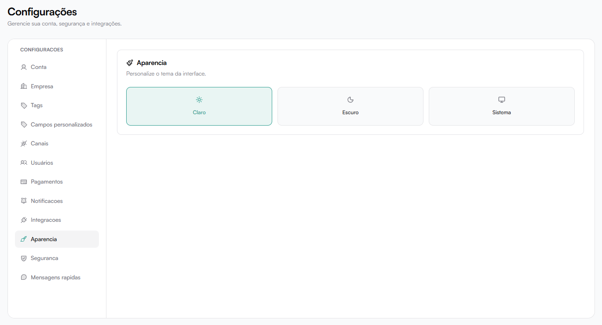

# Aparência

Permite personalizar o tema visual da interface.

Opções disponíveis:
- Claro
- Escuro
- Sistema (segue configuração do sistema operacional)

A alteração é aplicada imediatamente ao usuário atual.
