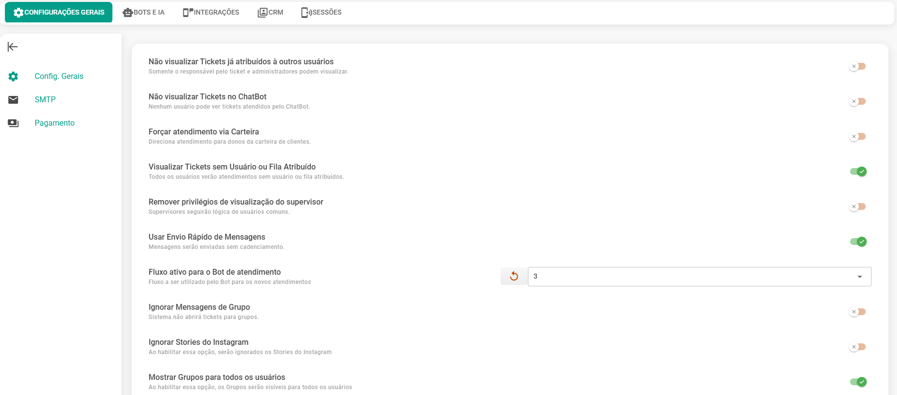
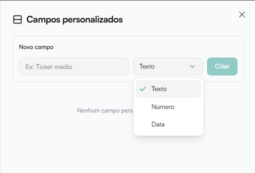

# Campos Personalizados

Permite criar campos adicionais para enriquecer informações dos contatos.

Exemplo de uso:

- Ticket médio
- Origem do lead
- CPF
- Tipo de contrato

Campos personalizados podem ser preenchidos em:

- Tela de contato
- Modais de criação e edição

## Gerenciar Campos

Ao clicar em Gerenciar campos, abre-se o painel lateral.

### Criar novo campo

Campos necessários:

- Nome do campo
- Tipo de campo (ex: Texto, Número ou Data)

Clique em Criar para adicionar.

Caso não existam campos cadastrados, a tela exibirá:

Nenhum campo personalizado criado.

## Quando usar campos personalizados?

Recomendado quando:

- Precisa coletar dados específicos do negócio
- Deseja segmentações mais avançadas
- Utiliza automações baseadas em atributos do contato
