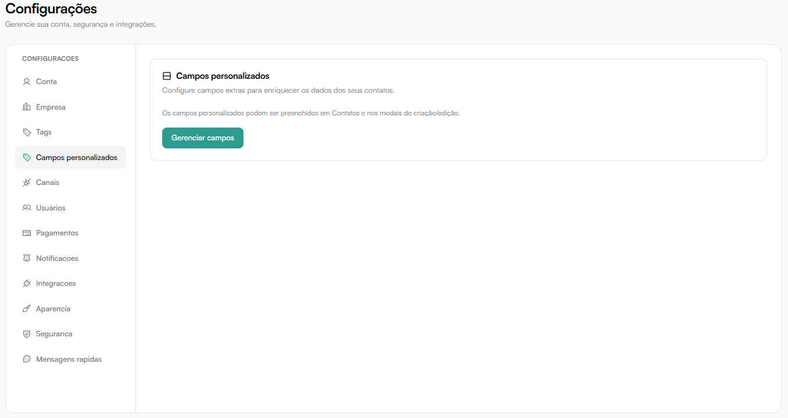
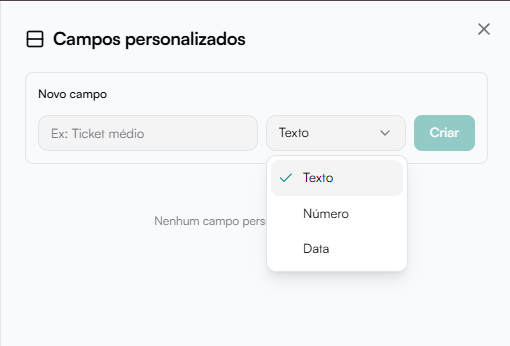

# Campos personalizados

Campos personalizados guardam informações específicas da sua operação que não
existem no cadastro padrão.

Exemplos:

- CPF ou CNPJ
- origem detalhada
- tipo de contrato
- orçamento estimado
- data de renovação
- produto de interesse

## Campos de contatos

Em **Configurações → Campos personalizados**, gerencie os campos usados no
cadastro e nos detalhes dos contatos.

Clique em **Gerenciar campos** para criar, editar ou organizar as definições.

## Campos de negociações

As negociações possuem layout próprio. Abra uma negociação no Funil e, na seção
**Campos personalizados**, clique em **Configurar**.

Você pode:

- seguir o layout padrão da empresa
- ativar um **Layout próprio** para uma negociação
- organizar campos em grupos
- alterar ordem, largura e obrigatoriedade
- usar um template de layout
- salvar a organização atual como template

## Tipos disponíveis em negociações

- **Texto**
- **Número**
- **Moeda (R$)**
- **Data**
- **Seleção**

### Moeda (R$)

O tipo **Moeda (R$)** é indicado para orçamento, receita estimada, custo ou
qualquer outro valor financeiro.

Durante a edição, o campo aplica a máscara brasileira. Por exemplo, `3500`
aparece como **R$ 3.500,00**. O valor continua numérico, permitindo:

- filtrar por igual, maior, menor ou intervalo
- ordenar e comparar valores
- importar a coluna junto com contatos e negociações
- alternar uma definição entre **Número** e **Moeda** sem perder o valor

:::info[Valor principal da negociação]
O campo **Valor** no topo da negociação também usa máscara em reais. Campos
personalizados de Moeda são valores adicionais e não substituem o total
principal.
:::

## Filtros no Funil

Os filtros respeitam o tipo do campo:

- texto usa busca textual
- número e moeda usam comparações e intervalos
- data usa períodos
- seleção usa uma ou mais opções cadastradas

Regras avançadas podem ser combinadas com **E** ou **OU**.

## Importação

Na importação de contatos para um funil, colunas podem ser mapeadas para campos
personalizados da negociação. Valores de Moeda aceitam formatos numéricos
compatíveis e são revisados antes da importação.

## Boas práticas

- Use nomes claros e sem abreviações internas.
- Escolha **Moeda** para valores financeiros e **Número** para quantidades ou
  índices.
- Evite criar dois campos com o mesmo significado.
- Marque como obrigatório apenas o que a equipe realmente precisa preencher.
- Agrupe os campos conforme a etapa do processo comercial.
