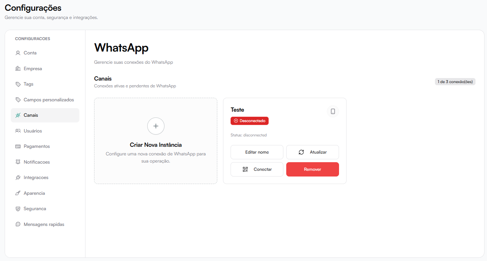

# Canais — WhatsApp

A seção **Canais** permite gerenciar as conexões de WhatsApp utilizadas no sistema.

Você pode:

- Criar novas instâncias
- Conectar via QR Code
- Conectar via API oficial (Meta)
- Atualizar status
- Editar nome da instância
- Remover conexões
- Monitorar limite de conexões

Localização:  
**Configurações → Canais**

---

# Visão Geral da Tela

Na tela principal são exibidas:

- Lista de instâncias criadas
- Status de conexão
- Ações rápidas (Conectar, Atualizar, Editar nome, Remover)
- Contador de conexões utilizadas (ex: 2 de 3 conexões)

## Criar Nova Conexão

Para adicionar um novo canal:

1. Clique em **Criar Nova Instância**
2. Escolha o método de conexão

Você poderá escolher entre:

- QR Code (WhatsApp Web)
- WhatsApp Meta API (API Oficial)

# Métodos de Conexão

### 1. QR Code (WhatsApp Web)

Conexão rápida via espelhamento do WhatsApp Web.

#### Vantagens
- Setup instantâneo
- Não precisa de verificação empresarial
- Processo simples

#### Atenção
- Pode sofrer bloqueios
- Não é a API oficial
- Depende do WhatsApp Web ativo

#### Processo:
1. Definir nome da instância
2. Criar instância
3. Escanear o QR Code
4. Aguardar conexão

O sistema cria automaticamente um ID interno para a instância.

### 2. WhatsApp Meta API (API Oficial)

Conexão oficial via WhatsApp Business Cloud API.

#### Vantagens
- 100% compliant
- Sem risco de ban
- Conexão oficial com Meta

#### Requisitos:
- Conta no Facebook/Meta Business
- WhatsApp Business Account (WABA)
- Número de telefone verificado

#### Processo:
1. Selecionar API Oficial
2. Clicar em **Conectar com Facebook**
3. Autorizar a conta Meta
4. Finalizar integração

## Cartão da Instância

Cada instância exibida na tela mostra:

- Nome da instância
- Status (Conectado / Desconectado / Connecting)
- Ícone do canal
- Ações disponíveis

## Ações Disponíveis

### Editar nome
Permite alterar o nome exibido da instância.

### Atualizar
Atualiza o status da conexão.

Utilizado quando:
- Conexão caiu
- Após escanear QR
- Após configuração da API

### Conectar
Inicia o processo de conexão:

- QR Code → Exibe QR para escanear
- API → Redireciona para autenticação Meta

### Remover Instância

Permite excluir uma conexão ativa.

Antes de remover, o sistema exibe:

- Quantidade de prompts vinculados
- Conversas abertas
- Follow-ups ativos
- Agendamentos
- Integrações relacionadas

#### Migração ao Remover

Antes da remoção definitiva, é necessário:

- Selecionar uma instância de destino

Todos os dados vinculados serão migrados para o canal selecionado:

- Conversas
- Prompts
- Follow-ups
- Agendamentos

Após confirmar, a instância será removida.

## Limite de Conexões

No topo da tela é exibido:

Exemplo:
`2 de 3 conexões`

Isso indica o número de instâncias utilizadas em relação ao limite contratado.

## Status da Instância

Os possíveis estados são:

- Conectado
- Desconectado
- Connecting

O status impacta diretamente no recebimento e envio de mensagens.