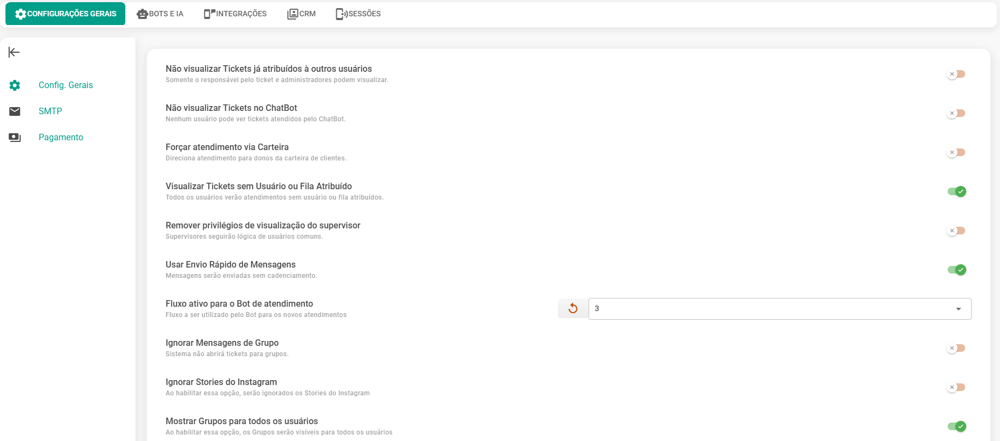

# Configurações Gerais

A seguir apresentamos uma **descrição** detalhada das **configurações** gerais do painel.
Essas opções permitem personalizar o comportamento do sistema de acordo com as necessidades da sua operação, oferecendo maior controle sobre a forma como os atendimentos são exibidos, gerenciados e distribuídos entre os usuários.

| Tipo de Permissão | Descrição |
|-------------------|-----------|
| Não visualizar Tickets já atribuídos à outros usuários | Se ativo, somente o usuário responsável pelo ticket e/ou os administradores visualizarão o atendimento. |
| Não visualizar Tickets no ChatBot | Habilitando esta opção somente administradores poderão visualizar tickets que estiverem interagindo com o ChatBot. |
| Forçar atendimento via Carteira | Caso essa opção esteja ativa, todo contato vinculado a uma carteira será direcionado ao usuário correspondente. Assim, somente os donos da carteira irão atender os clientes recorrentes. |
| Visualizar Tickets sem Usuário ou Fila Atribuído | Habilitando esta opção todos os usuários visualizarão os atendimentos que entrarem na plataforma (invalida os demais filtros e condições). |
| Remover privilégios de visualização do supervisor | Habilitando esta opção, a listagem de tickets do supervisor seguirá a lógica do usuário comum e não mais do administrador. |
| Usar Envio Rápido de Mensagens | Mensagens serão enviadas de forma imediata, sem passar pelo sistema de envio cadenciado. |
| Fluxo ativo para o Bot de Atendimento | Escolhe o fluxo que será utilizado pelo Bot nos novos atendimentos. |
| Ignorar Mensagens de Grupo | O sistema não abrirá ticket para grupos. |
| Ignorar Stories do Instagram | Serão ignorados os Stories do Instagram. |
| Mostrar Grupos para todos os usuários | Os Grupos serão visíveis para todos os usuários. |
| Mostrar Fechados para todos os usuários | Os Tickets Fechados serão visíveis para todos os usuários. |
| Recusar chamadas no WhatsApp | Ligações de áudio e vídeo serão recusadas automaticamente. É possível atribuir mensagem automática após rejeição. |
| Habilitar guia de atendimento de Chatbots | Será adicionada uma guia exclusiva para os chatbots. |
| Fixar conexões no topo do atendimento | Conexões deixarão de flutuar no rodapé e serão fixadas no topo da lista de atendimentos. |
| Forçar usuário atual ao mudar status do atendimento pendente | O ticket manterá o usuário associado quando mudar de aberto para pendente. |
| Mostrar histórico de mensagens | Mostra todas as mensagens associadas ao canal e contato em todos os tickets. |
| Listar atendimentos pela última mensagem | Atendimentos listados pela última mensagem recebida. |
| Desativar integrações externas quando carteirização estiver ativa | Integrações externas (ChatGPT, Typebot etc.) serão desativadas quando carteirização estiver ativa. |
| Habilitar espera no processamento de mensagens com integrações externas | Novas mensagens só serão processadas após resposta da primeira mensagem. |
| Transbordo de Mensagens | Faz transbordo do atendimento carteirizado se o usuário estiver offline. |
| Não atualizar nome ao receber mensagens | O sistema não atualizará o nome do contato em mensagem recebida. |
| Forçar admin no atendimento | Tickets pendentes serão atribuídos ao admin. |
| Usar Plugin de Áudio (Beta) | Utiliza novo plugin de áudio beta. |
| Usar Módulo de Áudio com Ondas (Beta) | Utiliza módulo de áudio com ondas sonoras. |
| Desabilitar controle de assinatura | Usuários não poderão desabilitar a assinatura no atendimento. |
| Controle de Features | Controla funcionalidades de espiar e fechamento forçado para usuários. |
| Forçar definição de demanda no fechamento de atendimento | Exige definição de demanda no fechamento do atendimento. |
| Contador nas tabs superiores (Privados/Grupos) | Usuários visualizarão tickets com mensagens abertas nas tabs superiores. |
| Resolver atendimento sem interação automaticamente | Atendimentos ociosos serão resolvidos automaticamente após tempo definido, com envio de mensagem configurada. |
| Filtrar atendimentos antigos | Filtra atendimentos antigos. |
| Notificações sonoras | Receber notificações de áudio. |
| Persistir Download de Mídias (Baileys) | Tentativas sequenciais de download de mídias recebidas pela API Baileys. |
| Máximo de vezes que a mensagem de horário de atendimento deve ser enviada | Define a quantidade máxima de vezes que a mensagem de ausência será enviada. |
| Quantidade de tickets que devem ser consultados em atendimentos | Define a quantidade de tickets exibidos na tela de atendimento. |
| Quantidade de mensagens que devem ser carregadas no chat interno por atendimento | Define a quantidade de mensagens carregadas no chat interno. |
| Números bloqueados na plataforma | Lista de números que não devem ser atendidos. |
| Enviar mensagens paradas | Envia mensagens paradas no sistema. |
| Resolver Mensagens | Remove mensagens com erro do sistema. |
| Validar Todos os Contatos | Valida o número de todos os contatos do sistema. |
| Atualizar Data das Mensagens Importadas | Atualiza a data das mensagens importadas para o horário original. |
| Atualizar Data dos Tickets | Atualiza a data dos tickets para o horário da mensagem mais recente. |
| Usar horários de atendimento do usuário | Usa os horários de atendimento do usuário para definir o horário do sistema. |
| Permitir pausar atendimento | Permite que o atendimento seja pausado temporariamente. |
| Habilitar envio de mensagem Waba fora da janela (não garante a entrega) | Habilita o envio de mensagens WABA após o envio de qualquer template, mesmo que a janela de conversas não esteja aberta. Não garante a entrega da mensagem. Consulte políticas Waba |

## SMTP

Nessa seção teremos a configuração do SMTP

O **SMTP** (*Simple Mail Transfer Protocol*) é um protocolo de comunicação usado para enviar e-mails pela internet. Ele funciona como um “carteiro digital”: pega a mensagem do remetente e a entrega ao servidor de e-mail do destinatário.

Ativar **SMTP** no sistema significa que ele poderá enviar mensagens automáticas (como notificações, alertas, relatórios ou confirmações) diretamente para os usuários por e-mail.

Para isso, você precisa configurar corretamente:

* **Servidor SMTP** → geralmente fornecido pelo serviço de e-mail (ex: Gmail, Outlook, seu próprio host).
* **Porta SMTP** → porta de comunicação (mais comuns: 587 com TLS, 465 com SSL, 25 sem criptografia).
* **Usuário e Senha** → credenciais da conta de e-mail que fará o envio.
* **Protocolo de Segurança** → define se a conexão usará SSL/TLS para criptografar o tráfego.

| Tipo de Permissão         | Descrição |
|----------------------------|----------------------------------------| 
| Ativar SMTP   | Quando ativo o sistema enviará informações para o e-mail do usuário. Nesse caso, é necessário informar o servidor de e-mail, porta SMTP, usuário de e-mail e senha de e-mail. |
| Servidor               | Servidor de e-mail do seu host |
| Porta SMTP             | Porta de acesso ao servidor SMTP |
| Usuário                | Conta de e-mail |
| Senha                  | Senha do e-mail |
| Protocolo de Segurança | Ativar protocolo seguro. |
