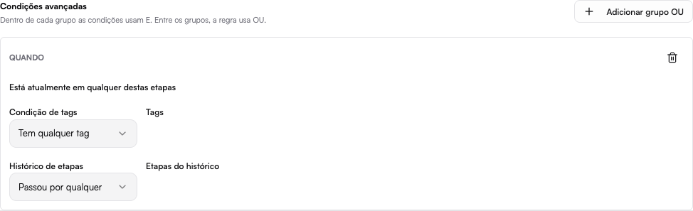

# Hub de Conversão

O **Hub de Conversão** ajuda a entender de onde vêm os seus leads e como eles
interagem com a sua empresa antes e durante o atendimento.

## O que você pode fazer

- Visualizar os **envios de formulário** e filtrar leads por origem.
- Acompanhar a **atividade do contato no site** (páginas e ações).
- Organizar **listas de rastreamento** para segmentar contatos.
- Registrar **conversões de anúncios** e integrá-las com a Meta.

## Formulários

Os formulários capturam novos leads e os trazem para dentro da plataforma já
associados a um contato. Com o **mapeamento inteligente de campos**, os dados
enviados pelo formulário são reconhecidos e direcionados automaticamente para
os campos corretos do contato.

## Listas de rastreamento

As listas de rastreamento permitem agrupar contatos a partir do comportamento
deles — útil para segmentar campanhas e medir resultados.

## Conversões de anúncios

O Hub de Conversão registra conversões originadas de anúncios e pode
sincronizá-las com a Meta, conectando o investimento em mídia ao resultado
real dentro do CRM.

### Condições avançadas

Nas integrações da Meta e do Google Ads, use **Condições avançadas** para enviar
uma conversão somente quando a negociação atender aos critérios comerciais.

Dentro de cada grupo, as condições são combinadas com **E**: todas precisam ser
verdadeiras. Use **Adicionar grupo OU** quando caminhos diferentes também devem
registrar a conversão. Por exemplo:

- está atualmente em **Proposta enviada** e tem a tag **Cliente premium**; ou
- passou por **Demonstração** e está atualmente em **Fechado ganho**.

Cada grupo pode considerar:

- a etapa atual da negociação;
- qualquer tag, todas as tags ou a ausência das tags selecionadas;
- qualquer etapa ou todas as etapas pelas quais a negociação já passou.

Uma regra sem grupos avançados continua funcionando apenas com os critérios
básicos já configurados. É possível criar até dez grupos por regra.

:::tip
Para acompanhar essas oportunidades no funil, veja a página de [Funil](../funil/funil.md).
:::
