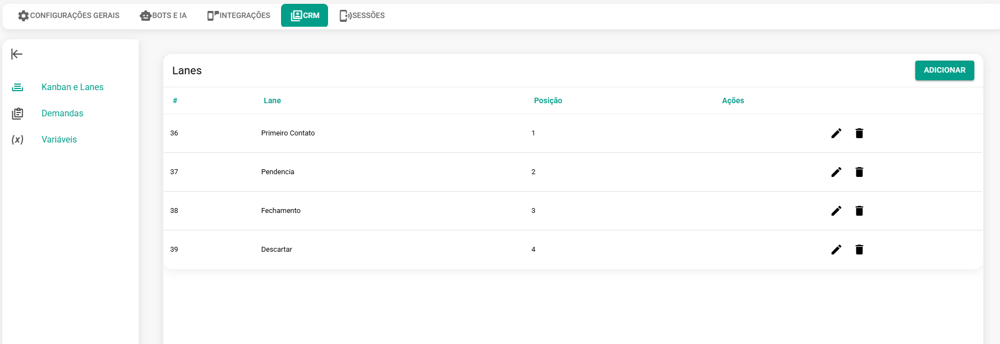
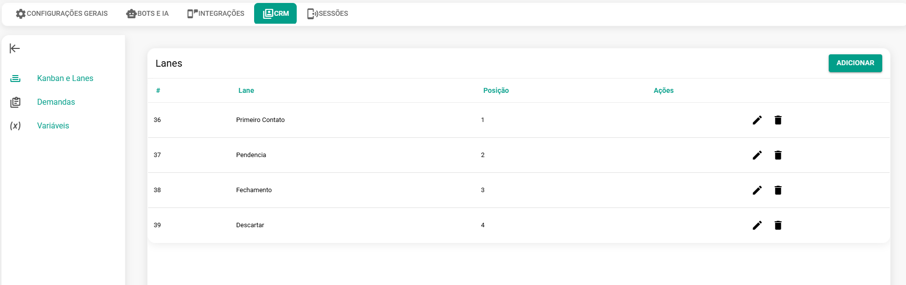
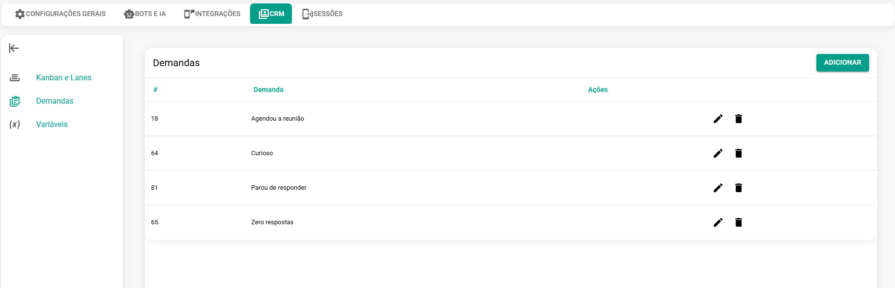
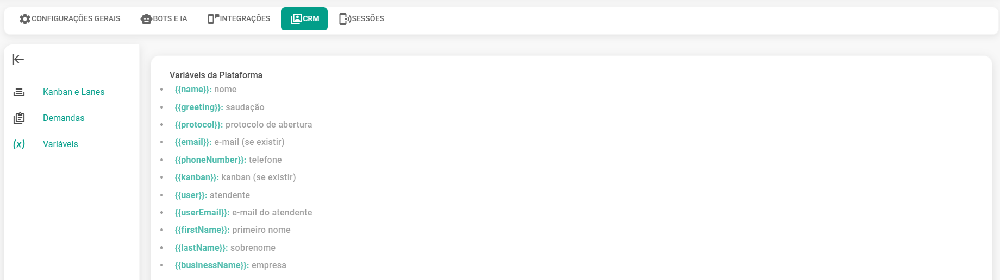

# CRM (Customer Relationship Management)

Gerencie seu Kanban e suas demandas nesta seção. Você também pode consultar todas as variáveis disponíveis no sistema.

## Kanban

Gerencie seu quadro **Kanban** nesta seção: crie novos cards e raias (lanes), edite ou exclua os elementos existentes.

## Demandas

Gerencie suas demandas nesta seção: **crie** novas, **edite** as existentes ou **exclua** as que não são mais necessárias.

## Variáveis

Nessa seção você tem a listagem das variáveis disponíveis no sistema:

| Tipo de Permissão | Descrição |
| :--- | :--- |
| **name** | nome |
| **greeting** | saudação |
| **protocol** | protocolo de abertura |
| **email** | e-mail (se existir) |
| **phoneNumber** | telefone |
| **kanban** | kanban (se existir) |
| **user** | atendente |
| **userEmail** | e-mail do atendente |

