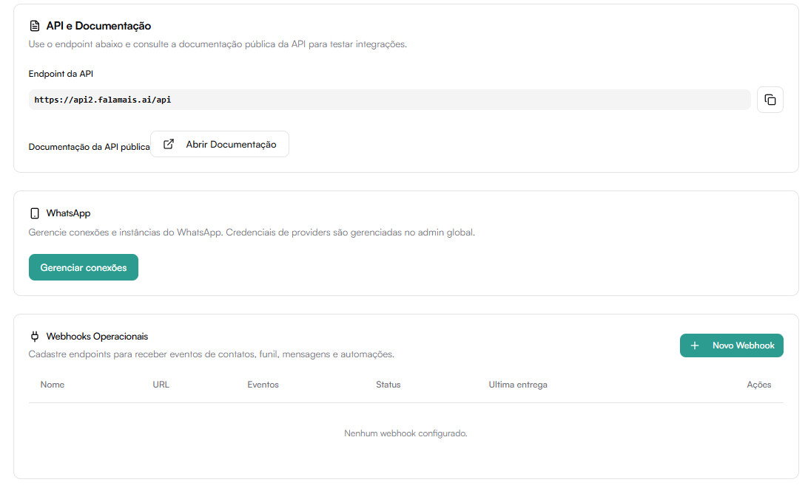

# Integrações

A aba Integrações permite conectar sistemas externos e configurar autenticações técnicas.

## API e Documentação

Exibe o endpoint base da API da plataforma.

Endpoint:
https://api2.falamais.ai/api

Ações disponíveis:
- Copiar endpoint
- Abrir documentação pública da API

Use esta seção para:
- Desenvolver integrações
- Testar endpoints
- Consultar exemplos de requisição

## WhatsApp

Permite gerenciar conexões e instâncias do WhatsApp.

Ação disponível:
Gerenciar conexões

Credenciais de providers são gerenciadas no admin global.

## Webhooks Operacionais

Permite cadastrar endpoints externos para receber eventos da plataforma.

Eventos disponíveis incluem:
- Contatos
- Funil
- Mensagens
- Automações

Informações exibidas:
- Nome
- URL
- Eventos inscritos
- Status
- Última entrega

Para criar um webhook:
Clique em Novo Webhook.

## Chaves de API (API Keys)

Permite criar e gerenciar chaves para autenticar requisições externas.

Campos exibidos:
- Nome
- Prefixo
- Data de criação
- Último uso

Para gerar nova chave:
Clique em Gerar Nova Chave.

:::warning Atenção:
Guarde a chave com segurança.
Não compartilhe publicamente.
:::