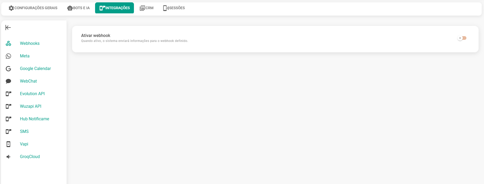
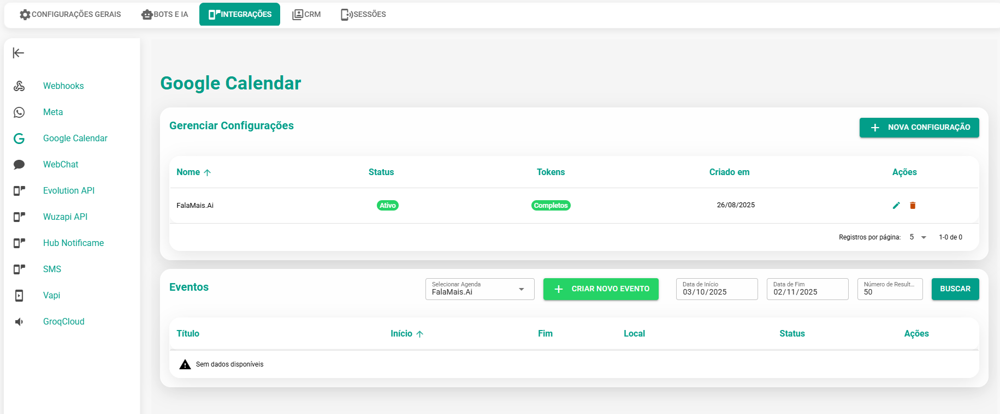
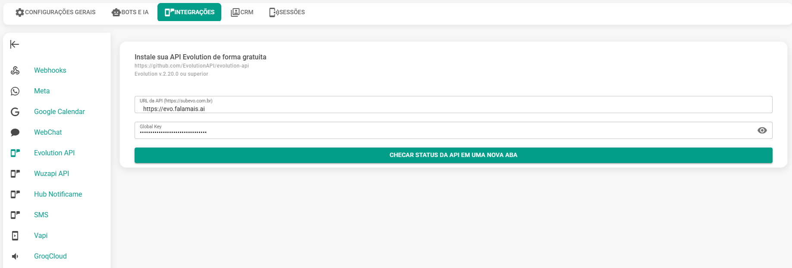
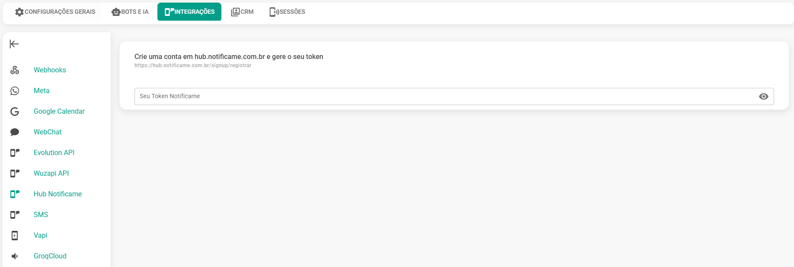
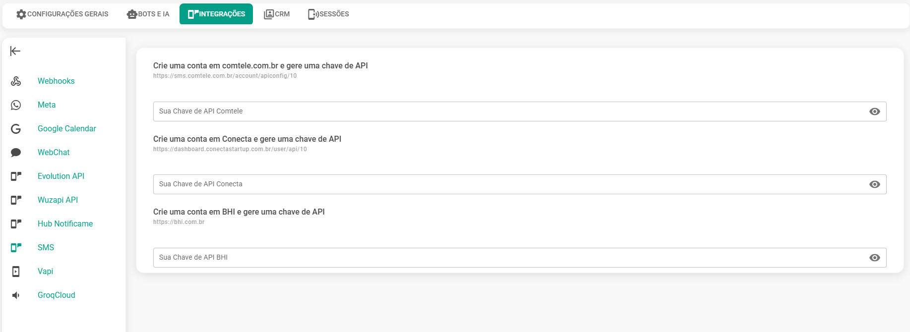

# Integrações

Nessa seção temos as seguinte integrações para serem feitas.

## Webhooks

Nessa seção você tem a opção das seguintes permissões:

| Tipo de Permissão | Descrição |
| :--- | :--- |
| **Ativar Webhook** | Quando ativo, o sistema enviará informações para o webhook definido. Nesse caso é necessário informar a URL do Webhook |
| **Receber mensagens e atendimentos** | Quando ativo, o sistema enviará informações para o webhook definido. |
| **Criar canal/conexão** | Quando ativo, o sistema enviará informações para o webhook definido. |
| **Atualizar canal/conexão** | Quando ativo, o sistema enviará informações para o webhook definido. |
| **Criar usuário** | Quando ativo, o sistema enviará informações para o webhook definido. |
| **Atualizar usuário** | Quando ativo, o sistema enviará informações para o webhook definido. |
| **Criar API** | Quando ativo, o sistema enviará informações para o webhook definido. |
| **Atualizar API** | Quando ativo, o sistema enviará informações para o webhook definido. |
| **Renovar token da API** | Quando ativo, o sistema enviará informações para o webhook definido. |

## Meta

Nessa seção você tem a opção das permissões:

| Tipo de Permissão | Descrição |
| :--- | :--- |
| **Token Webhook** | Token para validação do Webhook na BM da Meta. |
| **Webhook Meta** | URL que deverá ser informada na BM da Meta. | 

Você também poderá testar números associados a sua BM informando os dados abaixo:

| Tipo de Permissão | Descrição |
| :--- | :--- |
| **WABA ID** | Identificação da conta WABA |
| **WABA API Version** | Versão da API Waba | 
| **WABA Token** | Token de acesso a conta WABA |

## Google Calendar

**Integre** sua conta ao Google Agenda (Google Calendar) nesta seção. Para um passo a passo detalhado, consulte nosso vídeo de tutorial.

<iframe width="700" height="410" src="https://www.youtube.com/embed/SuMbPVqucvg?si=eN-Gn08jwd_GTl1x" title="YouTube video player" frameborder="0" allow="accelerometer; autoplay; clipboard-write; encrypted-media; gyroscope; picture-in-picture; web-share" referrerpolicy="strict-origin-when-cross-origin" allowfullscreen></iframe>

## Evolution API

Nessa seção você tem a opção das permissões:

| Tipo de Permissão | Descrição |
| :--- | :--- |
| **URL da API** | Informar a url de instalação da Evolution |
| **Global Key** | Informar a Global Key da Evolution | 

## Wuzapi API

Nessa seção você tem a opção das permissões:

| Tipo de Permissão | Descrição |
| :--- | :--- |
| **URL da API** | Informar a url de instalação da WUZAPI |

## Hub Notificame

Nesta seção você pode cadastrar seu token notificame:

| Tipo de Permissão | Descrição |
| :--- | :--- |
| **Seu token notificame** | Informar o token contratado na [notificame](https://app.notificame.com.br/) |

Se cadastre aqui: [https://app.notificame.com.br/](https://app.notificame.com.br/)

## SMS

Nessa seção você tem a opção das permissões:

Crie uma conta em comtele.com.br e gera uma chave de API:

[https://sms.comtele.com.br/account/apiconfig/1](https://sms.comtele.com.br/account/apiconfig/1)

Crie uma conta em Conecta e gera uma chave de API:

[https://dashboard.conectastartup.com.br/application/login](https://dashboard.conectastartup.com.br/application/login)

Crie uma conta em BHI e gere uma chave de API:

[https://livison.com/](https://livison.com/)

| Tipo de Permissão | Descrição |
| :--- | :--- |
| **Chave de API Comtele** | Token de autenticação para envio de SMS |
| **Chave de API Conecta** | Token de autenticação para envio de SMS |
| **Chave de API BHI** | Token de autenticação para envio de SMS |

## GroqCloud

Nessa seção você tem a opção das permissões:

| Tipo de Permissão | Descrição |
| :--- | :--- |
| **Chave da API** | Informar a chave de API da GroqCloud |
| **Idioma** | Idioma padrão para transcrição |
| **Modelo** | Modelo da IA |

