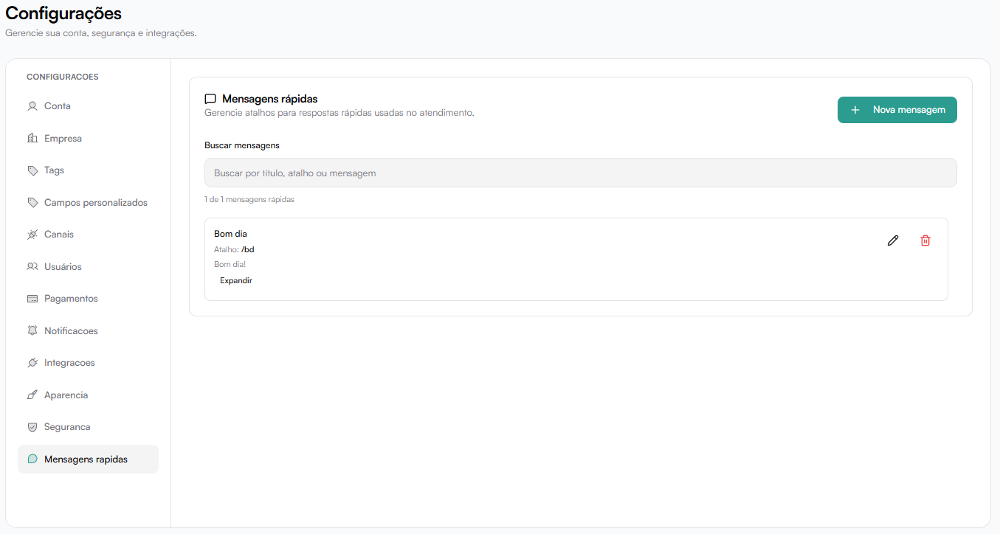

# Mensagens rápidas

Permite criar atalhos para respostas usadas com frequência no atendimento.

Ajuda a:
- Aumentar produtividade
- Padronizar comunicação
- Reduzir tempo de resposta

## Lista de mensagens

Cada mensagem exibe:
- Título
- Atalho
- Conteúdo
- Ações (editar ou excluir)

## Nova mensagem rápida

Para criar:

1. Clique em Nova mensagem.
2. Preencha os campos:

### Título
Nome interno da mensagem.
Exemplo: Boas-vindas

### Atalho
Comando para chamar a mensagem durante o atendimento.

Use:
/
ou
#

Exemplo:
/boas-vindas

### Mensagem
Texto que será enviado ao cliente.

Além de texto simples, uma mensagem rápida pode ter itens avançados, como mídia e botões para WhatsApp via UAZAPI.

Mensagens rápidas também podem ser usadas em cadências de regras de follow-up. Nesse caso, a regra reaproveita a mensagem cadastrada, incluindo texto, mídia, botões e atrasos internos configurados.

:::tip[Áudio como nota de voz]
Áudios anexados em mensagens rápidas saem como nota de voz por padrão quando usados no WhatsApp, inclusive em cadências de follow-up.
:::

## Botões em mensagens rápidas

Use botões quando a resposta precisa conduzir o cliente para uma escolha simples, um link, um código copiável ou uma ligação.

Cada item de botões permite:

- Escrever a mensagem principal.
- Adicionar um rodapé opcional.
- Configurar até três botões.

Tipos de botão disponíveis:

- **Resposta** → envia a opção escolhida de volta para a conversa.
- **Link** → abre uma página externa.
- **Copiar** → facilita copiar um código, cupom ou identificador.
- **Ligar** → inicia uma chamada telefônica.

:::info[Compatibilidade]
Botões em mensagens rápidas são enviados apenas quando a conversa usa uma conexão WhatsApp via UAZAPI. Para outros canais, mantenha uma versão em texto da mensagem rápida.
:::

Após preencher, clique em:

**Salvar**
