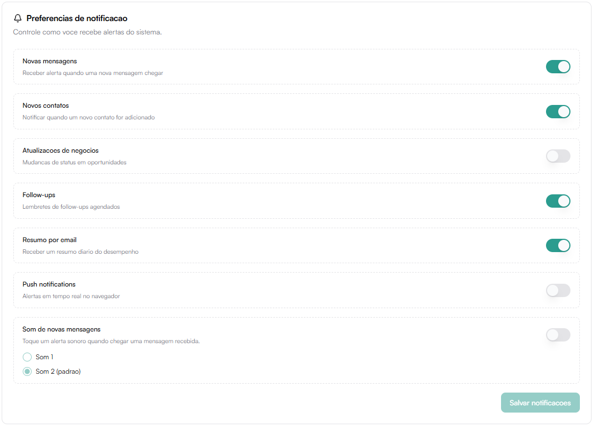

# Notificações

A aba Notificações permite controlar como e quando você recebe alertas dentro da plataforma.

Essas configurações são individuais por usuário e impactam sua experiência operacional diária.

## Preferências de Notificação

Permite ativar ou desativar diferentes tipos de alertas.

### Novas mensagens
Receber alerta quando uma nova mensagem chegar.

Indicado para:
- Atendimento em tempo real
- Operações com alto volume de conversas

### Novos contatos
Notifica quando um novo contato for adicionado.

Útil para:
- Equipes comerciais
- Controle de geração de leads

### Atualizações de negócios
Alerta sobre mudanças de status em oportunidades do funil.

Recomendado para:
- Gestores
- Acompanhamento de negociações

### Follow-ups
Recebe lembretes de follow-ups agendados.

Importante para:
- Não perder oportunidades
- Manter organização comercial

### Resumo por email
Recebe um resumo diário do desempenho por email.

Indicado para:
- Gestores
- Acompanhamento estratégico

### Push notifications
Ativa alertas em tempo real no navegador.

Pode exigir permissão do navegador.

### Som de novas mensagens

Permite ativar alerta sonoro ao receber mensagens.

Opções disponíveis:
- Som 1
- Som 2 (padrão)

Após alterar configurações, clique em:

Salvar notificações

---

## Confirmação de leitura

Define se o sistema deve marcar mensagens como lidas no WhatsApp.

Opção:
- Enviar confirmação de leitura

Quando ativado:
- O cliente verá que a mensagem foi visualizada.

Após alteração, clique em:

Salvar preferências
