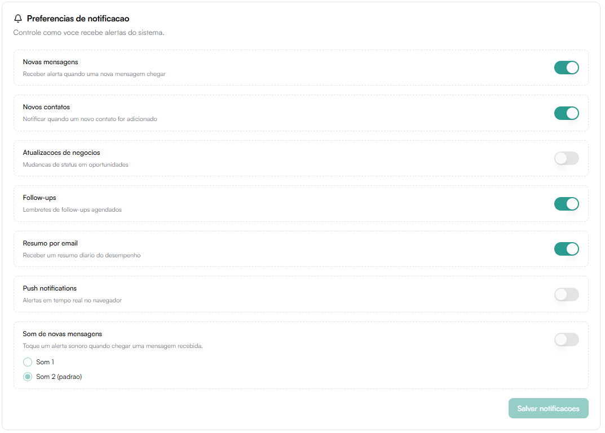
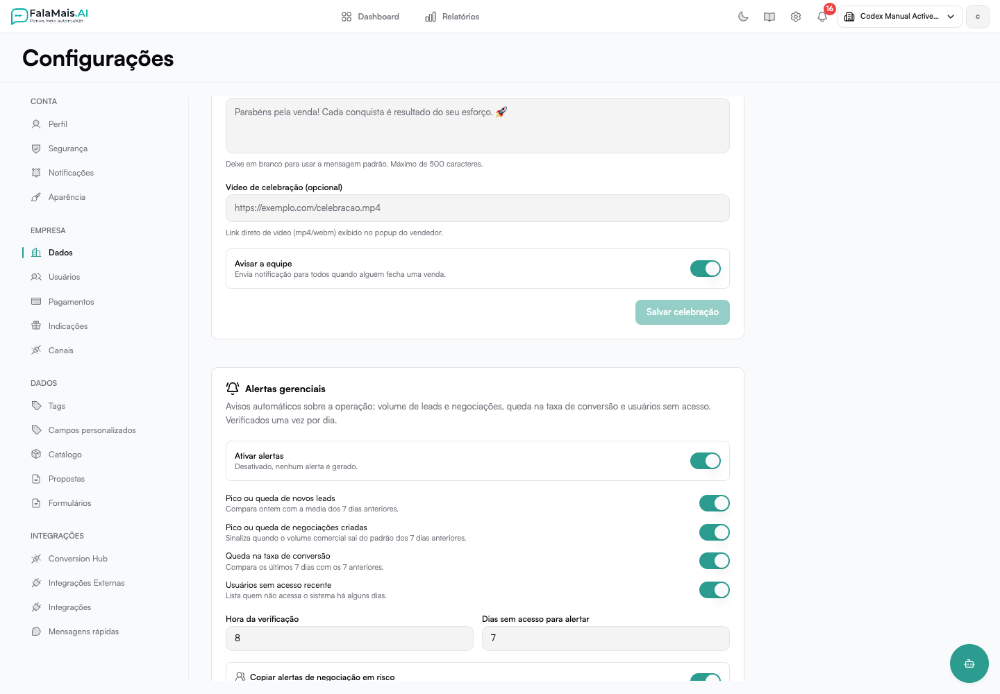

# Notificações

A aba Notificações permite controlar como e quando você recebe alertas dentro da plataforma.

Essas configurações são individuais por usuário e impactam sua experiência operacional diária.

## Inbox do sininho

O sino no topo da plataforma abre uma inbox compacta sem tirar você da tela atual.
Use as categorias para reduzir o ruído e encontrar rapidamente o que precisa de
ação:

- **Todas** — reúne as notificações mais recentes.
- **Tarefas & Agenda** — prazos, tarefas concluídas e eventos.
- **Alertas** — solicitações de atendimento humano e negociações em risco.
- **Avisos** — aniversários, atualizações e demais comunicados.

Notificações de aniversário exibem a ação **Revisar mensagem sugerida**. Ela abre
a conversa com uma saudação pronta no campo de texto, mas o envio sempre depende
da sua revisão e confirmação.

## Cópia dos alertas de negociação em risco

Quem administra a empresa pode abrir **Configurações → Empresa → Alertas
gerenciais** e ativar **Copiar alertas de negociação em risco**.

Selecione as pessoas que devem acompanhar esses alertas além do responsável pela
negociação. Para proteger a visibilidade comercial, a lista aceita apenas
usuários ativos com permissão para ver todas as negociações da equipe. Se a
negociação não tiver responsável, o alerta continua sendo publicado para a
empresa.

O mesmo alerta não é repetido para a mesma pessoa no mesmo dia. Se o envio para
um destinatário falhar, o sistema pode tentar novamente sem duplicar os demais.

## Alerta de volume de negociações

Em **Configurações → Empresa → Alertas gerenciais**, ative **Pico ou queda de
negociações criadas** para acompanhar mudanças relevantes na entrada
comercial. Uma vez por dia, o sistema compara o volume de ontem com a média dos
sete dias anteriores.

O aviso é enviado apenas quando a diferença é significativa e há volume
suficiente para evitar ruído. Ele usa os mesmos destinatários de e-mail e a
mesma opção de central de notificações configurados para os demais alertas
gerenciais.

## Preferências de Notificação

Permite ativar ou desativar diferentes tipos de alertas.

### Novas mensagens
Receber alerta quando uma nova mensagem chegar.

Indicado para:
- Atendimento em tempo real
- Operações com alto volume de conversas

### Novos contatos
Notifica quando um novo contato for adicionado.

Útil para:
- Equipes comerciais
- Controle de geração de leads

### Atualizações de negócios
Alerta sobre mudanças de status em oportunidades do funil.

Recomendado para:
- Gestores
- Acompanhamento de negociações

### Follow-ups
Recebe lembretes de follow-ups agendados.

Importante para:
- Não perder oportunidades
- Manter organização comercial

### Resumo por email
Recebe um resumo diário do desempenho por email.

Indicado para:
- Gestores
- Acompanhamento estratégico

### Push notifications
Ativa alertas em tempo real no navegador.

Pode exigir permissão do navegador.

### Som de novas mensagens

Permite ativar alerta sonoro ao receber mensagens.

Opções disponíveis:
- Som 1
- Som 2 (padrão)

Após alterar configurações, clique em:

Salvar notificações

---

## Confirmação de leitura

Define se o sistema deve marcar mensagens como lidas no WhatsApp.

Opção:
- Enviar confirmação de leitura

Quando ativado:
- O cliente verá que a mensagem foi visualizada.

Após alteração, clique em:

Salvar preferências
