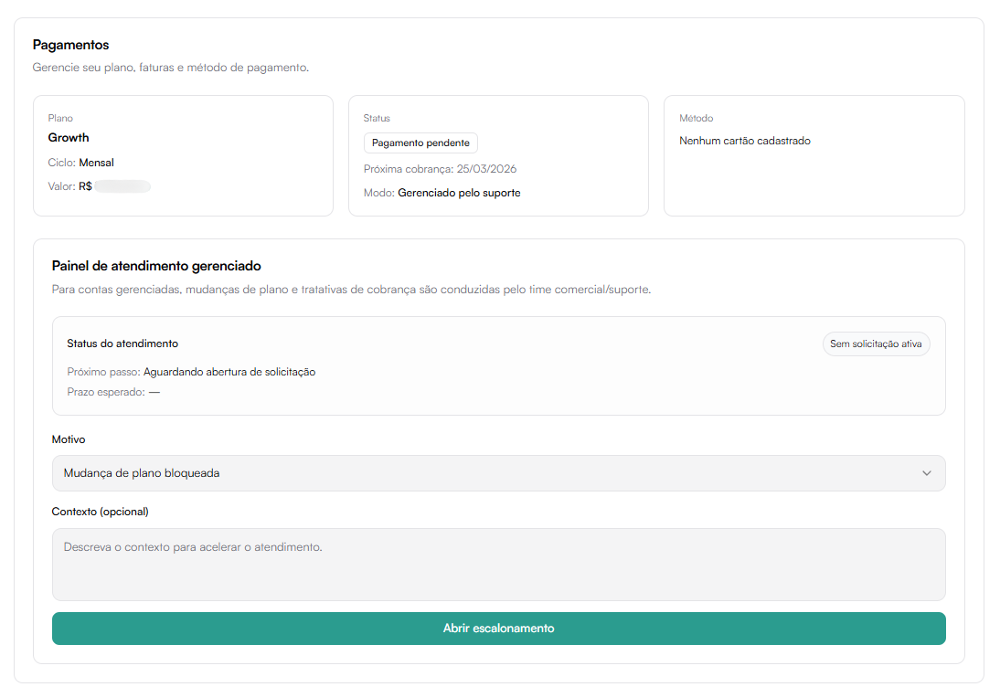

# Pagamentos

A seção **Pagamentos** permite gerenciar informações relacionadas ao plano contratado, status da assinatura, método de pagamento e histórico de faturas.

Localização:  
**Configurações → Pagamentos**

---

## Informações do Plano

No topo da tela são exibidos três cartões principais:

### Plano

Exibe os dados da assinatura atual:

- Nome do plano (ex: Growth)
- Ciclo de cobrança (Mensal / Anual)
- Valor da assinatura

Exemplo:
- Plano: Growth
- Ciclo: Mensal
- Valor: R$ 1.190,00/m

### Status

Indica a situação atual da assinatura:

- Ativo
- Inativo
- Suspenso (quando aplicável)

Também informa o modo de gerenciamento da conta:

- **Gerenciado pelo suporte**
- **Gerenciado pelo cliente (autoatendimento)**

### Método de Pagamento

Mostra:

- Cartão cadastrado
- Ou indicação de que não há cartão registrado

Exemplo:
- "Nenhum cartão cadastrado"

## Modos de Gerenciamento

O comportamento da área de pagamentos muda conforme o modo da conta.

### Gerenciado pelo Suporte

Nesse modo:

- Alterações de plano precisam ser solicitadas
- Tratativas de cobrança passam pelo time comercial
- Mudanças contratuais são mediadas pelo suporte

É exibido o **Painel de Atendimento Gerenciado**, permitindo:

- Escolher motivo da solicitação
- Adicionar contexto
- Abrir escalonamento

Após enviar:
- A solicitação entra em análise
- O status passa a indicar solicitação ativa

### Gerenciado pelo Cliente (Autoatendimento)

Nesse modo, o cliente possui maior autonomia.

A tela exibe:

- Informações do plano
- Botão **Pagar e ativar**
- Botão **Cancelar**

Pode ser exibida também a seguinte mensagem:

> Este plano tem customizações (features e/ou preço). Você pode atualizar o cartão, mas mudanças de plano devem ser feitas pelo suporte.

## Pagar e Ativar

Se houver pendência financeira ou ausência de método de pagamento:

1. Clique em **Pagar e ativar**
2. Abrirá a tela de ativação da assinatura

### Tela: Ativar Assinatura

Permite inserir os dados de cobrança antes de finalizar o pagamento.

Campos solicitados:

- Nome completo
- Email
- CPF ou CNPJ
- Telefone
- CEP
- Número
- Outros dados complementares

Após preencher:

Clique em **Continuar para pagamento**

O sistema processará a cobrança diretamente na plataforma.

### Cancelar Assinatura

O botão **Cancelar** permite iniciar o processo de cancelamento do plano atual.

Observações importantes:

- Pode seguir regras de contrato
- Pode haver período mínimo de fidelidade
- O cancelamento pode impactar acesso a funcionalidades

## Faturas

A seção **Faturas** mostra:

- Histórico de pagamentos
- Últimas cobranças registradas
- Situação das faturas

Caso não existam registros:
> Nenhuma fatura encontrada
