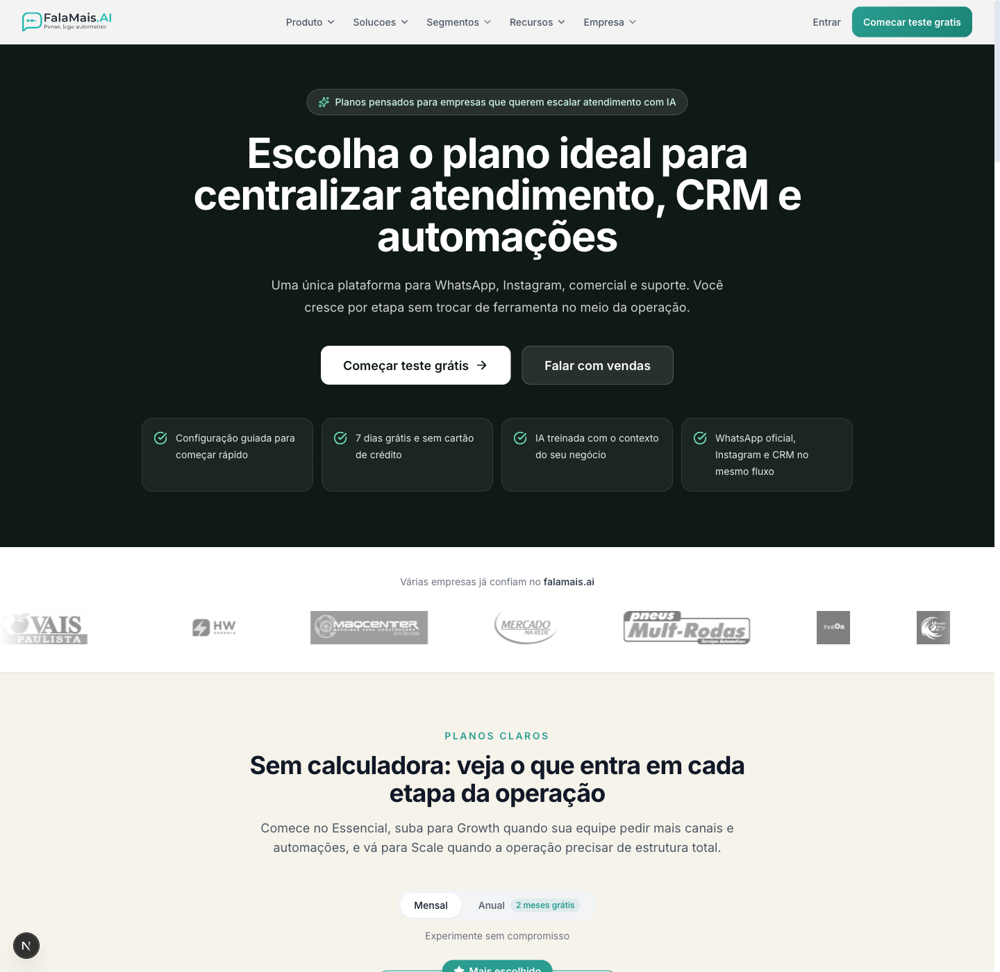

# Planos

A página de **Planos** ajuda você a comparar com clareza o que muda entre os
níveis **Essencial**, **Growth** e **Scale**.

Ela foi organizada para facilitar a decisão sem exigir cálculo manual: você vê
o valor de cada plano, os limites principais e quais recursos entram conforme a
operação cresce.

Localização:
**Site institucional → Planos**

---

## Como usar a página de planos

Na página você encontra:

- visão geral dos três planos
- preço mensal e opção anual
- comparação lado a lado dos recursos
- explicação rápida de quando cada plano costuma fazer sentido
- CTA para teste grátis ou contato com vendas

## O que comparar primeiro

Para decidir com mais rapidez, observe estes pontos:

### 1. Usuários

Veja quantas pessoas da sua equipe vão usar a plataforma no dia a dia.

### 2. Canais

Compare quantos canais de atendimento sua operação precisa hoje e no curto
prazo.

### 3. Automações e IA

Se você quer mais fluxos, mais autonomia e recursos avançados de IA, olhe com
atenção a evolução do Essencial para o Growth e para o Scale.

### 4. Estrutura comercial

A comparação mostra quando entram recursos voltados para uma operação mais
robusta, como mais automações, mais canais e suporte mais próximo.

## Quando vale falar com vendas

Falar com vendas faz mais sentido quando:

- você quer desenhar a melhor estrutura para sua equipe
- precisa de uma operação com mais canais ou onboarding mais próximo
- quer confirmar qual plano encaixa melhor no seu volume atual

## Dica prática

Se você ainda está validando a operação, comece pela leitura dos cards dos
planos e depois use a tabela comparativa para confirmar o que realmente muda em
cada nível.
