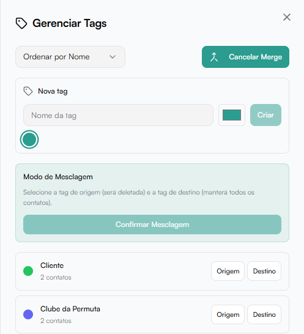

# Tags

As Tags permitem organizar, segmentar e classificar contatos dentro da plataforma.

Elas podem ser usadas em:

- Contatos
- Funis
- Automações
- Fluxos de mensagens

Tags ajudam a acionar:

- Gatilhos
- Condições
- Ações automatizadas

## Gerenciar Tags

Ao clicar em Gerenciar tags, abre-se o painel lateral de controle.

### Criar nova tag

Campos:

- Nome da tag
- Cor personalizada

Clique em Criar para finalizar.

### Lista de tags

Cada tag exibe:

- Nome
- Número de contatos associados
- Cor identificadora

Ações disponíveis:

- Editar
- Excluir

## Mesclar Tags

A funcionalidade Mesclar Tags permite unificar duas tags em uma única, consolidando todos os contatos em apenas uma classificação.

Esse recurso é especialmente útil quando existem:

- Tags duplicadas
- Tags com nomes semelhantes
- Erros de padronização
- Segmentações criadas de forma redundante

### Como funciona a mesclagem?

Ao ativar o Modo de Mesclagem, você deverá selecionar:

- Tag de Origem → será deletada após a mesclagem
- Tag de Destino → permanecerá ativa e receberá todos os contatos

Após selecionar as duas opções, clique em Confirmar Mesclagem.

### O que acontece após confirmar?

- Todos os contatos da tag de origem serão transferidos para a tag de destino.
- A tag de origem será excluída do sistema.
- Nenhum contato é perdido.
- As automações vinculadas à tag de destino continuam funcionando normalmente.

:::warning Atenção
- A ação não pode ser desfeita.
- Verifique se automações, funis ou fluxos utilizam a tag que será excluída.
- Certifique-se de que a tag de destino está corretamente nomeada antes de confirmar.
:::

### Exemplo prático

Você possui duas tags:

- Lead Google
- Lead_Google

Ambas representam a mesma origem.

Ao mesclar:

1. Defina uma como Origem.
2. Defina a outra como Destino.
3. Clique em Confirmar Mesclagem.

Resultado:

Uma única tag permanece ativa, concentrando todos os contatos.

### Boas práticas

- Padronize nomes antes de mesclar.
- Evite criar tags muito específicas e pouco reutilizáveis.
- Revise periodicamente a estrutura de segmentação.
- Utilize cores estratégicas para facilitar a identificação visual.
