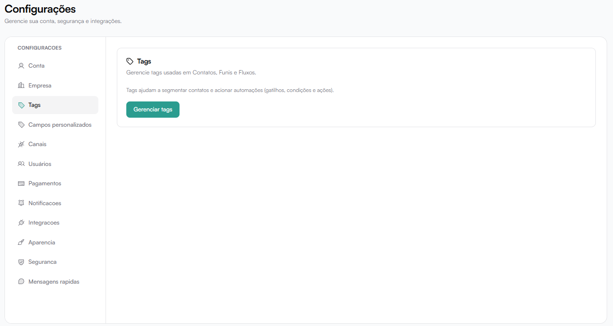
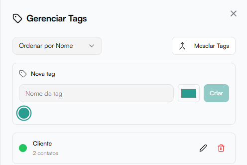
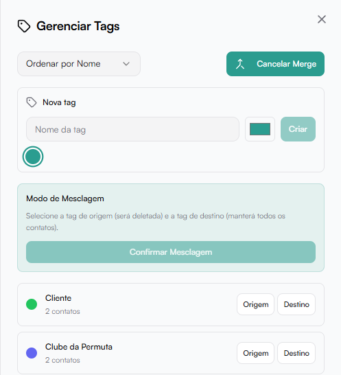

# Tags

As Tags permitem organizar, segmentar e classificar contatos dentro da plataforma.

Elas podem ser usadas em:

- Contatos
- Funis
- Automações
- Fluxos de mensagens

Tags ajudam a acionar:

- Gatilhos
- Condições
- Ações automatizadas

## Gerenciar Tags

Ao clicar em Gerenciar tags, abre-se o painel lateral de controle.

### Criar nova tag

Campos:

- Nome da tag
- Cor personalizada

Clique em Criar para finalizar.

### Lista de tags

Cada tag exibe:

- Nome
- Número de contatos associados
- Cor identificadora

Ações disponíveis:

- Editar
- Excluir

Antes de excluir, o FalaMais.AI verifica se a tag faz parte de uma versão de
fluxo publicada ou já vinculada a uma execução. Nesses casos, a exclusão é
bloqueada antes de qualquer alteração e a tela explica por que a tag precisa
ser mantida.

## Mesclar Tags

A funcionalidade Mesclar Tags permite unificar duas tags em uma única, consolidando todos os contatos em apenas uma classificação.

Esse recurso é especialmente útil quando existem:

- Tags duplicadas
- Tags com nomes semelhantes
- Erros de padronização
- Segmentações criadas de forma redundante

### Como funciona a mesclagem?

Ao ativar o Modo de Mesclagem, você deverá selecionar:

- Tag de Origem → será deletada após a mesclagem
- Tag de Destino → permanecerá ativa e receberá todos os contatos

Após selecionar as duas opções, clique em Confirmar Mesclagem.

### O que acontece após confirmar?

Antes de mover os contatos, o FalaMais.AI verifica se a tag de origem faz parte
de alguma versão publicada de um fluxo ou de uma versão já vinculada a uma
execução.

- **Sem vínculo protegido:** os contatos são transferidos, as regras e os
  rascunhos de fluxo passam a usar a tag de destino e a tag de origem é
  excluída. Nenhum contato é perdido.
- **Com vínculo publicado ou em execução:** a mesclagem é bloqueada antes de
  qualquer alteração. Nenhum contato é movido e nenhuma tag é excluída. A tela
  informa que a tag precisa ser mantida para preservar o histórico e as
  execuções daquele fluxo.

Versões publicadas e versões ligadas a execuções são registros imutáveis. Nesse
segundo caso, mantenha a tag de origem para o histórico e use a tag de destino
em novos rascunhos e automações.

:::warning[Atenção]
- A ação não pode ser desfeita.
- Uma tag usada por uma versão publicada ou ligada a uma execução não pode ser
  mesclada nem excluída.
- Verifique também se regras, funis ou rascunhos utilizam a tag de origem.
- Certifique-se de que a tag de destino está corretamente nomeada antes de confirmar.
:::

### Exemplo prático

Você possui duas tags:

- Lead Google
- Lead_Google

Ambas representam a mesma origem.

Ao mesclar:

1. Defina uma como Origem.
2. Defina a outra como Destino.
3. Clique em Confirmar Mesclagem.

Resultado:

Uma única tag permanece ativa, concentrando todos os contatos.

### Boas práticas

- Padronize nomes antes de mesclar.
- Evite criar tags muito específicas e pouco reutilizáveis.
- Revise periodicamente a estrutura de segmentação.
- Utilize cores estratégicas para facilitar a identificação visual.
