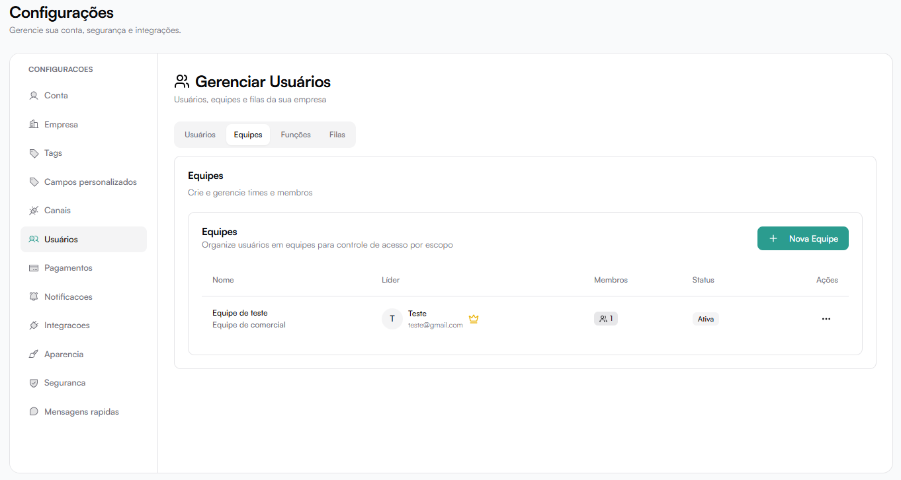

# Equipes

A aba **Equipes** permite organizar usuários em grupos.

Exemplo:

- Vendas
- Suporte
- Atendimento
- Financeiro

---

## Criar Nova Equipe

Clique em **Nova Equipe**.

Campos:

- **Nome** (obrigatório)
- **Descrição**
- **Líder da Equipe**

O líder tem permissão para gerenciar membros da equipe (adicionar, remover).

---

## Finalidade das Equipes

Equipes são utilizadas para:

- Organizar estrutura interna
- Distribuir conversas respeitando times
- Controlar visibilidade de dados
- Aplicar regras de distribuição
