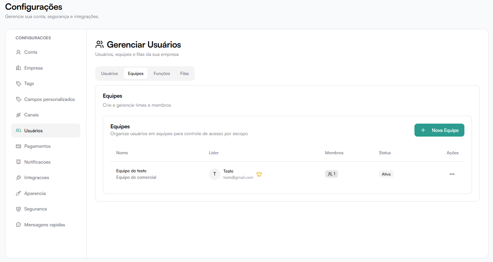

# Equipes

A aba **Equipes** permite organizar usuários em grupos.

Exemplo:

- Vendas
- Suporte
- Atendimento
- Financeiro

---

## Criar Nova Equipe

Clique em **Nova Equipe**.

Campos:

- **Nome** (obrigatório)
- **Descrição**
- **Líder da Equipe**

O líder tem permissão para gerenciar membros da equipe (adicionar, remover).

---

## Finalidade das Equipes

Equipes são utilizadas para:

- Organizar estrutura interna
- Distribuir conversas respeitando times
- Controlar visibilidade de dados
- Aplicar regras de distribuição

## Limitar funis por equipe

Na edição da equipe, o administrador pode selecionar os funis que seus membros
e líder podem acessar. Quando a equipe tem essa restrição, os demais funis deixam
de fazer parte do acesso concedido por ela.

Se uma pessoa participa de várias equipes, ela pode acessar os funis selecionados
em qualquer uma dessas equipes, respeitando os limites da função e as restrições
individuais. A equipe não amplia uma permissão que o cargo não possui.

Mudanças na equipe ou nos funis permitidos atualizam o acesso das pessoas afetadas.
Veja também [Funções e permissões](./funcao.md) e
[Restrições individuais de usuários](./usuarios.md#restrições-individuais).
