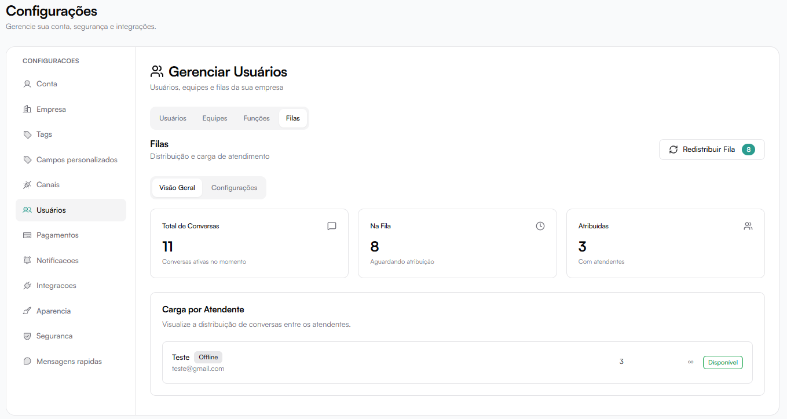
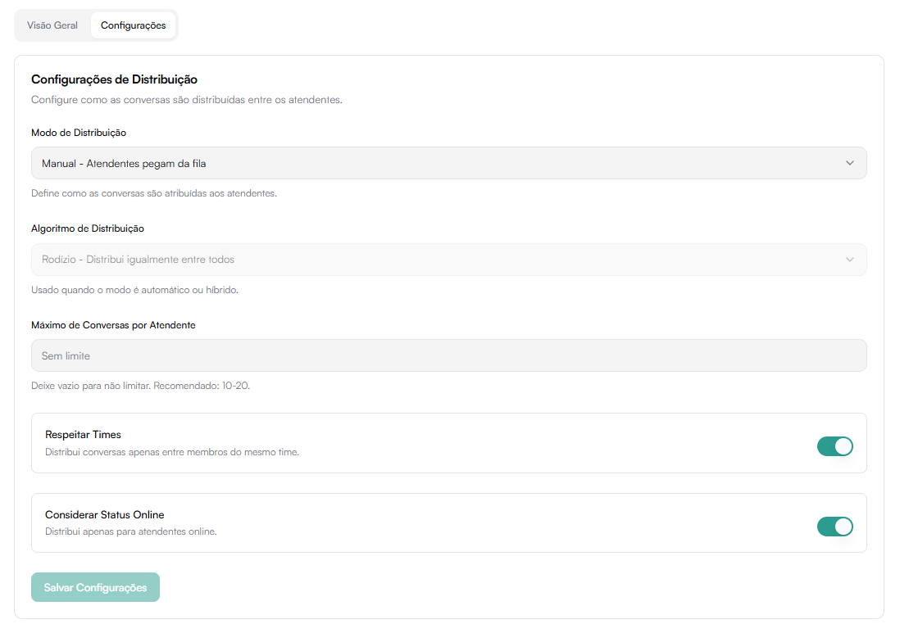

# Filas

As **Filas** organizam como as conversas entram no sistema e são distribuídas entre atendentes.

---

## Visão Geral

A aba **Visão Geral** dentro de **Usuários → Filas** apresenta um panorama em tempo real da distribuição de conversas na operação.

Ela permite acompanhar:

- Volume total de conversas
- Quantas estão aguardando atribuição
- Quantas já estão com atendentes
- Carga individual por atendente

### Indicadores Principais

No topo da tela são exibidos três cartões informativos:

#### Total de Conversas
Quantidade total de conversas ativas no momento.

Inclui:
- Conversas na fila
- Conversas atribuídas

#### Na Fila

Mostra quantas conversas estão:

- Aguardando atribuição
- Ainda não assumidas por atendentes

Essas conversas dependem do modo de distribuição configurado.

#### Atribuídas

Quantidade de conversas que já estão:

- Vinculadas a atendentes
- Em atendimento ativo

### Redistribuir Fila

Botão localizado no topo direito.

Permite redistribuir manualmente as conversas da fila com base nas regras configuradas.

Útil para:

- Rebalanceamento de carga
- Mudança de turno
- Correções operacionais
- Redistribuição em massa

O número ao lado do botão indica quantas conversas estão atualmente na fila.

### Carga por Atendente

A seção **Carga por Atendente** exibe como as conversas estão distribuídas entre os membros da equipe.

Para cada atendente são exibidos:

- Nome
- Email
- Status (Online / Offline)
- Quantidade de conversas atribuídas
- Disponibilidade

### Status do Atendente

O sistema indica:

- **Online** → disponível para novas conversas
- **Offline** → não está ativo no momento

### Conversas Ativas

Mostra o número de atendimentos simultâneos que o usuário está gerenciando.

Esse número deve respeitar os limites configurados na função (caso existam).

## Configurações de Distribuição

Possíveis modos de distribuição:

- Manual — atendentes pegam da fila
- Automático (quando habilitado)

### Algoritmo de Distribuição

Exemplo:

- Rodízio (distribuição equilibrada entre atendentes)

### Máximo de Conversas por Atendente

Define limite simultâneo de conversas por usuário.

Recomendado: 10 a 20.

### Respeitar Times

Distribui conversas apenas entre membros do mesmo time.

### Considerar Status Online

Distribui apenas para usuários online.
