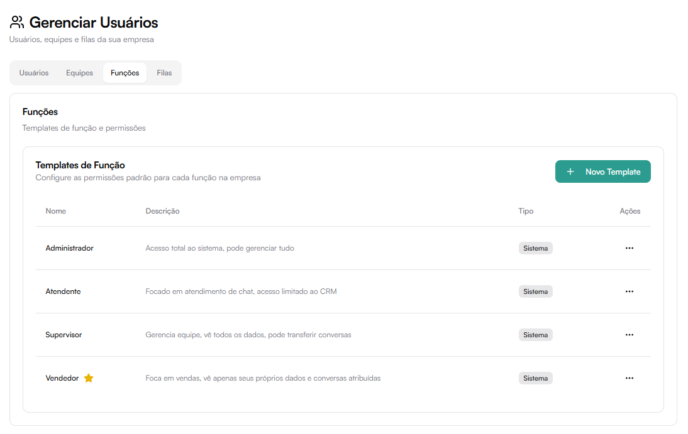
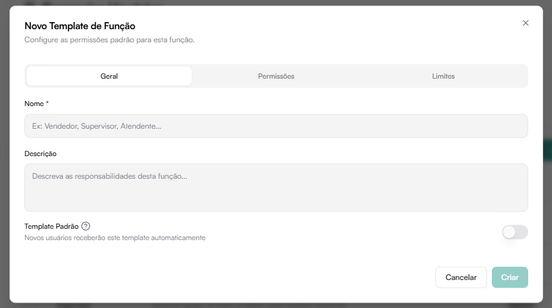

# Funções

A aba **Funções** define os níveis de permissão do sistema.

Cada função é baseada em um **Template de Função**, que controla acesso a módulos e ações.

---

## Templates padrão do sistema

Exemplos:

- **Administrador** — Acesso total
- **Supervisor** — Gerencia equipe e dados
- **Atendente** — Foco em chat e CRM limitado
- **Vendedor** — Foco em negociações próprias

## Criar Novo Template de Função

Clique em **Novo Template**.

O template é dividido em três seções:

- Geral
- Permissões
- Limites

## Aba Geral

Campos:

- Nome da função
- Descrição
- Definir como template padrão (novos usuários recebem automaticamente)

## Aba Permissões

As permissões são organizadas por módulos:

### Módulos

Define quais módulos o usuário pode acessar:

- Dashboard
- Chat
- Contatos
- Funis
- Relatórios
- Usuários
- Agenda
- Configurações
- IA
- Canais
- Fluxos

### Permissões de Chat

Controle de acesso às conversas:

- Escopo de visibilidade:
  - Somente atribuídas
  - Todas
- Ver arquivadas
- Pegar da fila
- Transferir
- Devolver para fila
- Enviar mensagens
- Deletar mensagens
- Pausar/Retomar IA

### Permissões de Equipe

- Convidar usuários
- Remover usuários
- Criar templates
- Editar funções
- Ver atividades

### Permissões de Relatórios

- Ver dashboard
- Ver relatórios de vendas
- Ver relatórios de equipe
- Exportar dados
- Definir escopo (próprios ou gerais)

### Permissões de Recursos

Controle sobre:

#### Contatos
- Criar
- Ver
- Editar
- Deletar
- Importar
- Exportar
- Atribuir a outros
- Escopo de visibilidade

#### Negócios (Oportunidades)
- Criar
- Ver
- Editar
- Deletar
- Alterar responsável
- Mover entre etapas
- Definir escopo

#### Funis
- Criar
- Ver
- Editar
- Deletar
- Criar etapas
- Reordenar etapas

#### Agenda
- Criar
- Ver
- Editar
- Deletar
- Atribuir eventos
- Gerenciar horários

### Configurações do Sistema

Permissões administrativas como:

- Gerenciar empresa
- Gerenciar WhatsApp
- Gerenciar integrações
- Gerenciar faturamento

### IA e Automação

- Editar prompt do sistema
- Gerenciar assistentes
- Ver métricas de IA
- Configurar integrações

### Fluxos

- Criar
- Ver
- Editar
- Deletar
- Ativar/desativar
- Editar gatilhos
- Editar ações

## Aba Limites

Permite configurar limites para usuários:

- Chats simultâneos
- Negociações simultâneas
- Contatos próprios
- Mensagens por dia

Se deixado em branco → ilimitado.