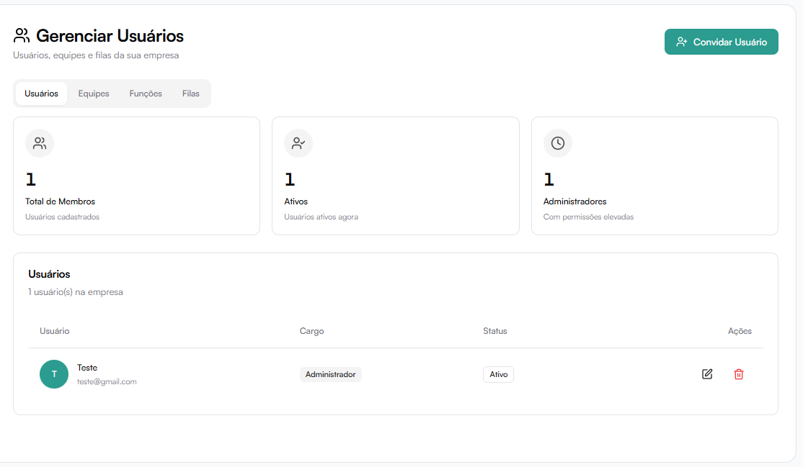

# Usuários

## Gerenciar Usuários

A aba **Usuários** mostra todos os membros cadastrados na empresa.

### Indicadores

No topo da página são exibidos:

- **Total de membros**
- **Usuários ativos**
- **Administradores**

### Convidar Usuário

Clique em **Convidar Usuário**.

Ao convidar um novo usuário, é possível definir:

- Nome
- Email
- Função (cargo/permissão)
- Equipe

O usuário receberá um convite para acessar a plataforma.

### Informações exibidas na lista

Para cada usuário é possível visualizar:

- Nome
- Email
- Função
- Status (Ativo/Inativo)

### Editar Usuário

Ao editar um usuário, é possível:

- Alterar nome
- Trocar função
- Ajustar permissões via template de função

### Remover Usuário

É possível remover usuários do sistema, conforme permissões da função.