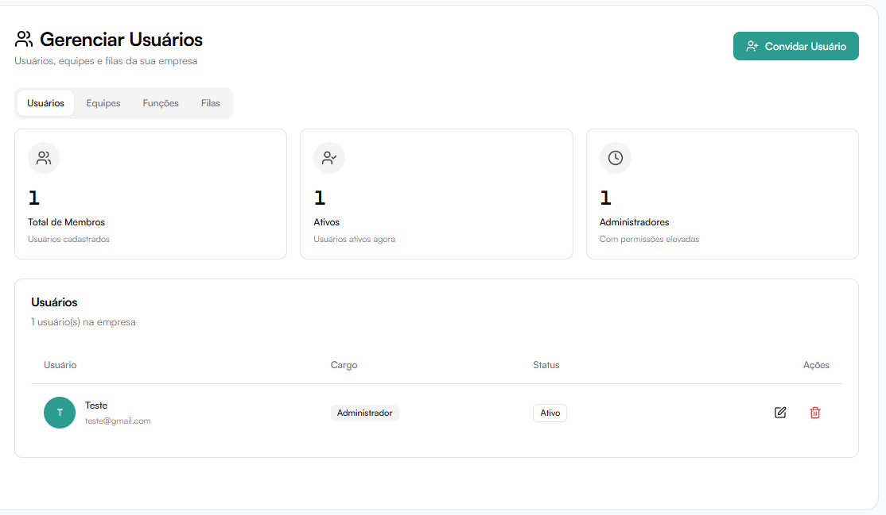

# Usuários

## Gerenciar Usuários

A aba **Usuários** mostra todos os membros cadastrados na empresa.

### Indicadores

No topo da página são exibidos:

- **Total de membros**
- **Usuários ativos**
- **Administradores**

### Adicionar um usuário

Em **Configurações → Usuários e equipes → Usuários**, clique em **Convidar
usuário**.

Preencha o nome, o email e a função da pessoa. Se necessário, selecione também
a equipe. Depois, escolha como o primeiro acesso será liberado:

- **Enviar convite:** a pessoa recebe um email com um link protegido para
  confirmar o endereço e criar a própria senha. O link pode ser usado uma única
  vez e fica disponível por até 72 horas.
- **Definir senha agora:** você informa uma senha inicial e entrega os dados de
  acesso diretamente à pessoa.

Para a maioria dos casos, prefira **Enviar convite**. Assim, somente a pessoa
que recebeu o email conhece a senha escolhida.

### Acompanhar e reenviar convites

Quem ainda não concluiu o primeiro acesso aparece com o status **Convite
pendente**. Quando o prazo termina, o status muda para **Convite expirado**.

Para enviar um novo link, abra o menu de ações da pessoa e selecione **Reenviar
convite**. O link anterior deixa de funcionar assim que o novo convite é
gerado.

Depois que a pessoa aceita o convite, o email é confirmado, a conta é ativada
e ela já pode entrar com a senha que escolheu.

### Informações exibidas na lista

Para cada usuário é possível visualizar:

- Nome
- Email
- Função
- Status (Ativo/Inativo)

### Editar Usuário

Ao editar um usuário, é possível:

- Alterar nome
- Trocar função
- Ajustar permissões via template de função

### Remover Usuário

É possível remover usuários do sistema, conforme permissões da função.
