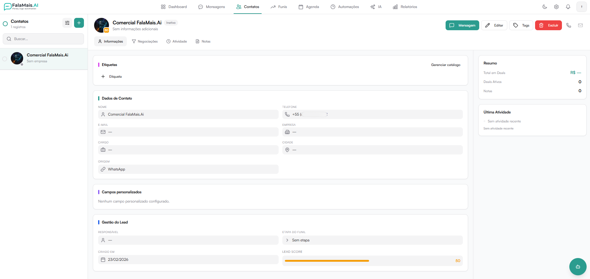
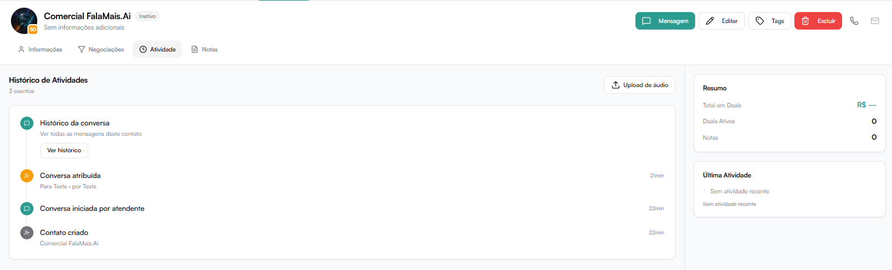
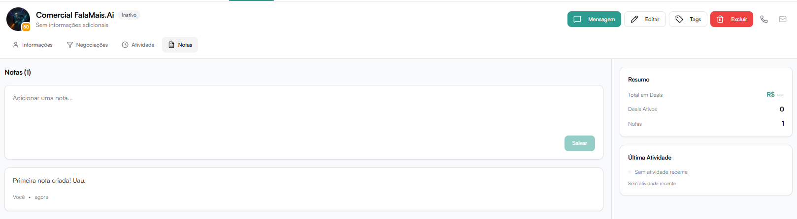

# Contatos

O módulo Contatos centraliza todas as informações relacionadas aos leads e clientes da plataforma.

Aqui é possível:

- Criar novos contatos
- Visualizar e buscar contatos
- Editar informações
- Gerenciar tags
- Acompanhar negociações
- Registrar atividades
- Adicionar notas internas
- Iniciar conversas

## Lista de Contatos

No menu lateral esquerdo é exibida a lista com todos os contatos cadastrados.

Funcionalidades disponíveis:

- Campo de busca para localizar contatos por nome.
- Indicador de total de registros.
- Informações resumidas:
  - Nome
  - Empresa (se houver)
  - Data de criação
  - Tags
  - Status

Ao clicar em um contato, o painel completo é exibido.

### Cabeçalho do Contato

No topo do perfil do contato são exibidas:

- Nome
- Status (Ativo / Inativo)
- Empresa associada
- Lead Score
- Etiqueta (caso tenha uma)

Ações disponíveis:

- Mensagem → Inicia conversa com o contato
- Editar → Permite editar informações do contato
- Excluir → Remove o contato do sistema

## Aba Informações

Exibe os dados principais do contato.

Seções disponíveis:

### Etiquetas

Permite visualizar e adicionar tags ao contato.

### Dados de Contato

Campos padrão:

- Nome
- Telefone
- Email
- Empresa
- Cargo
- Cidade
- Origem (ex: WhatsApp)

Esses dados podem ser editados pelo botão "Editar" no topo.

### Campos personalizados

Exibe campos adicionais criados em Configurações > Campos personalizados.

Caso nenhum campo esteja configurado, aparecerá:

"Nenhum campo personalizado configurado."

### Gestão do Lead

Informações estratégicas do contato:

- Responsável
- Etapa do funil
- Data de criação
- Lead Score

O Lead Score indica o nível de qualificação do contato.

## Aba Negociações

Exibe negociações vinculadas ao contato.

Se o contato ainda não estiver em um funil, aparecerá:

"Este contato ainda não está em um funil."

Ações disponíveis:

- Criar negociação
- Ver funis

### Criar Nova Negociação

A funcionalidade Nova Negociação permite criar uma oportunidade comercial vinculada ao contato.

Essa ação pode ser feita pela aba "Negociações" dentro do perfil do contato.

Quando criar uma negociação?

Crie uma negociação quando:

- O contato demonstrar interesse comercial.
- Houver envio de proposta.
- Iniciar um processo de venda estruturado.
- Desejar acompanhar evolução dentro do funil.

### Campos da Nova Negociação

Ao clicar em Criar negociação, será exibido um modal com os seguintes campos:

Título da negociação

Define o nome da oportunidade.

Exemplo:
- Proposta Plano Premium
- Projeto Consultoria 2026

Recomendação:
Use títulos padronizados para facilitar relatórios.

### Participantes (opcional)

Permite adicionar outras pessoas à negociação.

Funcionalidades:

- Buscar participantes existentes
- Adicionar novos participantes
- Definir participante principal

O contato atual será exibido como Principal.

### Etapa

Define em qual etapa do funil a negociação será iniciada.

Exemplo:
- Novo
- Qualificação
- Proposta
- Fechamento

A etapa selecionada determinará onde a negociação aparecerá no funil.

### Valor

Campo para registrar o valor estimado da negociação.

Exemplo:
12000

Pode ser usado para:

- Previsão de receita
- Relatórios de pipeline
- Controle financeiro

### Data prevista

Define a data estimada de fechamento da negociação.

Formato:
dd/mm/aaaa

Utilizada para:

- Previsões comerciais
- Gestão de metas
- Acompanhamento de prazo

### Finalizando

Após preencher os campos:

Clique em Criar negociação.

A negociação será:

- Vinculada ao contato
- Inserida na etapa escolhida do funil
- Exibida na aba Negociações do contato
- Contabilizada nos relatórios

:::tip Observações

- Caso o contato não esteja associado a um funil, a negociação será criada no funil ativo padrão.
- O valor pode ser alterado posteriormente.
- A etapa pode ser movida manualmente dentro do funil.
- A exclusão da negociação deve ser feita pelo módulo de Funis.
:::

## Aba Atividade

Exibe o histórico completo de interações e alterações relacionadas ao contato.

Exemplos de eventos registrados:

- Conversa atribuída
- Conversa liberada
- Conversa encerrada
- Tag adicionada
- Transferências entre atendentes
- Mudanças de status

Também é possível visualizar:

- Histórico da conversa (todas as mensagens trocadas)

## Aba Notas

Permite adicionar observações internas sobre o contato.

Características:

- Notas são visíveis apenas internamente.
- Não são enviadas ao cliente.
- Podem ser usadas para contexto, lembretes ou estratégia.

Para adicionar:

1. Digite a nota no campo disponível.
2. Clique em Salvar.

## Painel Lateral (Resumo)

À direita da tela são exibidos dados resumidos:

Resumo:
- Total em Deals
- Deals Ativos
- Notas

Última Atividade:
- Última atualização registrada no contato
