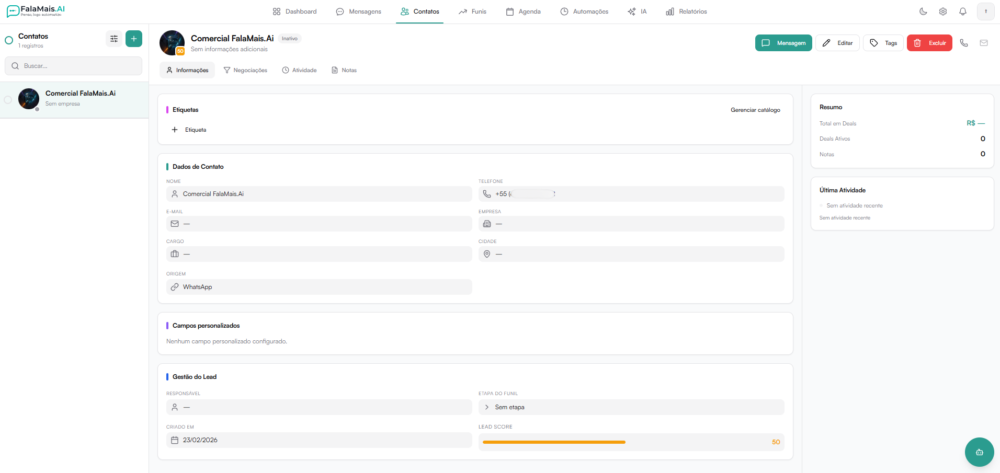
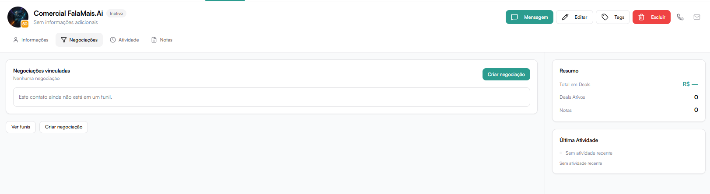
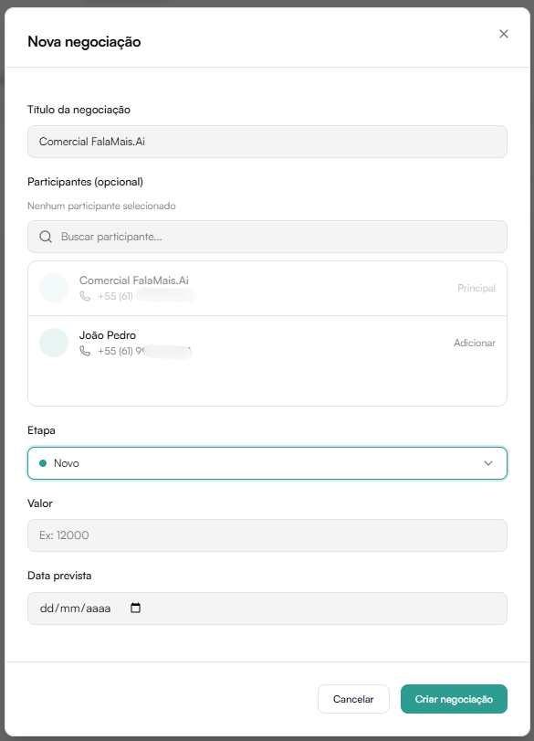
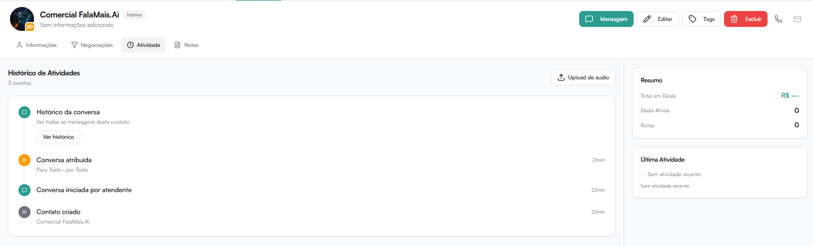
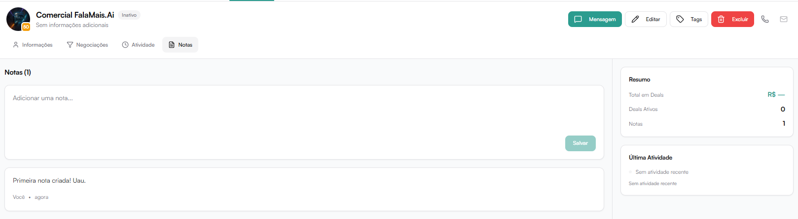

# Contatos

O módulo Contatos centraliza todas as informações relacionadas aos leads e clientes da plataforma.

Aqui é possível:

- Criar novos contatos
- Visualizar e buscar contatos
- Editar informações
- Gerenciar tags
- Acompanhar negociações
- Registrar atividades
- Adicionar notas internas
- Iniciar conversas

## Lista de Contatos

No menu lateral esquerdo é exibida a lista com todos os contatos cadastrados.

Funcionalidades disponíveis:

- Campo de busca para localizar contatos por nome.
- Indicador de total de registros.
- Informações resumidas:
  - Nome
  - Empresa (se houver)
  - Data de criação
  - Tags
  - Status

Ao clicar em um contato, o painel completo é exibido.

### Cabeçalho do Contato

No topo do perfil do contato são exibidas:

- Nome
- Status (Ativo / Inativo)
- Badge **"IA bloqueada"** — exibida quando a IA está desativada para aquele contato
- Subtítulo com informações adicionais do contato

Ações disponíveis:

- **Mensagem** → Inicia conversa com o contato
- **Desbloquear IA** → Reativa a IA para o contato quando ela estiver bloqueada
- **Editar** → Permite editar informações do contato
- **Tags** → Gerencia as tags vinculadas ao contato
- **Excluir** → Remove o contato do sistema
- **Ícone de telefone** → Acesso rápido para ligar ao contato
- **Ícone de e-mail** → Acesso rápido para enviar e-mail ao contato

## Aba Informações

Exibe os dados principais do contato.

Seções disponíveis:

### Etiquetas

Permite visualizar e adicionar etiquetas ao contato. O botão **"Gerenciar catálogo"** abre a lista completa de etiquetas disponíveis. Use o botão **"+ Etiqueta"** para adicionar uma nova ao contato.

### Dados de Contato

Campos padrão:

- Nome
- Telefone
- Instagram @
- E-mail
- CPF/CNPJ
- Empresa
- Cargo
- Cidade

Esses dados podem ser editados pelo botão **"Editar"** no topo.

### Listas em que este contato está

Exibe quais listas inteligentes incluem este contato. Caso ele ainda não faça parte de nenhuma lista, aparecerá:

"Este contato ainda não entrou em nenhuma lista inteligente."

### Origem do contato

Mostra de onde veio o contato — canal de entrada, vínculo com anúncios e histórico de atribuição. É dividida em duas partes:

- **Origem Principal** — o canal pelo qual o contato chegou pela primeira vez (ex: WhatsApp, Instagram). Se ainda não houver origem registrada, exibirá: "Sem origem atribuída até o momento."
- **Histórico de Origens** — lista todas as atribuições históricas do contato. Se não houver registros, exibirá: "Nenhuma atribuição histórica registrada."

### Campos personalizados

Exibe campos adicionais criados em Configurações > Campos personalizados.

Caso nenhum campo esteja configurado, aparecerá:

"Nenhum campo personalizado configurado."

### Gestão do Lead

Informações estratégicas do contato:

- **Responsável** — atendente ou equipe responsável pelo contato
- **Etapa do funil** — fase atual do contato no processo de vendas
- **Criado em** — data de cadastro do contato
- **Lead Score** — pontuação de qualificação do contato de 0 a 100, representada por uma barra colorida. Quanto maior a pontuação, mais qualificado é o lead.

## Aba Negociações

Exibe todas as negociações vinculadas ao contato. Caso o contato ainda não esteja em nenhum funil, aparecerá:

"Este contato ainda não está em um funil."

Ações disponíveis:

- **Criar negociação** → Abre o modal para criar uma nova oportunidade comercial
- **Ver funis** → Navega para o módulo de Funis

### Criar Nova Negociação

A funcionalidade Nova Negociação permite criar uma oportunidade comercial vinculada ao contato.

Essa ação pode ser feita pelo botão **"Criar negociação"** na aba Negociações ou pelo botão de mesmo nome exibido na mensagem de estado vazio.

Quando criar uma negociação?

Crie uma negociação quando:

- O contato demonstrar interesse comercial.
- Houver envio de proposta.
- Iniciar um processo de venda estruturado.
- Desejar acompanhar evolução dentro do funil.

### Campos da Nova Negociação

Ao clicar em Criar negociação, será exibido um modal com os seguintes campos:

**Título da negociação**

Define o nome da oportunidade.

Exemplo:
- Proposta Plano Premium
- Projeto Consultoria 2026

Recomendação: use títulos padronizados para facilitar relatórios.

**Participantes (opcional)**

Permite adicionar outras pessoas à negociação.

- Buscar participantes existentes
- Adicionar novos participantes
- Definir participante principal

O contato atual será exibido como Principal.

**Etapa**

Define em qual etapa do funil a negociação será iniciada.

Exemplo:
- Novo
- Qualificação
- Proposta
- Fechamento

A etapa selecionada determinará onde a negociação aparecerá no funil.

**Valor**

Campo para registrar o valor estimado da negociação. Pode ser usado para previsão de receita, relatórios de pipeline e controle financeiro.

**Data prevista**

Define a data estimada de fechamento da negociação (formato dd/mm/aaaa). Utilizada para previsões comerciais e gestão de metas.

### Finalizando

Após preencher os campos, clique em **Criar negociação**. A negociação será:

- Vinculada ao contato
- Inserida na etapa escolhida do funil
- Exibida na aba Negociações do contato
- Contabilizada nos relatórios

:::tip Observações

- Caso o contato não esteja associado a um funil, a negociação será criada no funil ativo padrão.
- O valor pode ser alterado posteriormente.
- A etapa pode ser movida manualmente dentro do funil.
- A exclusão da negociação deve ser feita pelo módulo de Funis.
:::

## Aba Atividade

Exibe o **Histórico de Atividades** completo do contato, com todos os eventos registrados em ordem cronológica. O total de eventos é exibido ao lado do título.

Ações disponíveis no topo:

- **Histórico WhatsApp** → Exibe todas as mensagens trocadas com o contato via WhatsApp
- **Upload de áudio** → Permite anexar um arquivo de áudio ao histórico do contato

Exemplos de eventos registrados:

- Contato criado
- Conversa iniciada
- Conversa atribuída (para qual atendente e por quem)
- Conversa devolvida para fila
- Responsável transferido
- Nota adicionada
- Tag adicionada
- Mudanças de status

Cada evento exibe a data em que ocorreu e, quando aplicável, quem realizou a ação.

## Aba Site

A aba Site exibe o rastreamento de atividade web do contato — páginas visitadas, cliques e interações registradas no seu site quando há integração configurada.

Caso nenhuma atividade tenha sido registrada, aparecerá:

"Nenhuma atividade web vinculada a este contato."

:::info
Para que dados apareçam nessa aba, é necessário ter o script de rastreamento do FalaMais instalado no seu site.
:::

## Aba Notas

Permite adicionar observações internas sobre o contato. O número total de notas é exibido ao lado do título da aba.

Características:

- Notas são visíveis apenas internamente pela equipe.
- Não são enviadas ao cliente.
- Cada nota exibe o autor e a data de criação.
- Podem ser usadas para contexto, lembretes ou estratégia comercial.

Para adicionar:

1. Digite a nota no campo "Adicionar uma nota...".
2. Clique em **Salvar**.

A nota ficará registrada abaixo do campo, com o nome do autor e a data.

## Painel Lateral (Resumo)

À direita da tela são exibidos dados resumidos do contato:

**Resumo:**
- Total em Deals — valor total acumulado nas negociações
- Deals Ativos — quantidade de negociações em andamento
- Notas — número de notas registradas

**Última Atividade:**
- Data e descrição da última interação registrada no contato
