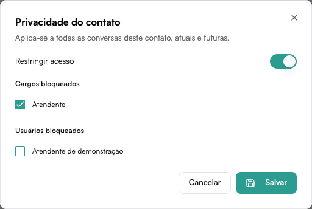

# Privacidade dos contatos

Administradores podem restringir o acesso de usuários e cargos inferiores a um contato. Isso ajuda a proteger atendimentos confidenciais, como conversas com o financeiro ou parceiros.

## Configurar uma restrição

1. Abra os detalhes do contato ou uma conversa vinculada a ele.
2. Selecione o cadeado **Privacidade do contato**.
3. Ative **Restringir acesso**.
4. Selecione os usuários ou cargos que devem ficar sem acesso.
5. Salve a configuração.

É necessário selecionar pelo menos um usuário ou cargo. Apenas opções abaixo do seu nível hierárquico aparecem na seleção. Usuários no mesmo nível ou acima do administrador que definiu a restrição não são bloqueados por ela.

## Onde a configuração se aplica

A restrição acompanha o contato nas conversas atuais e nas próximas conversas, inclusive em outros canais e em atendimentos arquivados ou encerrados. Permissões gerais, participação em equipe e atribuição do atendimento não liberam um contato restrito para aquele usuário.

As telas abertas são atualizadas quando a configuração muda. A regra também protege os dados vinculados apresentados em históricos, agendamentos e gravações de chamadas na plataforma. Ao mesclar contatos, as restrições são preservadas.

Se a restrição for aplicada a um cargo, ela considera o cargo atual de cada usuário. Mudanças de cargo podem alterar quem está sujeito ao bloqueio.

## Remover uma restrição

Abra novamente **Privacidade do contato**, ajuste a seleção ou desative **Restringir acesso** e salve. Um administrador de nível inferior não pode alterar uma restrição definida por alguém acima dele.

## Privacidade e bloqueio de atendimento

A privacidade controla o acesso da equipe na plataforma. Ela não pausa a IA, não bloqueia o cliente e não interrompe automaticamente o recebimento de mensagens. O acesso externo pelo próprio WhatsApp ou por serviços de telefonia continua sujeito às configurações desses serviços.

Os grupos mantêm seu controle de acesso próprio. Arquivos ou informações já copiados fora da plataforma não são removidos por uma mudança de privacidade.

Veja também: [Contatos](../contatos.md) e [Funções e permissões](../configuracao/usuarios/funcao.md).
