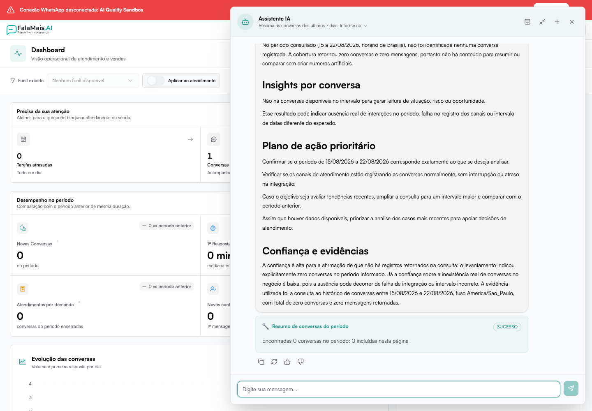

# Assistente IA (Copiloto Interno)

O **Assistente IA** é o copiloto interno do FalaMais.AI. Ele consulta os dados
que seu perfil pode acessar e ajuda a transformar pedidos em análises ou ações
dentro da plataforma.

Seu objetivo é acelerar tarefas, organizar processos e auxiliar usuários na
gestão de conversas, contatos, negociações e funis.

---

## O que é o Assistente IA?

O Assistente IA é um chat interno integrado ao sistema que pode:

- Responder dúvidas sobre funcionalidades
- Consultar indicadores e dados autorizados
- Resumir conversas de um período
- Orientar sobre boas práticas e próximos passos
- Criar e organizar estruturas no CRM
- Executar ações permitidas diretamente no sistema
- Automatizar tarefas operacionais

Ele entende comandos em linguagem natural. As consultas respeitam a empresa,
o perfil de acesso e as permissões de cada usuário.

## O que ele consegue fazer

O Assistente IA pode:

### Gestão de Contatos
- Criar tags
- Organizar contatos por categoria
- Criar follow-ups
- Adicionar notas
- Atualizar informações

### Gestão de Funis
- Criar novos funis
- Sugerir organização de etapas
- Estruturar fluxo comercial
- Organizar leads em etapas específicas

### Gestão de Negociações
- Criar negociações
- Atualizar etapas
- Alterar responsáveis
- Inserir valores e datas previstas

### Organização Inteligente
- Criar e aplicar tags
- Segmentar base de contatos
- Criar estruturas de acompanhamento

### Análises de conversas

- Resumir conversas das últimas 24 horas ou dos últimos 7 dias
- Informar quantas conversas foram encontradas e analisadas
- Sinalizar quando a consulta não encontrou dados ou teve cobertura parcial
- Organizar riscos, oportunidades e próximos passos sem inventar números

## Interface do Assistente

O Assistente funciona em formato de chat. Durante uma consulta, ele mostra a
etapa em andamento — por exemplo, planejamento, consulta e síntese — e atualiza
o tempo decorrido em análises mais longas. Isso permite acompanhar o trabalho
sem depender de uma animação genérica.

Quando uma ferramenta é usada, o resultado aparece em um bloco próprio com o
status da execução. A resposta aceita títulos, listas, tabelas, links seguros e
blocos de código, quando necessários.

Ao abrir, ele exibe sugestões rápidas como:

- Criar follow-up para clientes inativos
- Organizar leads em um funil de vendas
- Criar tags para categorizar contatos

Você pode:

- Clicar em uma sugestão
- Ou digitar um comando personalizado
- Interromper uma resposta em andamento
- Copiar ou gerar novamente a última resposta
- Avaliar a resposta como útil ou não útil
- Consultar conversas anteriores do Assistente

Exemplo de comandos:

- "Crie um funil para onboarding de clientes"
- "Adicione a tag Cliente VIP para todos os contatos com negociação ativa"
- "Organize leads sem responsável"
- "Crie um follow-up para clientes parados há 15 dias"
- "Analise as conversas das últimas 24 horas e informe a cobertura"
- "Resuma as conversas dos últimos 7 dias sem inventar números"

## Confirmações e segurança

Consultas não alteram dados. Ações que podem modificar o sistema passam pelas
permissões do usuário e podem exigir confirmação antes da execução.

Se uma ação já confirmada for interrompida, o Assistente não a repete
automaticamente. Confirme novamente somente depois de verificar o resultado.

Quando uma consulta não tiver dados suficientes, a resposta deve informar a
limitação com clareza. Não é necessário “liberar uma ferramenta” manualmente no
chat: se uma capacidade não estiver disponível para seu perfil, o Assistente
mostrará a restrição aplicável.

## Benefícios Estratégicos

O uso do Assistente IA permite:

- Redução de trabalho manual
- Organização automática do CRM
- Melhoria da qualidade dos dados
- Padronização de processos comerciais
- Ganho de velocidade operacional

Ele funciona como um **analista operacional interno**, disponível 24 horas.

## Diferença entre IA de Atendimento e Assistente Interno

| IA de Atendimento | Assistente IA |
|------------------|---------------|
| Atua no WhatsApp/conversa | Atua dentro do sistema |
| Foca no cliente | Foca na operação interna |
| Responde mensagens | Organiza e executa ações no CRM |
| Pode ter autonomia limitada | Pode ter autonomia ampliada |

## Boas Práticas

- Use comandos claros e objetivos
- Informe o período desejado nas análises
- Comece no modo Híbrido
- Valide estrutura antes de liberar Controle Total
- Revise ações que alteram dados antes de confirmar
- Utilize para tarefas repetitivas
- Peça sugestões de organização periodicamente
