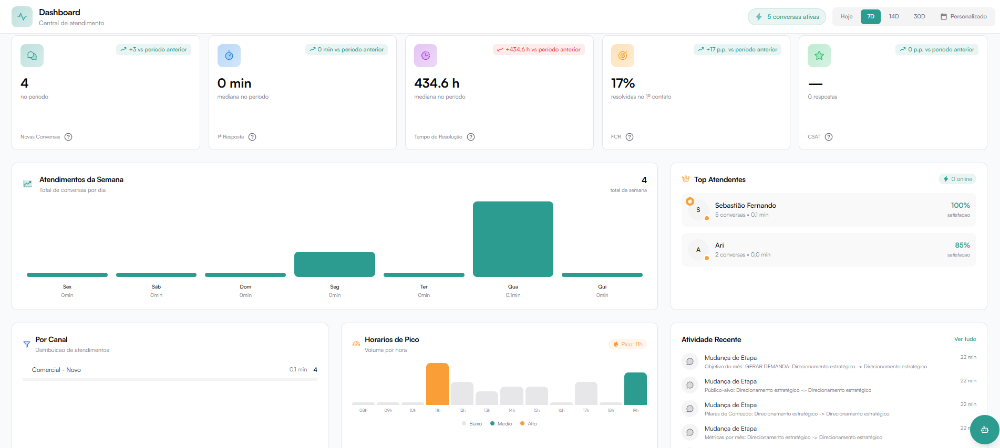
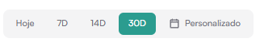
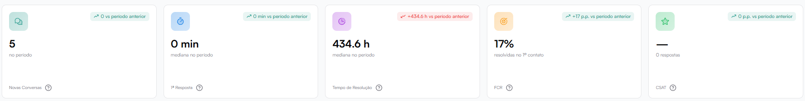
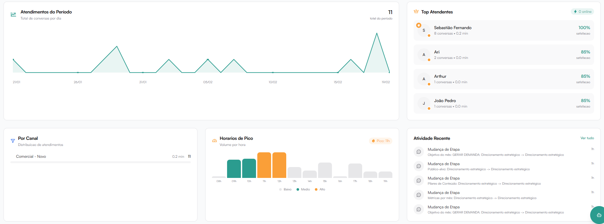

# Dashboard

  <iframe
    src="https://www.youtube.com/embed/Bedlh7HeViE?si=8rIkWE30TbAtajnL"
    title="YouTube video player"
    frameborder="0"
    allow="accelerometer; autoplay; clipboard-write; encrypted-media; gyroscope; picture-in-picture; web-share"
    referrerpolicy="strict-origin-when-cross-origin"
    allowfullscreen
    loading="lazy"
  ></iframe>

--- 

A **DashBoard** é a sua tela inicial, o primeiro espaço que você vê ao fazer *login*. 

O Dashboard é a **central** de **monitoramento** da operação de atendimento.

Nesta tela é possível acompanhar, em tempo real, o **volume** de conversas, **tempos** de resposta, **desempenho** da equipe e **indicadores** estratégicos.

Ele foi projetado para **responder** rapidamente às **seguintes** **perguntas**:

- Quantas conversas recebemos?
- Estamos respondendo com agilidade?
- Estamos resolvendo no primeiro contato?
- Quais os horários de maior demanda?
- Como está a performance da equipe?

### Filtro de Período

No canto superior direito da tela é possível selecionar o **período** de **análise**:

- Hoje
- 7D
- 14D
- 30D
- Personalizado

Todas as métricas do Dashboard são **recalculadas** automaticamente conforme o período selecionado.

:::warning Importante
Os **indicadores** exibem a variação em relação ao período anterior equivalente.

**Exemplo**: ao selecionar 7D, o sistema compara com os 7 dias anteriores.

Indicadores em **verde** representam **melhoria**.
Indicadores em **vermelho** representam **queda** de **desempenho**.
:::

## Métricas Principais

Os **cards** **superiores** apresentam os indicadores estratégicos da operação.

### Novas Conversas

Exibe o total de **conversas** iniciadas no período **selecionado**.

O que indica:
- **Volume** de demanda recebida
- **Crescimento** ou redução no fluxo de atendimento

Como usar esse dado:
- **Planejar** **dimensionamento** da equipe
- **Identificar** **crescimento** de leads
- **Monitorar** campanhas ativas

### 1ª Resposta

Mostra o **tempo** **mediano** da **primeira** **resposta** enviada ao cliente.

Por que é importante?
Quanto menor o tempo de primeira resposta:
- Maior a **percepção** de agilidade
- Maior a **chance** de conversão
- Melhor a **experiência** do cliente

Boa prática:
Operações comerciais devem buscar manter a primeira resposta abaixo de 5 minutos.

### Tempo de Resolução

Exibe o **tempo** mediano necessário para **finalizar** uma **conversa**.

O que avalia:
- Eficiência operacional
- Complexidade dos atendimentos
- Capacidade da equipe em resolver demandas

Atenção:
Um tempo de resolução muito alto pode indicar:
- Processos internos ineficientes
- Necessidade de treinamento
- Problemas de roteamento

### FCR (First Contact Resolution)

**Representa** a **porcentagem** de **atendimentos** resolvidos no primeiro contato.

O que significa?
Quanto maior o FCR:
- Menor retrabalho
- Maior satisfação do cliente
- Maior eficiência da equipe

**Exemplo**:
Se o FCR for 70%, significa que 70% das conversas foram resolvidas sem necessidade de retorno posterior.

### CSAT (Customer Satisfaction)

Mostra o índice de **satisfação** dos **clientes** com base nas avaliações recebidas após o atendimento.

Para que serve?
- **Medir** qualidade percebida
- **Identificar** pontos de melhoria
- **Avaliar** desempenho individual

## Gráficos

Os **gráficos** do Dashboard oferecem uma **visão visual** e **estratégica** da operação de atendimento.
Eles permitem identificar **padrões**, **comportamentos** recorrentes e **oportunidades** de melhoria de forma rápida e intuitiva.

Por meio dessas visualizações é **possível** analisar volume de conversas, desempenho da equipe, distribuição por canal e horários de maior demanda, facilitando a tomada de decisão baseada em dados.

Cada **gráfico** foi projetado para **apoiar** tanto a **gestão** operacional diária quanto o **planejamento** estratégico da equipe.

### Atendimentos da Semana

Este gráfico apresenta o **volume** de **conversas** **distribuído** por dia da semana.

Como interpretar:
- Barras mais altas indicam maior volume.
- Ajuda a identificar padrões recorrentes.

Aplicação prática:
- Ajustar escala de atendentes
- Antecipar dias de maior demanda
- Planejar campanhas

### Top Atendentes

Exibe os **atendentes** com melhor **desempenho** no período selecionado.

Informações disponíveis:
- Nome do atendente
- Número de conversas atendidas
- Tempo médio de atendimento
- Índice de satisfação (%)

Objetivo estratégico:
- Reconhecer alto desempenho
- Identificar padrões de excelência
- Detectar oportunidades de melhoria

### Atendimentos por Canal

Apresenta a **distribuição** das **conversas** conforme canal.

Aplicações:
- Entender de onde vem a maior demanda
- Identificar gargalos por área
- Avaliar impacto de campanhas específicas

### Horários de Pico

Mostra o **volume** de **atendimentos** **distribuído** por hora ao longo do dia.

O sistema identifica automaticamente:
- Horário de menor volume
- Horário de médio volume
- Horário de pico

Importância:
- Ajustar escala de atendimento
- Reduzir fila em horários críticos
- Melhorar tempo de resposta

## Atividade Recente

Lista as **ações** recentes **realizadas** na **plataforma**, como:

- Mudança de etapa no funil
- Atualizações de status
- Movimentações internas

Finalidade:
- Auditoria operacional
- Acompanhamento de progresso
- Controle de fluxo interno

## Como Usar o Dashboard para Tomada de Decisão

O Dashboard não é apenas **informativo** — é **estratégico**.

Você pode **utilizá**-lo para:

- Ajustar dimensionamento da equipe
- Identificar gargalos operacionais
- Melhorar SLA de resposta
- Monitorar qualidade de atendimento
- Avaliar impacto de campanhas

## Boas Práticas

- **Analise** o Dashboard diariamente
- **Compare** períodos equivalentes
- **Combine** dados de volume e qualidade
- Use os gráficos para **planejamento** semanal
